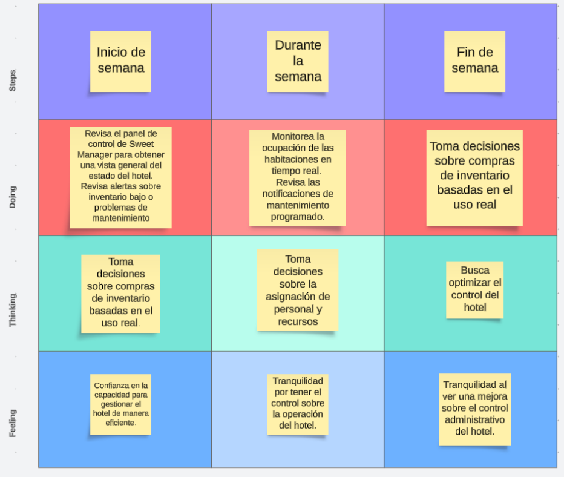
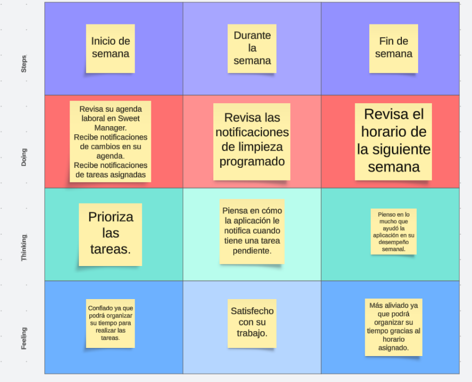

<center><h3>Informe del Trabajo Final</h3></center>

<center>
</center>
<center>Universidad Peruana de Ciencias Aplicadas</center>

**Nombre del curso: Desarrollo de Aplicaciones Open Source**
**Sección: WX56**
**Nombre del Profesor: Hugo Allan Mori**
**Nombre del StartUp: Sweet Manager**
**Nombre del Producto: Sweet Manager**
**Relación de Integrantes:**
- Mauricio Abraham Rivo Rojas Sánchez - U202211572
- Aaron Elías Acuña Alarcón - U202211572
- Fernando Brian Salgado Luna - U2022122023
- Leonardo Félix Jesus Linares Tejada - U202211168

<center><b>Marzo del 2024</b></center>

<br><br>
<center><u><b>Historial de Versiones</b></u></center>

<table>
    <thead>
        <tr>
            <th>Version</th>
            <th>Fecha</th>
            <th>Participantes</th>
            <th>Observaciones</th>
        </tr>
    </thead>
    <tbody>
        <tr>
            <td rowspan=4 align="center">TB1</td>
            <td rowspan=4 align="center">29/03/2024</td>
            <td align="center">- Mauricio Abraham Rivo Rojas Sánchez</td>
            <td>- Capítulo 5
            </td>
        </tr>
        <tr>
            <td align="center">- Aaron Elías Acuña Alarcon</td>
            <td>- Capítulo 1 <br>
                - Capítulo 2
            </td>
        </tr>
        <tr>
            <td align="center">- Fernando Brian Salgado Luna</td>
            <td>- Capítulo 3
            </td>
        </tr>
        <tr>
            <td align="center">- Leonardo Félix Linares Tejada</td>
            <td>- Capítulo 4
            </td>
        </tr>
    </tbody>
</table>

<center><u><b><h4>Tabla de Contenido (Índice)</h4></b></u></center>

<u><b><h4 style="color:red;">Student Outcome</h4></b></u>

<p>En Ingeniería de Software, el logro de curso contribuye a alcanzar el:</p>

<b>ABET – EAC - Student Outcome 3</b>
**Criterio:** Capacidad de comunicarse efectivamente con un rango de audiencias. 

En el siguiente cuadro se describen las acciones realizadas y enunciados de conclusiones por parte del grupo, que permiten sustentar el haber alcanzado el logro del ABET - EAC - Student Outcome 3.

<table>
    <thead>
        <tr>
            <th><b>Criterio Específico</b></th>
            <th><b>Acciones Realizadas</b></th>
            <th><b>Conclusiones</b></th>
        </tr>
    </thead>
    <tbody>
        <tr>
            <td>
                Comunica oralmente sus ideas y/o resultados con objetividad a público de diferentes especialidades y niveles jerarquicos, en el marco del desarrollo de un proyecto en ingeniería.
            </td>
            <td>
                - Mauricio Rojas
                TB1: En este entregable, he colaborado en el diálogo con mis compañeros de grupo, comunicando ideas con objetividad con diferentes niveles jerárquicos y especialidades, mejorando el diálogo entre nosotros. De esta manera, cumplí con el criterio específico del Student Outcome 3.<br>
                - Aaron Alarcón 
                TB1: En este proyecto, colaboré activamente en las discusiones junto a mis compañeros de equipo, compartiendo ideas de manera imparcial y comunicándome efectivamente con personas que tienen diferentes roles y áreas de experiencia. Así, logré satisfacer el criterio específico del Student Outcome 3.<br>
                - Fernando Salgado
                TB1: En este proyecto, participé de manera proactiva en las conversaciones con mis compañeros de equipo, intercambiando ideas de manera imparcial y manteniendo una comunicación clara y efectiva con individuos de distintos niveles de jerarquía y áreas de especialización. De este modo, logré cumplir con el criterio específico del Student Outcome 3.<br>
                - Leonardo Linares
                TB1: Durante la elaboración de este trabajo, contribuí activamente en las discusiones con mis compañeros de grupo, compartiendo opiniones de manera imparcial y estableciendo una comunicación efectiva con personas que poseen distintos niveles de autoridad y áreas de conocimiento. Así, logré cumplir con el criterio establecido en el Student Outcome 3.
            </td>
            <td>
            - Conclusión TB1:
            En conclusión, en este entregable, hemos dialogado en conjunto para analizar los requerimientos y planes para el desarrollo del proyecto de Software. De esta manera, hemos comunicado ideas oralmente con objetividad en diferentes niveles jerárquicos en proyectos de Ingeniería.
            </td>
        </tr>
        <tr>
            <td>
                Comunica en forma escrita ideas y/o resultados con objetividad a público de diferentes especialidades y niveles jerarquicos, en el marco del desarrollo de un proyecto en ingeniería.
            </td>
            <td>
            - Mauricio Rojas
            TB1: Para este trabajo realicé una investigación exhaustiva para recopilar información relevante y actualizada sobre el tema del proyecto, asegurando la precisión y relevancia de los datos presentados en el informe.<br>
            - Aaron Alarcón
            TB1:  En este trabajo redacté de forma clara y precisa los análisis de requerimientos y planes para el desarrollo del proyecto de Software, demostrando nuestra capacidad para comunicar información técnica de manera efectiva a públicos diversos.<br>
            - Fernando Salgado
            TB1: Para este trabajo me encargué de la redacción de los informes técnicos, asegurando que la comunicación fuera clara y precisa para todos los miembros del equipo y para los diferentes niveles jerárquicos involucrados en el proyecto.<br>
            - Leonardo Linares
            TB1: En este trabajo desarrollé presentaciones visuales para acompañar los informes, facilitando la comprensión de los resultados por parte de audiencias con diferentes especialidades y niveles jerárquicos.
            </td>
            <td>
            - Conclusión TB1:
            En conclusión, en este informe escrito, hemos detallado de manera clara y objetiva los resultados  del análisis de requerimientos y planes para el desarrollo del proyecto de Software. Esta comunicación escrita ha sido dirigida a un público de diferentes especialidades y niveles jerárquicos, demostrando nuestra capacidad para transmitir información técnica de manera efectiva en el contexto del desarrollo de proyectos de Ingeniería.
            </td>
        </tr>
    </tbody>
</table>

# Contenido

[Registro de Versiones del Informe](#registro-de-versiones-del-informe)

[Project Report Collaboration Insights](#project-report-collaboration-insights)

[Student Outcome](#student-outcome)

[Capítulo I: Introducción](#capítulo-i-introducción)

[1.1 Startup Profile](#11-startup-profile)  
[1.1.1. Descripción de la Startup](#111-descripción-de-la-startup)  
[1.1.2. Perfiles de integrantes del equipo](#112-perfiles-de-integrantes-del-equipo)

[1.2. Solution Profile](#12-solution-profile)  
[1.2.1 Antecedentes y problemática](#121-antecedentes-y-problemática)  
[1.2.2 Lean UX Process.](#122-lean-ux-process)  
[1.2.2.1. Lean UX Problem Statements.](#1221-lean-ux-problem-statements)  
[1.2.2.2. Lean UX Assumptions.](#1222-lean-ux-assumptions)  
[1.2.2.3. Lean UX Hypothesis Statements.](#1223-lean-ux-hypothesis-statements)  
[1.2.2.4. Lean UX Canvas.](#1224-lean-ux-canvas)

[1.3. Segmentos objetivo.](#13-segmentos-objetivo)

[Capítulo II: Requirements Elicitation & Analysis](#capítulo-ii-requirements-elicitation--analysis)

[2.1. Competidores](#21-competidores)  
[2.1.1. Análisis competitivo]()  
[2.1.2. Estrategias y tácticas frente a competidores](#211-análisis-competitivo)

[2.2. Entrevistas](#22-entrevistas)  
[2.2.1. Diseño de entrevistas](#221-diseño-de-entrevistas)    
[2.2.3. Análisis de entrevistas](#223-análisis-de-entrevistas)

[2.3. Needfinding](#23-needfinding)  
[2.3.1. User Personas](#231-user-personas)  
[2.3.2. User Task Matrix](#232-user-task-matrix)  
[2.3.3. User Journey Mapping](#233-user-journey-mapping)  
[2.3.4. Empathy Mapping](#234-empathy-mapping)  
[2.3.5. As-is Scenario Mapping](#235-as-is-scenario-mapping)

[2.4. Ubiquitous Language](#24-ubiquitous-language)

[Capítulo III: Requirements Specificatio](#capítulo-iii-requirements-specification)

[3.1. To-Be Scenario Mapping](#31-to-be-scenario-mapping)

[3.2. User Stories](#32-user-stories)

[3.3. Impact Mapping](#33-impact-mapping)

[3.4. Product Backlog](#34-product-backlog)

[Capítulo IV: Product Desig](#capítulo-iv-product-design)

[4.1. Style Guidelines](#41-style-guidelines)  
[4.1.1. General Style Guidelines](#411-general-style-guidelines)  
[4.1.2. Web Style Guidelines](#412-web-style-guidelines)

[4.2. Information Architecture](#42-information-architecture)  
[4.2.1. Organization Systems](#421-organization-systems)  
[4.2.2. Labeling Systems](#422-labeling-systems)  
[4.2.3. SEO Tags and Meta Tag](#423-seo-tags-and-meta-tags)  
[4.2.4. Searching Systems](#424-searching-systems)   
[4.2.5. Navigation Systems](#425-navigation-systems)

[4.3. Landing Page UI Design](#43-landing-page-ui-design)   
[4.3.1. Landing Page Wireframe](#431-landing-page-wireframe)  
[4.3.2. Landing Page Mock-up](#432-landing-page-mock-up)

[4.4. Web Applications UX/UI Design](#44-web-applications-uxui-design)  
[4.4.1. Web Applications Wireframes](#441-web-applications-wireframes)  
[4.4.2. Web Applications Wireflow Diagrams](#442-web-applications-wireflow-diagrams)  
[4.4.2. Web Applications Mock-ups](#442-web-applications-mock-ups)   
[4.4.3. Web Applications User Flow Diagrams](#443-web-applications-user-flow-diagrams)

[4.5. Web Applications Prototyping](#45-web-applications-prototyping)

[4.6. Domain-Driven Software Architecture](#46-domain-driven-software-architecture)  
[4.6.1. Software Architecture Context Diagram](#461-software-architecture-context-diagram)  
[4.6.2. Software Architecture Container Diagrams](#462-software-architecture-container-diagrams)  
[4.6.3. Software Architecture Components Diagrams](#463-software-architecture-components-diagrams)

[4.7. Software Object-Oriented Design](#47-software-object-oriented-design)  
[4.7.1. Class Diagrams](#471-class-diagrams)  
[4.7.2. Class Dictionary](#472-class-dictionary)

[4.8. Database Design](#48-database-design)  
[4.8.1. Database Diagram](#481-database-diagram)

[Capítulo V: Product Implementation, Validation & Deploymen](#capítulo-v-product-implementation-validation--deployment)

[5.1. Software Configuration Management](#51-software-configuration-management)  
[5.1.1. Software Development Environment Configuration](#511-software-development-environment-configuration)  
[5.1.2. Source Code Management](#512-source-code-management)  
[5.1.3. Source Code Style Guide & Conventions](#513-source-code-style-guide--conventions)  
[5.1.4. Software Deployment Configuration](#514-software-deployment-configuration)

[5.2. Landing Page, Services & Applications Implementation](#52-landing-page-services--applications-implementation)  
[5.2.X. Sprint ](#52x-sprint-n)  
[5.2.X.1. Sprint Planning n](#52x1-sprint-planning-n)  
[5.2.X.2. Sprint Backlog n](#52x2-sprint-backlog-n)  
[5.2.X.3. Development Evidence for Sprint Review](#52x3-development-evidence-for-sprint-review)  
[5.2.X.4. Testing Suite Evidence for Sprint Review](#52x4-testing-suite-evidence-for-sprint-review)  
[5.2.X.5. Execution Evidence for Sprint Review](#52x5-execution-evidence-for-sprint-review)  
[5.2.X.6. Services Documentation Evidence for Sprint Review](#52x6-services-documentation-evidence-for-sprint-review)  
[5.2.X.7. Software Deployment Evidence for Sprint Review](#52x7-software-deployment-evidence-for-sprint-review)  
[5.2.X.8. Team Collaboration Insights during Sprint](#52x8-team-collaboration-insights-during-sprint)

[5.3. Validation Interviews](#53-validation-interviews)  
[5.3.1. Diseño de Entrevistas](#531-diseño-de-entrevistas)  
[5.3.2. Registro de Entrevistas](#532-registro-de-entrevistas)  
[5.3.3. Evaluaciones según heurísticas](#533-evaluaciones-según-heurísticas)

[5.4. Video About-the-Product](#54-video-about-the-product)

[Conclusiones](#conclusiones)

[Conclusiones y recomendaciones](#conclusiones-y-recomendaciones)

[Video About-the-Team](#video-about-the-team)

[Bibliografía](#bibliografía)

[Anexos](#anexos)


# Capítulo I: Introducción

## 1.1. Startup Profile

La gestión eficiente de un hotel es fundamental para garantizar una experiencia excepcional para los huéspedes y maximizar los ingresos. Con este fin, presentamos “Sweet Manager”, una aplicación de gestión de procesos hoteleros diseñada para simplificar y optimizar todas las operaciones relacionadas con la administración de un hotel de tal manera que se puede brindar una estancia cómoda y de calidad a los clientes que frecuentan el hotel.

### 1.1.1. Descripción de la Startup

Sweet Manager es una solución integral que abarca desde el seguimiento de ingresos y gastos hasta la gestión de proveedores, inventarios e incluso recursos humanos. Con una interfaz intuitiva y fácil de usar, nuestra aplicación permite a los gerentes y propietarios de hoteles tener un control total sobre todas las facetas de su negocio, desde cualquier lugar y en cualquier momento.

Destacamos las siguientes características:<br><br>
Gestión de Ingresos y Gastos: Sweet Manager ofrece un seguimiento detallado de todos los ingresos y gastos del hotel, proporcionando informes en tiempo real para una toma de decisiones informada.<br><br>
Control de Inventarios: Con nuestra aplicación, los hoteles pueden gestionar eficientemente sus inventarios de alimentos, bebidas, artículos de tocador y más, evitando escasez y desperdicios.<br><br>
Gestión de Proveedores: Facilitamos la comunicación y la gestión de relaciones con los proveedores, permitiendo realizar pedidos de forma rápida y eficiente.<br><br>
Gestión de Clientes: Mejoramos la organización y control de los clientes que reserven su estancia en el hotel implementando calendarios y agendas para una mejor gestión.

#### 1.1.2. Perfiles de integrantes del equipo

| Miembros del equipo                             | Codigo Estudiante | Carrera                | Conocimientos / Habilidades |
| ----------------------------------------------- | ----------------- | ---------------------- | --------------------------- |
| Mauricio Abraham Rivo Rojas Sánchez	 | U202211572            | Ingenieria de software | C++, C#, javascript y java            |
| Aaron Elías Acuña Alarcón 	 | U202211552            | Ingenieria de software | C++, C#, html, SQL server, etc.             |
| Leonardo Félix Jesús Linares Tejada 	 | U202211168            | Ingenieria de software | C++, C#, html, css, etc.             |
| Fernando Brian Salgado Luna 	 | U20221A322            | Ingenieria de software | C++, java, Kotlin, Go, Spring Boot .etc             |

## 1.2. Solution Profile

Como se mencionó anteriormente, el objetivo de Sweet Manager es ser una aplicación que ayuda en la gestión de procesos hoteleros, específicamente, el seguimiento de ingresos, los proveedores del hotel, los insumos y los recursos disponibles.<br><br>
Pero, para poder prosperar y ser exitosos, necesitamos reconocer el ambiente competitivo que rodea nuestra aplicación. Por lo tanto, reconoceremos nuestros objetivos y restricciones con las siguientes secciones.


### 1.2.1 Antecedentes y problemática

Para poder competir con nuestros competidores, debemos reconocer los antecedentes y la problemática a solucionar.<br><br>
En la industria hotelera, la gestión eficiente de procesos es fundamental para garantizar la rentabilidad y la satisfacción del cliente. La falta de herramientas adecuadas puede llevar a pérdidas económicas y a una experiencia deficiente para los huéspedes.

**What:** Sweet Manager es una solución integral diseñada para abordar estas complejidades al proporcionar una plataforma única para la gestión de todos los aspectos de un hotel, desde las finanzas hasta los recursos humanos.

**Who:** Los hoteles y establecimientos de alojamiento en todo el mundo se enfrentan a desafíos constantes en la gestión de sus operaciones diarias. Desde el seguimiento de ingresos hasta la administración de inventarios y la coordinación del personal, la gestión hotelera puede ser compleja y consumir mucho tiempo.

**When:** La problemática puede surgir en cualquier momento dado, puede ser un problema diario, ya sea con problemas en la gestión del personal o administración de inventarios, o un problema que se encuentra a último segundo, como una falta de recursos de comida o agua o luz, etc.

**Where:** La necesidad de una gestión eficiente se extiende a hoteles y establecimientos de alojamiento en todas partes, desde pequeñas posadas hasta grandes cadenas hoteleras, tanto en entornos urbanos como en destinos turísticos.

**Why:** La gestión ineficiente puede llevar a pérdidas financieras, escasez de inventario, falta de coordinación del personal y, en última instancia, a una experiencia insatisfactoria para los huéspedes, lo que afecta la reputación y la rentabilidad del hotel.

**How:** Sweet Manager aborda esta problemática al proporcionar una plataforma centralizada y fácil de usar que permite a los hoteles gestionar todos los aspectos de su negocio de manera eficiente y efectiva.

**How much:** A partir de un modelo de suscripción, Sweet Manager puede llegar a ser una mera herramienta para momentos puntuales, o una herramienta que prácticamente se vuelve esencial para la sobrevivencia y prospección de un hotel.

### 1.2.2 Lean UX Process.

El proceso Lean UX aborda la visión del modelo de negocio que respalda nuestro proyecto, siendo el producto principal nuestro software. A lo largo de este documento y en este capítulo, exploramos varios elementos clave de este proceso.

Comenzamos con los "Problem Statements", que abarcan aspectos como el dominio, los segmentos de clientes, los puntos de dolor, las brechas, la visión/estrategia y el segmento inicial. Siguiendo la metodología Lean UX, también consideramos las "Assumptions Statements" y las "Hypothesis Statements".

#### 1.2.2.1. Lean UX Problem Statements.

**Problem Statement:**

La gestión eficiente de hoteles presenta desafíos significativos, incluyendo la falta de herramientas integradas que aborden todas las facetas del negocio. Los propietarios y gerentes se enfrentan a dificultades para gestionar ingresos, inventarios, proveedores y recursos humanos de manera eficaz, lo que puede resultar en pérdida de ingresos, desperdicio de recursos y experiencias insatisfactorias para los huéspedes.

**Dominio:**

La industria hotelera, tanto a nivel local como internacional.

**Segmentos de Gerentes:**

Propietarios y gerentes de hoteles de todos los tamaños, desde pequeñas posadas hasta grandes cadenas hoteleras.

**Puntos de Dolor:**

- Dificultad para realizar un seguimiento preciso de los ingresos y gastos del hotel.
- Desafíos en la gestión de inventarios y relaciones con proveedores.
- Complejidades en la gestión del personal y los recursos humanos.

**Visión/Estrategia:**

Proporcionar una solución integral y fácil de usar que aborde todas las necesidades de gestión de un hotel, desde las finanzas hasta los recursos humanos, mejorando la eficiencia operativa y la experiencia del cliente.

**Segmento Inicial:**

Hoteles independientes y pequeñas cadenas hoteleras que buscan soluciones accesibles y eficientes para optimizar sus operaciones.

#### 1.2.2.2. Lean UX Assumptions.

| Business Assumptions | User Assumptions |
| -------------------- | ---------------- |
| Aumento en la eficiencia operativa de los hoteles.|Acceso conveniente a una plataforma que simplifica todas las tareas de gestión hotelera.|
|Mejora en la rentabilidad a través de una gestión más efectiva de ingresos y recursos.|Mejora en la toma de decisiones basada en datos en tiempo real.|
|Mayor satisfacción del cliente al ofrecer experiencias más fluidas y personalizadas.|Reducción del estrés y la carga de trabajo asociados con la gestión manual de procesos.|

**Users:**
- Propietarios y gerentes de hoteles que buscan soluciones tecnológicas para optimizar la gestión de sus establecimientos.
- Personal de Trabajo encargado de tareas específicas dentro del hotel, como contabilidad, compras o recursos humanos.

**Features:**
- Sistema de seguimiento de ingresos y gastos en tiempo real.
- Herramientas para la gestión de inventarios y relaciones con proveedores.
- Módulos para la gestión de personal, incluyendo horarios, nóminas y evaluaciones de desempeño.
- Interfaz intuitiva y personalizable para adaptarse a las necesidades específicas de cada hotel.
- Integración con sistemas de gestión hotelera existentes para una experiencia sin fisuras.

#### 1.2.2.3. Lean UX Hypothesis Statements.

Creemos que al ofrecer una plataforma integral y fácil de usar para la gestión hotelera, aumentará la eficiencia operativa y la rentabilidad de los hoteles al simplificar las tareas de seguimiento de ingresos, gestión de inventarios y recursos humanos. Al proporcionar herramientas de análisis en tiempo real, los propietarios y gerentes podrán tomar decisiones informadas que mejoren la experiencia del cliente y optimicen los procesos internos. Nuestra hipótesis se basa en la premisa de que estas mejoras conducirán a una mayor satisfacción del cliente y una mayor eficiencia en la gestión hotelera.

#### 1.2.2.4. Lean UX Canvas.


## 1.3. Segmentos objetivo.

**Usuarios:**

- **Propietarios y Gerentes de Hoteles:** El objetivo principal de nuestra aplicación es asegurar que aquellos que se encargan de dirigir la dirección del hotel, tengan todas las herramientas disponibles que ofrecemos para el cuidado de sus hoteles, en cualquier momento
- **Personal de Trabajo:** Aunque no sean aquellos que dirigen la empresa, siguen siendo igual de importantes, al ser aquellos que se encargan del cuidado y atendimiento diario del hotel..

---

# Capítulo II: Requirements Elicitation & Analysis

## 2.1. Competidores.

### 2.1.1. Análisis competitivo.

| Competitive Analysis Landscape        |     |
| ------------------------------------- | --- |
| ¿Por qué llevar a cabo este análisis? | --  |

|                     |                                                       | (Nosotros)                                                                                                                     | Competidor                                                                  | Comptdor                                             |
| ------------------- | ----------------------------------------------------- | ------------------------------------------------------------------------------------------------------------------------------ | --------------------------------------------------------------------------- | ---------------------------------------------------- |
| PERFIL              | Overview                                              | lorem                                                                                                                          | ipsum                                                                       | lorem                                                |
|                     | Ventaja competitiva ¿Qué valor ofrece a los clientes? | ipsu                                                                                                                           | impuz                                                                       |
|                     | Mercado Objetivo                                      | Jeda                                                                                                                           | asa                                                                         | asa2                                                 |
| Perfil de marketing | Estrategia de Marketing                               | Redes Sociales                                                                                                                 | Redes Sociales                                                              | Televisión, Redes Sociales                           |
| Perfil del producto | Productos y servicios                                 | Elementos Gráficos Interactivos Enseñanza de Matemáticas Lúdica y Autodidacta Educación matemática interactiva Ámbito Freemium | Educación matemática interactiva Mas de 100 cursos en 28 idiomas diferentes | Educación general interactiva Contratos con Movistar |
|                     | Precios y costos                                      | Freemium (Cuenta Premium permite personalizar los juegos) Gratis                                                               | Gratuito                                                                    | Gratuito                                             |
|                     | Canales de distribución (Web y/o Móvil)               | Web y Móvil Web                                                                                                                | Móvil Web                                                                   | Web y móvil Web                                      |

### 2.1.2. Estrategias y tácticas frente a competidores.

| Competidores -> |               | Nosotros | Competidor2 | Competidor3 |
| --------------- | ------------- | -------- | ----------- | ----------- |
| Análisis SWOT   | Fortalezas    | lorem    | Lorem       | lorem       |
|                 | Debilidades   | lorem    | lorem       | lorem       | lorem |
|                 | Oportunidades | lorem    | lorem       | lorem       | lorem |
|                 | Amenazas      | lorem    | lorem       | lorem       | lorem |

## 2.2. Entrevistas.

### 2.2.1. Diseño de entrevistas.

**Preguntas generales:**

1. ¿Cuál es su nombre?
2. ¿Qué edad tiene?
3. ¿A qué se dedica?
4. ¿[Opinion de idea de propuesta]?

**Entrevistas usuario segmento 2**

1. ¿Lorem?
2. ¿Lorem?
3. ¿Lorem?
4. ¿Lorem?

**Entrevistas usuario segmento 2**

1. ¿Lorem?
2. ¿Lorem?
3. ¿Lorem?
4. ¿Lorem?

### 2.2.2. Registro de entrevistas.

**Segmento 1**  
Nombre: _____
Edad: _ años
Ocupación: _____  
  
{texto mucho}

**Segmento 2**  
Nombre: _____
Edad: _ años
Ocupación: _____  

{texto}

### 2.2.3. Análisis de entrevistas.

**Segmento 1:**
{texto}
**Segmento 2:**
{texto}

## 2.3. Needfinding.

### 2.3.1. User Personas.

**Segmento 1:**  


**Segmento 2:**


### 2.3.2. User Task Matrix.

| ---  | ------  | Segmento 1  | ------/----- | Segmento 2  | ---------- |
| ---- | ------- | ----------- | ------------ | ----------- | ---------- |
| ID   | Titulo  | Importancia | Frecuencia   | Importancia | Frecuencia |
| U01X | {Texto} | Alta        | Alta         | Media       | Baja       |

### 2.3.3. User Journey Mapping.

**Registration:**
Why would they trust us?

- s
- s
- s

**Onboarding and first use:**
How can they feel successful?

- s
- s
- s

**Sharing:**
Why would they invite others?

- s
- s
- s

### 2.3.4. Empathy Mapping.

**Segmento 1:**


**Segmento 2:**


### 2.3.5. As-is Scenario Mapping.

**Segmento 1**  
Escenario: {escenario}

As Is:
| Fases    | Fase 1 | Fase 2 | Fase 3 | Fase 4 |
| -------- | ------ | ------ | ------ | ------ |
| Doing    | texto  | texto  | texto  | texto  |
| Thinking | texto  | texto  | texto  | texto  |
| Feeling  | texto  | texto  | texto  | texto  |

**Segmento 2**  
Escenario: Dificultad para entender Matemáticas

As Is:
| Fases    | Fase 1 | Fase 2 | Fase 3 | Fase 4 |
| -------- | ------ | ------ | ------ | ------ |
| Doing    | texto  | texto  | texto  | texto  |
| Thinking | texto  | texto  | texto  | texto  |
| Feeling  | texto  | texto  | texto  | texto  |

## 2.4. Ubiquitous Language.

```
Texto ubiquo: Definicion de este
```

---

# Capítulo III: Requirements Specification

## 3.1. To-Be Scenario Mapping.

Segmento 1:



Segmento 1:



## 3.2. User Stories.

| Epic ID | Título                                  | Descripción                                                                         |
| ------- | --------------------------------------- | ----------------------------------------------------------------------------------- |
| EPIC01  | Gestión de servicios                    | Permitir a los gerentes gestionar los servicios.                                    |
| EPIC02  | Gestión de empleados                    | Permitir a los gerentes administrar a los empleados del hotel.                      |
| EPIC03  | Informes                                | Permitir a los gerentes generar y recibir informes y analizar datos.                |
| EPIC04  | Acciones del Personal                   | Permitir a los empleados gestionar a los clientes e información relacionada a ello. |
| EPIC05  | Recibimiento de información al personal | Permitir a los empleados recibir y reportar información del hotel.                  |

| Story ID | Título | Descripción | Criterios de Aceptación | Epic ID |
| -------- | ------ | ----------- | ----------------------- | ------- |
| HU01 | Actualizar las habitaciones disponibles | Como gerente quiero un sistema que automáticamente cambie el estado de los dormitorios dependiendo si alguien la reservó o no para mantener actualizado su estado. | Give: el sistema tiene información sobre las habitaciones <br> When: un usuario ingresa la información de una nueva habitación o modifica el estado de una habitación existente. <br> Then: El sistema valida la información ingresada y actualiza en la base de datos. | EPIC01 |
| HU02 | Asignar tareas a empleados | Como gerente, quiero poder asignar tareas a los empleados para distribuir eficientemente las responsabilidades y mejorar la productividad. | Give: el sistema tiene información sobre los empleados. <br> When: un gerente selecciona un empleado y le asigna una tarea. <br> Then: El sistema asigna la tarea al empleado y se registra en la base de datos. El sistema envía una notificación al empleado sobre la tarea. | EPIC01 |
| HU03 | Recibir notificaciones de baja en el inventario | Como gerente, quiero recibir notificaciones de baja en el inventario para tomar medidas rápidas en caso de escasez de suministros. | Give: el sistema tiene información del inventario <br> When: el nivel de inventario de un artículo es bajo <br> Then: El sistema envía una notificación al gerente con la información del artículo. | EPIC01 |
| HU04 | Visualizar la ocupación de habitaciones en tiempo real | Como gerente, quiero visualizar la ocupación de habitaciones en tiempo real para gestionar eficazmente la disponibilidad y asignación de habitaciones. | Give: el usuario quiere visualizar el estado de las habitaciones. <br> When: el usuario ingresa a la inversa de habitaciones <br> Then: El sistema muestra una vista en tiempo real de la ocupación de las habitaciones. | EPIC01 |
| HU05 | Recibir alertas de mantenimiento programado | Como gerente, quiero recibir alertas de mantenimiento programado para garantizar que el mantenimiento se realice de manera oportuna y evitar problemas inesperados. | Give: dado que el sistema tiene los mantenimientos <br> When: se acerca la fecha programada <br> Then: el sistema envía la alerta del evento programado. | EPIC01 |
| HU06 | Administrar permisos de los empleados | Como gerente, deseo gestionar el acceso y permisos de los empleados para garantizar la seguridad y la privacidad de la información del negocio. | Give:  <br> When: un gerente accede a la interfaz de administración de permisos. <br> Then: El sistema muestra una lista de empleados con sus roles y permisos actuales para que estos puedan ser editados. | EPIC01 |
| HU07 | Programar turnos de trabajo | Como gerente, deseo programar turnos de trabajo automáticamente para optimizar la asignación de personal y evitar conflictos de horarios. | Give: el sistema información sobre los empleados <br> When: un gerente accede a la interfaz de programación de turnos. <br> Then: El gerente puede seleccionar un empleado y asignarle un turno en un horario disponible. | EPIC02 |
| HU08 | Realizar seguimiento de gastos | Como gerente, deseo poder realizar seguimiento de gastos implementados para controlar los costos y optimizar la rentabilidad del negocio. | Give: el sistema tiene información sobre los gastos realizados. <br> When: el usuario ingresa al panel de gastos. <br> Then: el sistema muestra el seguimientos de los gastos. | EPIC02 |
| HU09 | Gestionar servicios adicionales | Como gerente, deseo gestionar la disponibilidad de servicios adicionales para ofrecer una experiencia personalizada y maximizar la satisfacción del cliente. | Give: cuando el gerente desea gestionar los servicios adicionales. <br> When: cuando se ingresa a la interfaz de servicios adicionales. <br> Then: el sistema actualiza los servicios adicionales. | EPIC01 |
| HU10 | Notificaciones de comentarios | Como gerente, deseo recibir notificaciones de comentarios y opiniones de clientes para responder rápidamente a las necesidades y preocupaciones de los clientes. | Give: el gerente tiene permisos para ver y responder a los comentarios de los clientes. <br> When: el cliente envía un comentario a través del sistema. <br> Then: el sistema envía una notificación al gerente sobre el nuevo comentario. | EPIC02 |
| HU11 | Crear promociones | Como gerente, deseo poder crear promociones y ofertas especiales para atraer a más clientes y aumentar las ventas. | Give: el sistema cuenta con módulo para administrar promociones. <br> When: El gerente accede a la interfaz de creación de promociones. <br> Then: El sistema guarda la promoción en la base de datos. El sistema muestra la promoción en la interfaz de usuario para los clientes. | EPIC01 |
| HU12 | Registro de proveedores | Como gerente, deseo mantener un registro de los proveedores para gestionar eficientemente las relaciones comerciales y los suministros. | Give: El sistema tiene un módulo para gestionar el registro de proveedores. <br> When: El gerente accede a la interfaz de registro de proveedores. <br> Then: El sistema permite al gerente ingresar la información del proveedor | EPIC01 |
| HU13 | Seguimiento del cliente | Como gerente, deseo poder realizar seguimiento de la satisfacción del cliente para identificar áreas de mejora y garantizar una experiencia de calidad. | Give: El sistema tiene información sobre las reservas de los clientes y sus experiencias en el hotel.Un cliente se hospeda en el hotel. <br> When:  <br> Then: El sistema permite al gerente acceder a la información del cliente, incluyendo su historial de reservas, comentarios y solicitudes. | EPIC03 |
| HU14 | Administrar facturas de servicios | Como gerente, deseo poder generar facturas para los servicios adicionales para facturar los servicios adicionales proporcionados a los clientes y registrar los ingresos correspondientes. | Give: El sistema tiene información sobre los servicios adicionales consumidos por los huéspedes. <br> When: El huésped realiza el check-out. <br> Then: El sistema genera una factura de servicios para el huésped, incluyendo la descripción del servicio, el precio y el total. | EPIC01 |
| HU15 | Notificaciones de cambio de agenda | Como empleado, deseo recibir notificaciones de cambios en mi agenda laboral para estar al tanto de los cambios en mi horario de trabajo y planificar en consecuencia. | Give: El sistema tiene información sobre los turnos de trabajo de los empleados. <br> When: El gerente modifica un turno de trabajo asignado a un empleado. <br> Then: El sistema envía una notificación al empleado sobre el cambio de turno. | EPIC05 |
| HU16 | Estado de las habitaciones | Como empleado, deseo poder registrar el estado de limpieza de las habitaciones | Give: Los empleados de limpieza tienen permisos para registrar el estado de las habitaciones. <br> When: Un empleado limpia una habitación. <br> Then: El sistema actualiza el estado de la habitación en la base de datos. | EPIC04 |
| HU17 | Información de procedimientos según el caso | Como empleado, deseo poder acceder a manuales de procedimientos | Give: El sistema tiene una biblioteca de manuales de procedimientos. <br> When: Un empleado accede a la biblioteca de procedimientos. <br> Then: El sistema muestra una lista de manuales de procedimientos disponibles. | EPIC05 |
| HU18 | Registrar el estado de suministros | Como empleado, deseo poder registrar el estado de los suministros para mantener un control preciso del inventario | Give: El sistema tiene información sobre el nivel de inventario de los suministros. <br> When: Un empleado utiliza un suministro. <br> Then: El sistema permite al empleado registrar la cantidad de suministro utilizada. El sistema actualiza el nivel de inventario del suministro en la base de datos. | EPIC04 |
| HU19 | Reportar problemas a la gerencia | Como empleado, deseo poder reportar problemas para comunicar a los gerentes del problema. | Give: El sistema tiene un módulo para reportar problemas. <br> When: Un empleado observa un problema en el hotel. <br> Then: El sistema guarda el reporte del problema en la base de datos. | EPIC05 |
| HU20 | Registrar el check-in del huésped. | Como empleado deseo registrar el check-in del huésped para registrar y confirmar su estadía en el hotel. | Give: El sistema tiene información sobre las reservas de los huéspedes. <br> When: Un cliente hace check-in <br> Then: El sistema valida la reserva | EPIC04 |
| HU21 | Registrar el check-out del huésped. | Como empleado deseo registrar el check-out del huésped para registrar y confirmar su salida del hotel. | Give: El sistema tiene información sobre las reservas de los huéspedes y los cargos pendientes. <br> When: Un huésped desea realizar el check-out del hotel. <br> Then: El sistema libera la habitación para que sea asignada a otro huésped. El sistema imprime una factura final para el huésped. | EPIC04 |


## 3.3. Impact Mapping.


## 3.4. Product Backlog.

| #Orden | User Story ID | Título | Descripción | Story Points |
| ----- | ------------- | ------ | ----------- | ------------ |
| 1 | HU01 | Actualizar las habitaciones disponibles | Como gerente quiero un sistema que automáticamente cambie el estado de los dormitorios dependiendo si alguien la reservó o no para mantener actualizado su estado. | 8 |
| 2 | HU02 | Asignar tareas a empleados | Como gerente, quiero poder asignar tareas a los empleados para distribuir eficientemente las responsabilidades y mejorar la productividad. | 8 |
| 3 | HU03 | Recibir notificaciones de baja en el inventario | Como gerente, quiero recibir notificaciones de baja en el inventario para tomar medidas rápidas en caso de escasez de suministros. | 5 |
| 4 | HU04 | Visualizar la ocupación de habitaciones en tiempo real | Como gerente, quiero visualizar la ocupación de habitaciones en tiempo real para gestionar eficazmente la disponibilidad y asignación de habitaciones. | 8 |
| 5 | HU05 | Recibir alertas de mantenimiento programado | Como gerente, quiero recibir alertas de mantenimiento programado para garantizar que el mantenimiento se realice de manera oportuna y evitar problemas inesperados. | 5 |
| 6 | HU06 | Administrar permisos de los empleados | Como gerente, deseo gestionar el acceso y permisos de los empleados para garantizar la seguridad y la privacidad de la información del negocio. | 8 |
| 7 | HU07 | Programar turnos de trabajo | Como gerente, deseo programar turnos de trabajo automáticamente para optimizar la asignación de personal y evitar conflictos de horarios. | 2 |
| 8 | HU08 | Realizar seguimiento de gastos | Como gerente, deseo poder realizar seguimiento de gastos implementados para controlar los costos y optimizar la rentabilidad del negocio. | 5 |
| 9 | HU09 | Gestionar servicios adicionales | Como gerente, deseo gestionar la disponibilidad de servicios adicionales para ofrecer una experiencia personalizada y maximizar la satisfacción del cliente. | 3 |
| 10 | HU10 | Notificaciones de comentarios | Como gerente, deseo recibir notificaciones de comentarios y opiniones de clientes para responder rápidamente a las necesidades y preocupaciones de los clientes. | 2 |
| 11 | HU11 | Crear promociones | Como gerente, deseo poder crear promociones y ofertas especiales para atraer a más clientes y aumentar las ventas. | 5 |
| 12 | HU12 | Registro de proveedores | Como gerente, deseo mantener un registro de los proveedores para gestionar eficientemente las relaciones comerciales y los suministros. | 5 |
| 13 | HU13 | Seguimiento del cliente | Como gerente, deseo poder realizar seguimiento de la satisfacción del cliente para identificar áreas de mejora y garantizar una experiencia de calidad. | 5 |
| 14 | HU14 | Administrar facturas de servicios | Como gerente, deseo poder generar facturas para los servicios adicionales para facturar los servicios adicionales proporcionados a los clientes y registrar los ingresos correspondientes. | 5 |
| 15 | HU15 | Notificaciones de cambio de agenda | Como empleado, deseo recibir notificaciones de cambios en mi agenda laboral para estar al tanto de los cambios en mi horario de trabajo y planificar en consecuencia. | 8 |
| 16 | HU16 | Estado de las habitaciones | Como empleado, deseo poder registrar el estado de limpieza de las habitaciones para mantener actualizado el mismo. | 8 |
| 17 | HU17 | Información de procedimientos según el caso | Como empleado, deseo poder acceder a manuales de procedimientos para saber cómo actuar dependiendo del caso que se presente. | 5 |
| 18 | HU18 | Registrar el estado de suministros | Como empleado, deseo poder registrar el estado de los suministros para mantener un control preciso del inventario | 2 |
| 19 | HU19 | Reportar problemas a la gerencia | Como empleado, deseo poder reportar problemas para comunicar a los gerentes del problema. | 5 |
| 20 | HU20 | Registrar el check-in del huésped. | Como empleado deseo registrar el check-in del huésped para registrar y confirmar su estadía en el hotel. | 5 |
| 21 | HU21 | Registrar el check-out del huésped. | Como empleado deseo registrar el check-out del huésped para registrar y confirmar su salida del hotel. | 5 |

# Capítulo IV: Product Design

## 4.1. Style Guidelines.

### 4.1.1. General Style Guidelines.

Descripcion del porque estos elementos seran importantes

**Color:** (Descripcion de los colores escogidos y porque)  


**Tipografia:** (Descripcion de la tipografia escogida para el proyecto y porque)

**Branding** (Describir logotipo y porque)


### 4.1.2. Web Style Guidelines.

Descripcion de los elementos que se utilizaran en el web app

**Background:** (primary, secondary, terniary)  

**Text Styles:** (H1, H2, p, a,)  

**Button Styles:** (Button, dropdowns, Switches)

**Icons:** (Fondo blanco con los iconos que vamos a usar)

**Misc** (Cosas como nav var o slideshows que pensemos usar)


## 4.2. Information Architecture.

### 4.2.1. Organization Systems.

Descripcion corta respecto a los sistemas de organizacion que usaremos  (Escoger)
"Hierarchical. This structures advices to present the content in a way to distinguish the level of importance by making
use of physical differences, such as size, colour, contrast, alignment etc.

Sequential. Guide users to follow a specific path towards their goal and provide content step-by-step based on the
current step.

Matrix. You can always give the users the option to choose the type of navigation they prefer, i.e. Alphabetical,
Chronological, by topic."

### 4.2.2. Labeling Systems.

The labeling system aims at uniting the data effectively and represent them in simple way and avoid confusing great
amount of information. A widely adopted way to achieve this is by creating the labels which represent loads of data in
few words.

Como decir "home, about us, etc" basicamente lo que iria en un nav var y asi

### 4.2.3. SEO Tags and Meta Tags

**Meta & SEO (Search Engine Optimization) Tags:**  sirven para que la pagina web sea encontrada facilmente es lo que
sale al encontrar la pagina en el buscador (se ponen en el <"head">)

* Titulo: ```<title> ___ </title> ```
* Descripcion: ```<meta name = "description" content = "texto descipcion"/> ```
* Palabras Clave: ```<meta name = "keyword" content = "keyword1, 2 3"/> ```

### 4.2.4. Searching Systems.

**Que se busca?:** Que buscara el usuario  
**Que resultados se mostraran?:** Que se mostrara  
**Interface de busqueda:** Descripcion de como ayuda a encontrar lo deseado


### 4.2.5. Navigation Systems.

Basicamente aqui definimos como funciona la navegacion del web app
**Hierarchical Navigation System:** Main page a destination pages.
**Global Navigation Systems** (Complemento del Hierachical) Movimiento vertical (te mueves por la pagina)con nav(debe
poder regresar a la principal)
**Local Navigation Systems** (vas a otras paginas) (complemento del global nav sistem sub-site) Usas otras paginas

## 4.3. Landing Page UI Design.

### 4.3.1. Landing Page Wireframe.

la pagina donde te registras y ves info del web app (te manda al web app)

Wireframe es todo lo funcional de la pagina


### 4.3.2. Landing Page Mock-up.

Mockup es todo lo relacionado al diseño de la pagina


## 4.4. Web Applications UX/UI Design.

### 4.4.1. Web Applications Wireframes.

lo funcional de cada aspecto del wireframe


### 4.4.2. Web Applications Wireflow Diagrams.

Wireflow es como se va a navegar por la pagina (boton me lleva a esta pagina y este me regresa)


### 4.4.2. Web Applications Mock-ups.

Diseño en todo aspecto


### 4.4.3. Web Applications User Flow Diagrams.

un flow diagram de como el usuario utilizara la pagina **[PARA CADA USER GOAL]**


## 4.5. Web Applications Prototyping.

[URL del Prototipo (Hecho en figma)](https://www.example.com)

## 4.6. Domain-Driven Software Architecture.

### 4.6.1. Software Architecture Context Diagram.

1. System Context Diagram: Diagrama que muestra la relacion del aplicativo con los usuarios
   se incluyen servicios externos (si hay pocos bounded context se incluyen ahi)

2. Bounded Context Map: Muestra la relacion entre bounded contexts (los bounded context son como una burbuja que
   encapsula palabras clave en los procesos para poder
   diferenciarlos [Ej. Bounded context enfocado en las ventas(ventas), otro en revisar el stock(gestion) y otro enfocado en los proveedores (suministros)])
   Se hace como un brainstorm y se ve en que pueden conectarse o
   comunicarse [se usa un circulo entre conexiones lineales (upstream o downstream) para definir comunicacion, algunos context se pueden integrar para representar por ejemplo un share model por database, tambien se mencionan los (third party context para definir los restful apis)]

### 4.6.2. Software Architecture Container Diagrams.

1. Bounded Context Deployable / Container Diagrams. Sirve para entender como funciona y el proceso, Se especifican DB's,
   indexers, Search engine, las Apis que usen los bounded context y se conectan por flechas, las cuales tienen como
   objetivo explicar la direcion y relacion junto a que se esta enviando/comunicando (TCP)

### 4.6.3. Software Architecture Components Diagrams.

1. Component diagrams: Estos van a mostrar las ordenes, procesos, mensajes y componentes utilizados en el uso del
   aplicativo, claro se deben hacer diferentes de estos para cada bounded o USER GOALS

## 4.7. Software Object-Oriented Design.

### 4.7.1. Class Diagrams.

Esta yaselasaben (diagrama de clases)
Clases(name), objetos(nombre-objeto [como objeto]), metodos("Accion") y atributos(Correo, edad,nombre como valor, ID)

### 4.7.2. Class Dictionary.

Inherit (ave(superclase) -> (subclase)canario )
Polymorphism (Ej. funcion de persona hablar() -> Peruano hablar() , Gringo hablar() todos tienen una funcion que
contiene persona y van cambiando sus formas)
Abstraction (Ej. Solo muestra el usuario, pero esta su edad, correo y veces usada que uso app en la base de datos (fuera
de vista))
Encapsulation (cuando tienes tus variables y metodos en la misma clase las estas encapsulando, aun mas se encapsulan en
Private y Public )

## 4.8. Database Design.

### 4.8.1. Database Diagram.

Diagrama de base de datos (la relacion entre clases PK FK el Normalizar tmbn, isiyisi 🕸)

# Capítulo V: Product Implementation, Validation & Deployment

## 5.1. Software Configuration Management.

Durante el desarrollo del proyecto utilizaremos las siguientes convenciones o reglas para mantener consistencia en todo momento:
| Contexto | Convencion |
|-----------|-----------|
| El nombre de archivos creados en el proyecto | El nombre de los archivos serán en minúscula y también le pondremos el tipo de archivo con un”.”. |
| Convenciones de Nomenclatura | Las propiedades de un objeto se trabajará en PascalCase, el nombre de las funciones será en lowerCamelCase, el nombre de las clases es en PascalCase, el nombre de las variables será en lowerCamelCase. 0 |
| Convenciones de estructura de código  | Agregar distintas carpetas para separar módulos de la aplicación de manera consistente.  |
| Convenciones de estilos de codificación| Seguir las convenciones de codificación de Java, es decir nombrar clases con CamelCase, comenzando con mayúscula; nombrar métodos y variables con camelCase, comenzando con minúscula; utilizar constantes en mayúsculas separadas por guiones bajos; organizar paquetes con nombres de dominio al revés en minúsculas; mantener una indentación consistente y comentarios claros.|
|Convenciones de documentación| Utilizar comentarios claros y concisos para explicar el propósito del código, tanto en códigos complejos como en la creación de clases, etc. Adicionalmente, mantener los comentarios actualizados para documentar la evolución del código.|
| Convenciones de control de versiones| Utilizar mensajes de commits muy descriptivos y significativos que expliquen claramente los cambios realizados en cada confirmación. Utilizar un formato consistente para los mensajes de commits como: verbo en presente seguido de frase corta. Utilizar ramas separadas para desarrollar nuevas características, corregir errores y realizar cambios de mantenimiento. Finalmente usar flujo de trabajo Github Flow. |
| Convenciones de gestión de dependencia | En el caso de Java usaremos el administrador de paquetes Maven. Para el caso de Angular usaremos Node.JS.|
| Convenciones de prueba | Utilizar comentarios descriptivos y claros para explicar el propósito del test y codigo.|
| Convenciones de seguridad | Encriptar las contraseñas de los usuarios con distintos algoritmos. Implementar sistema de autenticación seguro para proteger el acceso al sistema. Instalar librerías para validar la información ingresada por el usuario en los formularios. |
| Convenciones de colaboración y comunicación | Utilizar Discord como herramienta de colaboración en conjunto para llamadas o reuniones. Reunirnos seguido para mantenernos actualizados de las versiones y del proyecto. Apoyarnos en conjunto, aprender de nuestros errores y dar feedbacks mutuamente. |

### 5.1.1. Software Development Environment Configuration.

| Nombre de Producto | Descripcion | Propósito de Uso | Ruta Descarga o Link |
|-----------|-----------|-----------|-----------|
| Intellij IDEA |IntelliJ IDEA, desarrollado por JetBrains, es un entorno de desarrollo integrado (IDE) que ofrece una interfaz intuitiva y características avanzadas de codificación, análisis estático y depuración para una amplia gama de lenguajes de programación, especialmente Java, Kotlin, y más. Con integración con herramientas de construcción, soporte para tecnologías modernas, extensibilidad y compatibilidad multiplataforma, IntelliJ IDEA es una herramienta poderosa y versátil que ayuda a los desarrolladores a mejorar su productividad y calidad del código. | Nuestro propósito de uso de Intellij IDEA es usarlo como un entorno de desarrollo con el lenguaje Java. Principalmente le destacaremos el uso para el backend de nuestra aplicación, específicamente creación de Web Services. | Link de descarga: [jetbrains descarga](https://www.jetbrains.com/es-es/toolbox-app/) Se descarga Toolbox JetBrains donde se encuentran distintos frameworks de muchos lenguajes, entre ellos Intellij IDEA.|
| MongoDB | MongoDB es un sistema de gestión de bases de datos NoSQL que se basa en la idea de almacenar datos en documentos BSON (Binary JSON) dentro de colecciones. MongoDB ofrece una estructura flexible y anidada para los datos. Esto permite representar información compleja de manera más natural. MongoDB proporciona una potente capacidad de consulta y operaciones de lectura y escritura de alta velocidad. Su arquitectura distribuida facilita la escalabilidad horizontal, lo que significa que puede manejar grandes volúmenes de datos distribuidos en múltiples servidores. | Nuestro propósito de uso de MongoDB es proporcionar  un sistema de gestión de bases de datos NoSQL altamente flexible y escalable, ya que está diseñado para manejar datos estructurados y no estructurados de manera eficiente, permitiendo almacenar y recuperar información de manera rápida y sencilla.| Link de Servicio (MongoDB Atlas):[Link descarga](https://www.mongodb.com/es/cloud/atlas/register) <br>Link de Descarga (MongoDB Compass): [Link descarga](https://www.mongodb.com/es/products/tools/compass) <br> MongoDB es una base de datos de tipo Saas y escritorio. Se puede usar tanto en la web como en su aplicación de escritorio. |
| WebStorm JetBrains | WebStorm es un entorno de desarrollo integrado (IDE) creado por JetBrains, diseñado específicamente para el desarrollo web front-end y back-end. Es conocido por su robustez, eficiencia y amplia gama de características orientadas al desarrollo web. | Nuestro propósito de uso de WebStorm es porque tiene características o herramientas avanzadas, un entorno eficiente y completo para el desarrollo Web, desde la edición de código hasta la depuración y la gestión de proyectos. | Link de descarga: [Jet Brains](https://www.jetbrains.com/es-es/toolbox-app/) Se descarga Toolbox JetBrains donde se encuentran distintos frameworks de muchos lenguajes, entre ellos WebStorm.|
| Postman | Postman es una plataforma de colaboración para el desarrollo de API (Interfaz de Programación de Aplicaciones) que permite diseñar, probar, documentar y compartir API de manera eficiente.| Nuestro propósito de uso de Postman es simplificar y mejorar el proceso de desarrollo, prueba y documentación de las API. Consideramos que es una herramienta esencial para  desarrollar, probar y colaborar en torno a las APIs. | Link de Descarga: [Link Descarga](https://www.postman.com/downloads/) Link de Servicio: [Link Servicio](https://identity.getpostman.com/login) . Postman es una aplicación de escritorio y también es un Saas. Por lo tanto, se puede descargar para escritorio o se puede ingresar a su página web para su servicio.|
| Git |Git es un sistema de control de versiones distribuido ampliamente utilizado en el desarrollo de software. Fue creado por Linus Torvalds en 2005 para el desarrollo del kernel de Linux y desde entonces se ha convertido en una herramienta fundamental para el control de versiones en proyectos de software de todo tipo y tamaño. |  Nuestro propósito de uso de Git es proporcionar un sistema de control de versiones flexible, confiable y colaborativo para que facilite el desarrollo de software eficiente y la colaboración de  equipos de desarrollo, mediante sus herramientas y funcionalidades avanzadas.| Link de Descarga: [Link Descarga](https://git-scm.com/downloads). Git es un control de versiones local, se instala localmente y puedes administrar tus repositorios locales.|
| Github | GitHub es una plataforma de desarrollo colaborativo de software que utiliza el sistema de control de versiones Git. Permite a los desarrolladores trabajar juntos en proyectos, facilitando la gestión y colaboración en el código fuente. Los usuarios pueden cargar su código, realizar seguimientos de cambios, proponer modificaciones (mediante solicitudes de extracción), realizar revisiones de código, y gestionar problemas y tareas, entre otras funciones. Adicionalmente, también permite alojar documentación.  | Nuestro propósito de uso de Github (Web) es facilitar la colaboración en proyectos de desarrollo de software. Utilizaremos GitHub para mantener un control de versiones efectivo de mi código, lo que nos permite realizar un seguimiento de los cambios a lo largo del tiempo y revertirlos si es necesario. Además, aprovecharemos las funciones de GitHub para trabajar en equipo de manera eficiente, creando ramas para desarrollar nuevas características o corregir errores sin interferir con el código principal. También valoramos la capacidad de revisión de código que ofrece GitHub, ya que me permite colaborar con mis compañeros de equipo, revisar sus cambios y proporcionar retroalimentación para mejorar la calidad del código. | Link de Servicio: [Github link](https://github.com/) Github es un Software de escritorio y Saas. En este caso nosotros no instalaremos el Github Desktop, por lo tanto usaremos su aplicación de la Web.|

### 5.1.2. Source Code Management.

Link Repositorio Web Services Proyecto: [Link Web Services](https://github.com/Grupo-Trabajo-Final-Open-Source/web-services)

Link Repositorio Landing Page Proyecto: [Link Landing Page](https://github.com/Grupo-Trabajo-Final-Open-Source/landing-page)

Link Repositorio Front - End Web Proyecto: [Link Front End](https://github.com/Grupo-Trabajo-Final-Open-Source/front-end)

**¿Cómo implementaremos GitFlow?**
Nosotros crearemos una rama para cada capítulo, es decir una rama para Chapter 1, Chapter 2, Chapter 3, Chapter 4 y Chapter 5. Por el cual, consideraremos las siguientes convenciones para el nombre de las features branch: el nombre de las branchs serán en snake-case. Adicionalmente, daremos una descripción sólida para todos los commits implementados durante el desarrollo de los branchs. No omitiremos la creación de una rama llamada “development” donde haremos todos los cambios que queramos hacer al main, para posteriormente hacer ‘merg’. Cabe recalcar que también usaremos “feature-branches” en donde se desarrollará distintos cambios para posteriormente en el futuro implementarlo a “development”.


### 5.1.3. Source Code Style Guide & Conventions.

**Lenguaje Javascript**
| Referencias Adoptadas | Explicación y Convenciones |
|-----------|-----------|
| Google JavaScript Style Guide [javascript guide link](https://google.github.io/styleguide/jsguide.html) | Consideramos importante tener una guía de javascript para tener mayor información y documentación de este lenguaje y en su futuro uso.|
| MDN JavaScript guidelines [javascript guideline link](https://developer.mozilla.org/es/docs/Web/JavaScript)| Consideramos beneficioso para nosotros que vamos a usar Javascript, ya que mejoraremos  nuestras habilidades existentes o encontrar recursos útiles y herramientas para el desarrollo y la depuración de código JavaScript. |

**Lenguaje Gherkin**

| Referencias Adoptadas | Explicación y Convenciones|
|-----------|-----------|
| Gherkin Conventions for Readable Specifications: [gherkin link](https://specflow.org/gherkin/gherkin-conventions-for-readable-specifications/) | Consideramos guiarnos y aprender de la documentación situada en la referencia indicada, porque necesitamos tener ideas de cómo trabajar bajo ese lenguaje y poder usar de manera adecuada las herramientas. |


**Lenguaje Md**

| Referencias Adoptadas| Explicación y Convenciones |
|-----------|-----------|
| The Markdown Guide: [guide](https://www.markdownguide.org/) | Consideramos guiarnos de la guía oficial de markdown para tener mayor noción de trabajo con el uso de esta tecnología. Usaremos el archivo .md para todo lo que es descripción o información del proyecto. |


### 5.1.4. Software Deployment Configuration.

En esta sección solamente tomaremos en cuenta el despliegue para la Landing Page porque estamos en el Sprint 1 y no implementaremos aún Web Services ni Frontend Web.

**Landing Page:**
Las configuraciones para la landing page será la siguiente:

1. Primero, para desplegar la Landing Page utilizando el servicio automatizado de Netlify, debemos crear el repositorio de Github de la Landing Page.


2. Debemos iniciar sesión en Netlify o crear una cuenta si no tenemos una.

3. Dentro de la plataforma Netlify, seleccionamos el apartado “Sites” y en “Add new site” seleccionamos “Import an existing project”.

4. Seleccionamos “Deploy with Github” y permitimos acceder a nuestros repositorios.

5. Seleccionamos la cuenta u organización y buscamos el repositorio de la Landing Page.

6. Por último asignamos el nombre del proyecto y seleccionamos la branch, en este caso el branch ‘development’.


**Web Services:**
Aún no porque estamos en el Sprint 1.

**Frontend Web:**
Aún no porque estamos en el Sprint 1.


## 5.2. Landing Page, Services & Applications Implementation.

### 5.2.1. Sprint 1

#### 5.2.1.1. Sprint Planning 1.

<table>
    <thead>
        <tr>
            <th> Sprint #</th>
            <th> Sprint 1</th>
        </tr>
    </thead>
    <tbody>
        <tr>
            <td style="font-weight: bold; text-align: center" colspan="2"> Sprint Planing Background</td>
        </tr>
        <tr>
            <td style="font-weight: bold;"> Date</td>
            <td> 4/04/2024 </td>
        </tr>
        <tr>
            <td style="font-weight: bold;"> Time</td>
            <td> 00:5 4am horas (GMT-5)</td>
        </tr>
        <tr>
            <td style="font-weight: bold;"> Location</td>
            <td> Lima, Reunion virtual por Discord
            <td>
        </tr>
        <tr>
            <td style="font-weight: bold;"> Prepared By</td>
            <td> Mauricio Abraham Rivo Rojas Sánchez
            <td>
        </tr>
        <tr>
            <td style="font-weight: bold;"> Attendees (to planning meeting)</td>
            <td> Acuña Alarcon, Aaron Elías / Salgado Luna, Fernando Brian / Linares Tejada, Leonardo Félix 
            <td>
        </tr>
        <tr>
            <td style="font-weight: bold;"> Sprint n – 1 Review Summary</td>
            <td> Sprint 1: No aplica porque estamos en el Sprint 1
            <td>
        </tr>
        <tr>
            <td style="font-weight: bold;"> Sprint n – 1 Retrospective Summary</td>
            <td>
        Sprint 1: No aplica porque estamos en el Sprint 1
            <td>
        </tr>
        <tr>
            <td style="font-weight: bold; text-align: center" colspan="2"> Sprint Goal & User Stories</td>
        </tr>
        <tr>
            <td style="font-weight: bold;"> Sprint 1 Velocity</td>
            <td> 8
            <td>
        </tr>
        <tr>
            <td style="font-weight: bold;"> Sum of Story Points</td>
            <td> 8
            <td>
        </tr>
    </tbody>
</table>

#### 5.2.1.2. Sprint Backlog 1.


#### 5.2.1.3. Development Evidence for Sprint Review.

<table>
    <thead>
    <tr>
        <th>Repository</th>
        <th>Branch</th>
        <th>Commit Id</th>
        <th>Commit Message</th>
        <th>Commit Message Body</th>
        <th>Committed on (Date)</th>
    </tr>
    </thead>
    <tbody>
    <tr>
        <td rowspan="1000">landing-page</td>
    </tr>
    <tr>
        <td rowspan="4">develop</td>
    </tr>
    <tr>
        <td>4baab547224993ef9dfbed6ab4719337f7419a53</td>
        <td>feat: added README documentation.</td>
        <td></td>
        <td> 13/04/2024</td>
    </tr>
    <tr>
        <td>bc49c2a0536083b1fc07f18421d12e4853112892</td>
        <td>feat: added assets to project.</td>
        <td></td>
        <td> 13/04/2024 </td>
    </tr>
    <tr>
        <td>bf64e8597ce13b6d4185029cd689e02f461fe3fd</td>
        <td>Merge pull request #1 from Group-Trabajo-Final-Open-Source/feature/styles-footer.</td>
        <td></td>
        <td>13/04/2024</td>
    </tr>
    <tr>
        <td rowspan="2">feature/navbar</td>
    </tr>
    <tr>
        <td>572c564942e5f259f3e3b5fe54a8adbabd25b98f</td>
        <td>feat(features/navbar): added navbar documentation.</td>
        <td></td>
        <td>13/04/2024</td>
    </tr>
    <tr>
        <td rowspan="2">feature/hero</td>
    </tr>
    <tr>
        <td>7e5d2d675964a0aaddec23b5890c1b16fdce853a</td>
        <td>feat(feature/hero): added hero section.</td>
        <td></td>
        <td>13/04/2024</td>
    </tr>
    <tr>
        <td rowspan="2">feature/description</td>
    </tr>
    <tr>
        <td>3880187c9596479fc6cf936e6ee39b373f5ea8c7</td>
        <td>feat(feature/description): added description sections.</td>
        <td></td>
        <td>13/04/2024</td>
    </tr>
    <tr>
        <td rowspan="2">feature/benefits</td>
    </tr>
    <tr>
        <td>5a83aa3bd347de9519536f9a017a6531a59a4c20</td>
        <td>feat(feature/benefits)added benefits section.</td>
        <td></td>
        <td>13/04/2024</td>
    </tr>
    <tr>
        <td rowspan="2">feature/plans</td>
    </tr>
    <tr>
        <td>6e513f3f94a22ab619744817aed09573eba0a5ba</td>
        <td>feat(feature/plans): added section plans.</td>
        <td></td>
        <td>13/04/2024</td>
    </tr>
    <tr>
        <td rowspan="2">feature/footer</td>
    </tr>
    <tr>
        <td>122db0a8cc6c0436e7d39212441749b58c62d0dd</td>
        <td>feat(feature/footer): added footer documentation.</td>
        <td></td>
        <td>13/04/2024</td>
    </tr>
    <tr>
        <td rowspan="2">feature/styles-hero</td>
    </tr>
    <tr>
        <td>b19ddf691dff7ab12e101884b3f70830506566ea</td>
        <td>feat(feature/styles-hero): added styles for hero section.</td>
        <td></td>
        <td>13/04/2024</td>
    </tr>
    <tr>
        <td rowspan="2">feature/styles-section</td>
    </tr>
    <tr>
        <td>57f161dc83d5604e49c6432dc436c26cebd2c835</td>
        <td>feat(feature/styles-section): added styles for some sections.</td>
        <td></td>
        <td>13/04/2024</td>
    </tr>
    <tr>
        <td rowspan="2">feature/styles-footer</td>
    </tr>
    <tr>
        <td>0264b347c2eda4e76d32f932c4a4da8f1b422556</td>
        <td>feat(feature/styles-footer): added styles for footer.</td>
        <td></td>
        <td>13/04/2024</td>
    </tr>
    </tbody>
</table>

#### 5.2.1.4. Testing Suite Evidence for Sprint Review.

Al ser un landing page, no se requiere de una suite de pruebas para su desarrollo.

#### 5.2.1.5. Execution Evidence for Sprint Review.

**Sprint 1:**
En este entregable, hemos logrado desarrollar la Landing Page para nuestra StartUp Sweet Manager.
El link de la Landing Page es el siguiente: [Landing Page](https://sweet-manager.netlify.app/)

#### 5.2.1.6. Services Documentation Evidence for Sprint Review.

En este sprint se cumplió el objetivo de desarrollar la Landing Page; sin embargo, al ser Landing Page no requiere de documentación relacionada a Web Services.

#### 5.2.1.7. Software Deployment Evidence for Sprint Review.

En el este sprint, se completó el desarrollo del landing page y se utilizó un conjunto de herramientas para su despliegue:

- Git: Utilizado como sistema de control de versiones para facilitar el trabajo en equipo durante el desarrollo del landing page.
- GitFlow: Implementado como flujo de trabajo para gestionar el progreso individual de cada miembro del equipo en el desarrollo del landing page.
- GitHub: Empleado como plataforma colaborativa para almacenar las versiones del proyecto y facilitar el desarrollo conjunto del equipo.
- Netlify: Utilizado como plataforma para automatizar la hospedaje y despliegue del landing page, especialmente diseñada para sitios web estáticos.


#### 5.2.1.8. Team Collaboration Insights during Sprint.

El equipo construyó la página de aterrizaje utilizando ramas para cada característica. Esta estrategia permitió que cada integrante del equipo trabajara en una parte del proyecto sin afectar el trabajo de los demás. Una vez completada cada característica, se verificó que no hubiera conflictos con la rama principal y se creó una solicitud de extracción para integrarla con dicha rama. A continuación, se adjunta una imagen que ilustra la colaboración del equipo en GitHub.


## 5.3. Validation Interviews.

### 5.3.1. Diseño de Entrevistas.

**Preguntas generales:**

1. ¿Cuál es su nombre?
2. ¿Qué edad tiene?
3. ¿A qué se dedica?
4. ¿[Opinion de idea de propuesta]?

**Entrevistas usuario segmento 2**

1. ¿Lorem?
2. ¿Lorem?
3. ¿Lorem?
4. ¿Lorem?

**Entrevistas usuario segmento 2**

1. ¿Lorem?
2. ¿Lorem?
3. ¿Lorem?
4. ¿Lorem?

### 5.3.2. Registro de Entrevistas.

**Segmento 1**  
Nombre: _____
Edad: _ años
Ocupación: _____  
  
{texto mucho}

**Segmento 2**  
Nombre: _____
Edad: _ años
Ocupación: _____  

{texto}

### 5.3.3. Evaluaciones según heurísticas.

| HEURÍSTICA                                    | EVALUACIÓN ✅❌ | NOTA    |
| --------------------------------------------- | ------------- | ------- |
| Visibilidad del estado del sistema            |               | {texto} |
| Coincidencia entre el sistema y el mundo real |               | {texto} |
| Control y libertad del usuario                |               | {texto} |
| Consistencia y estándares                     |               | {texto} |
| Prevención de errores                         |               | {texto} |
| Mostrar antes que recordar                    |               | {texto} |
| Flexibilidad y eficiencia de uso              |               | {texto} |
| Diseño estético y minimalista                 |               | {texto} |
| Comunicar errores con facilidad               |               | {texto} |
| Ayuda y documentación                         |               | {texto} |

## 5.4. Video About-the-Product.

[URL del video about the product](https://www.example.com)

# Conclusiones

{texto}

# Conclusiones y recomendaciones.

{texto}

# Video About-the-Team.

[URL del video about the team](https://www.example.com)

# Bibliografía

``` 
formato

"Apellido", Ini.Ciales. & "otroAutor", O.A. (año). titulo del articulo.
        "nombre del articulo o lo q sea, Volumen(si es que tiene), numero  de pagina"#-#. https//link.org/eeeseneko

```

# Anexos

datos, gráficos, imágenes, esquemas, mapas o referencias de otros autores

