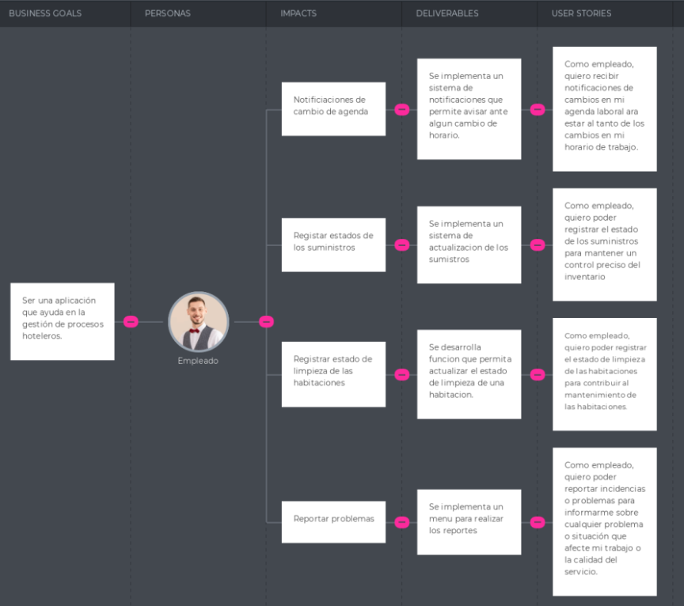

<hr>

# <center>COURSE PROJECT</center>

<p align="center">
    <strong>Universidad Peruana de Ciencias Aplicadas</strong><br>
    </img><br>
    <strong>Ingeniería de Software</strong><br>
    <strong>Aplicaciones Open Source - WX56</strong><br>
    <strong>Profesor: Hugo Allan Mori </strong><br>
    <br>INFORME
</p>

**Nombre del StartUp: Sweet Manager** <br>
**Nombre del Producto: Sweet Manager** <br>
**Relación de Integrantes:** <br>
- Mauricio Abraham Rivo Rojas Sánchez - U202211572
- Aaron Elías Acuña Alarcón - U202211572
- Fernando Brian Salgado Luna - U202212023
- Leonardo Félix Jesus Linares Tejada - U202211168

<center><b>Marzo del 2024</b></center>

<br><br>
# Registro de Versiones del Informe

<table>
    <thead>
        <tr>
            <th>Version</th>
            <th>Fecha</th>
            <th>Participantes</th>
            <th>Observaciones</th>
        </tr>
    </thead>
    <tbody>
        <tr>
            <td rowspan=4 align="center">TB1</td>
            <td rowspan=4 align="center">29/03/2024</td>
            <td align="center">- Mauricio Abraham Rivo Rojas Sánchez</td>
            <td>- Capítulo 5
            </td>
        </tr>
        <tr>
            <td align="center">- Aaron Elías Acuña Alarcon</td>
            <td>- Capítulo 1 <br>
                - Capítulo 2
            </td>
        </tr>
        <tr>
            <td align="center">- Fernando Brian Salgado Luna</td>
            <td>- Capítulo 3
            </td>
        </tr>
        <tr>
            <td align="center">- Leonardo Félix Linares Tejada</td>
            <td>- Capítulo 4
            </td>
        </tr>
        <tr>
            <td rowspan=4 align="center">TP1</td>
            <td rowspan=4 align="center">27/04/2024</td>
            <td align="center">- Mauricio Abraham Rivo Rojas Sánchez</td>
            <td>- Sprint Backlog 2 <br>
                - Sprint Planning 2     
            </td>
        </tr>
        <tr>
            <td align="center">- Aaron Elías Acuña Alarcon</td>
            <td>- Execution Evidence for Sprint Review <br>
                - Team Collaboration Insights during Sprint.
            </td>
        </tr>
        <tr>
            <td align="center">- Fernando Brian Salgado Luna</td>
            <td>- Development Evidence for Sprint Review <br>
                - Testing Suite Evidence for Sprint Review
            </td>
        </tr>
        <tr>
            <td align="center">- Leonardo Félix Linares Tejada</td>
            <td>- Service Documentation Evidence for Sprint Review
            </td>
        </tr>
        <tr>
            <td rowspan=4 align="center">TB2</td>
            <td rowspan=4 align="center">29/05/2024</td>
            <td align="center">- Mauricio Abraham Rivo Rojas Sánchez</td>
            <td>- Sprint Backlog 3 <br>
                - Sprint Planning 3     
            </td>
        </tr>
        <tr>
            <td align="center">- Aaron Elías Acuña Alarcon</td>
            <td>- Execution Evidence for Sprint Review <br>
                - Team Collaboration Insights during Sprint.
            </td>
        </tr>
        <tr>
            <td align="center">- Fernando Brian Salgado Luna</td>
            <td>- Development Evidence for Sprint Review <br>
                - Testing Suite Evidence for Sprint Review
            </td>
        </tr>
        <tr>
            <td align="center">- Leonardo Félix Linares Tejada</td>
            <td>- Service Documentation Evidence for Sprint Review
            </td>
        </tr>
        <tr>
            <td rowspan=4 align="center">TF1</td>
            <td rowspan=4 align="center">26/06/2024</td>
            <td align="center">- Mauricio Abraham Rivo Rojas Sánchez</td>
            <td>- Sprint Backlog 4 <br>
                - Sprint Planning 4     
            </td>
        </tr>
        <tr>
            <td align="center">- Aaron Elías Acuña Alarcon</td>
            <td>- Execution Evidence for Sprint Review <br>
                - Team Collaboration Insights during Sprint.
            </td>
        </tr>
        <tr>
            <td align="center">- Fernando Brian Salgado Luna</td>
            <td>- Development Evidence for Sprint Review <br>
                - Testing Suite Evidence for Sprint Review
            </td>
        </tr>
        <tr>
            <td align="center">- Leonardo Félix Linares Tejada</td>
            <td>- Service Documentation Evidence for Sprint Review
            </td>
        </tr>
    </tbody>
</table>

# Contenido

[Registro de Versiones del Informe](#registro-de-versiones-del-informe)

[Project Report Collaboration Insights](#project-report-collaboration-insights)

[Student Outcome](#student-outcome)

[Capítulo I: Introducción](#capítulo-i-introducción)

[1.1 Startup Profile](#11-startup-profile)  
[1.1.1. Descripción de la Startup](#111-descripción-de-la-startup)  
[1.1.2. Perfiles de integrantes del equipo](#112-perfiles-de-integrantes-del-equipo)

[1.2. Solution Profile](#12-solution-profile)  
[1.2.1 Antecedentes y problemática](#121-antecedentes-y-problemática)  
[1.2.2 Lean UX Process.](#122-lean-ux-process)  
[1.2.2.1. Lean UX Problem Statements.](#1221-lean-ux-problem-statements)  
[1.2.2.2. Lean UX Assumptions.](#1222-lean-ux-assumptions)  
[1.2.2.3. Lean UX Hypothesis Statements.](#1223-lean-ux-hypothesis-statements)  
[1.2.2.4. Lean UX Canvas.](#1224-lean-ux-canvas)

[1.3. Segmentos objetivo.](#13-segmentos-objetivo)

[Capítulo II: Requirements Elicitation & Analysis](#capítulo-ii-requirements-elicitation--analysis)

[2.1. Competidores](#21-competidores)  
[2.1.1. Análisis competitivo]()  
[2.1.2. Estrategias y tácticas frente a competidores](#211-análisis-competitivo)

[2.2. Entrevistas](#22-entrevistas)  
[2.2.1. Diseño de entrevistas](#221-diseño-de-entrevistas)    
[2.2.3. Análisis de entrevistas](#223-análisis-de-entrevistas)

[2.3. Needfinding](#23-needfinding)  
[2.3.1. User Personas](#231-user-personas)  
[2.3.2. User Task Matrix](#232-user-task-matrix)  
[2.3.3. User Journey Mapping](#233-user-journey-mapping)  
[2.3.4. Empathy Mapping](#234-empathy-mapping)  
[2.3.5. As-is Scenario Mapping](#235-as-is-scenario-mapping)

[2.4. Ubiquitous Language](#24-ubiquitous-language)

[Capítulo III: Requirements Specification](#capítulo-iii-requirements-specification)

[3.1. To-Be Scenario Mapping](#31-to-be-scenario-mapping)

[3.2. User Stories](#32-user-stories)

[3.3. Impact Mapping](#33-impact-mapping)

[3.4. Product Backlog](#34-product-backlog)

[Capítulo IV: Product Design](#capítulo-iv-product-design)

[4.1. Style Guidelines](#41-style-guidelines)  
[4.1.1. General Style Guidelines](#411-general-style-guidelines)  
[4.1.2. Web Style Guidelines](#412-web-style-guidelines)

[4.2. Information Architecture](#42-information-architecture)  
[4.2.1. Organization Systems](#421-organization-systems)  
[4.2.2. Labeling Systems](#422-labeling-systems)  
[4.2.3. SEO Tags and Meta Tag](#423-seo-tags-and-meta-tags)  
[4.2.4. Searching Systems](#424-searching-systems)   
[4.2.5. Navigation Systems](#425-navigation-systems)

[4.3. Landing Page UI Design](#43-landing-page-ui-design)   
[4.3.1. Landing Page Wireframe](#431-landing-page-wireframe)  
[4.3.2. Landing Page Mock-up](#432-landing-page-mock-up)

[4.4. Web Applications UX/UI Design](#44-web-applications-uxui-design)  
[4.4.1. Web Applications Wireframes](#441-web-applications-wireframes)  
[4.4.2. Web Applications Wireflow Diagrams](#442-web-applications-wireflow-diagrams)  
[4.4.2. Web Applications Mock-ups](#442-web-applications-mock-ups)   
[4.4.3. Web Applications User Flow Diagrams](#443-web-applications-user-flow-diagrams)

[4.5. Web Applications Prototyping](#45-web-applications-prototyping)

[4.6. Domain-Driven Software Architecture](#46-domain-driven-software-architecture)  
[4.6.1. Software Architecture Context Diagram](#461-software-architecture-context-diagram)  
[4.6.2. Software Architecture Container Diagrams](#462-software-architecture-container-diagrams)  
[4.6.3. Software Architecture Components Diagrams](#463-software-architecture-components-diagrams)

[4.7. Software Object-Oriented Design](#47-software-object-oriented-design)  
[4.7.1. Class Diagrams](#471-class-diagrams)  
[4.7.2. Class Dictionary](#472-class-dictionary)

[4.8. Database Design](#48-database-design)  
[4.8.1. Database Diagram](#481-database-diagram)

[Capítulo V: Product Implementation, Validation & Deploymen](#capítulo-v-product-implementation-validation--deployment)

[5.1. Software Configuration Management](#51-software-configuration-management)  
[5.1.1. Software Development Environment Configuration](#511-software-development-environment-configuration)  
[5.1.2. Source Code Management](#512-source-code-management)  
[5.1.3. Source Code Style Guide & Conventions](#513-source-code-style-guide--conventions)  
[5.1.4. Software Deployment Configuration](#514-software-deployment-configuration)

[5.2. Landing Page, Services & Applications Implementation](#52-landing-page-services--applications-implementation)  
[5.2.1. Sprint 1](#521-sprint-1)  
[5.2.1.1. Sprint Planning 1](#5211-sprint-planning-1)  
[5.2.1.2. Sprint Backlog 1](#5212-sprint-backlog-1)  
[5.2.1.3. Development Evidence for Sprint Review](#5213-development-evidence-for-sprint-review)  
[5.2.1.4. Testing Suite Evidence for Sprint Review](#5214-testing-suite-evidence-for-sprint-review)  
[5.2.1.5. Execution Evidence for Sprint Review](#5215-execution-evidence-for-sprint-review)  
[5.2.1.6. Services Documentation Evidence for Sprint Review](#5216-services-documentation-evidence-for-sprint-review)  
[5.2.1.7. Software Deployment Evidence for Sprint Review](#5217-software-deployment-evidence-for-sprint-review)  
[5.2.1.8. Team Collaboration Insights during Sprint](#5218-team-collaboration-insights-during-sprint)

[5.2.2. Sprint 2](#522-sprint-2)  
[5.2.2.1. Sprint Planning 2](#5221-sprint-planning-2)  
[5.2.2.2. Sprint Backlog 2](#5222-sprint-backlog-2)  
[5.2.2.3. Development Evidence for Sprint Review](#5223-development-evidence-for-sprint-review)  
[5.2.2.4. Testing Suite Evidence for Sprint Review](#5224-testing-suite-evidence-for-sprint-review)  
[5.2.2.5. Execution Evidence for Sprint Review](#5225-execution-evidence-for-sprint-review)  
[5.2.2.6. Services Documentation Evidence for Sprint Review](#5226-services-documentation-evidence-for-sprint-review)  
[5.2.2.7. Software Deployment Evidence for Sprint Review](#5227-software-deployment-evidence-for-sprint-review)  
[5.2.2.8. Team Collaboration Insights during Sprint](#5228-team-collaboration-insights-during-sprint)

[5.2.3. Sprint 3](#523-sprint-3)  
[5.2.3.1. Sprint Planning 3](#5231-sprint-planning-3)  
[5.2.3.2. Sprint Backlog 3](#5232-sprint-backlog-3)  
[5.2.3.3. Development Evidence for Sprint Review](#5233-development-evidence-for-sprint-review)  
[5.2.3.4. Testing Suite Evidence for Sprint Review](#5234-testing-suite-evidence-for-sprint-review)  
[5.2.3.5. Execution Evidence for Sprint Review](#5235-execution-evidence-for-sprint-review)  
[5.2.3.6. Services Documentation Evidence for Sprint Review](#5236-services-documentation-evidence-for-sprint-review)  
[5.2.3.7. Software Deployment Evidence for Sprint Review](#5237-software-deployment-evidence-for-sprint-review)  
[5.2.3.8. Team Collaboration Insights during Sprint](#5238-team-collaboration-insights-during-sprint)

[5.2.4. Sprint 4](#524-sprint-4)  
[5.2.4.1. Sprint Planning 3](#5241-sprint-planning-4)  
[5.2.4.2. Sprint Backlog 3](#5242-sprint-backlog-4)  
[5.2.4.3. Development Evidence for Sprint Review](#5243-development-evidence-for-sprint-review)  
[5.2.4.4. Testing Suite Evidence for Sprint Review](#5244-testing-suite-evidence-for-sprint-review)  
[5.2.4.5. Execution Evidence for Sprint Review](#5245-execution-evidence-for-sprint-review)  
[5.2.4.6. Services Documentation Evidence for Sprint Review](#5246-services-documentation-evidence-for-sprint-review)  
[5.2.4.7. Software Deployment Evidence for Sprint Review](#5247-software-deployment-evidence-for-sprint-review)  
[5.2.4.8. Team Collaboration Insights during Sprint](#5248-team-collaboration-insights-during-sprint)


[5.3. Validation Interviews](#53-validation-interviews)  
[5.3.1. Diseño de Entrevistas](#531-diseño-de-entrevistas)  
[5.3.2. Registro de Entrevistas](#532-registro-de-entrevistas)  
[5.3.3. Evaluaciones según heurísticas](#533-evaluaciones-según-heurísticas)

[5.4. Video About-the-Product](#54-video-about-the-product)

[Conclusiones](#conclusiones)

[Conclusiones y recomendaciones](#conclusiones-y-recomendaciones)

[Video About-the-Team](#video-about-the-team)

[Bibliografía](#bibliografía)

[Anexos](#anexos)

# Project Report Collaboration Insights

En esta sección, regirstraremos los cambios y logros que se completaron en cada entrega del reporte.

## TB1
La entrega TB1 finalizó con éxito y están documentadas en el siguiente repositorio de Github perteneciente a la organización del equipo: https://github.com/Grupo-Trabajo-Final-Open-Source/project-report
Durante el desarrollo del informe se tuvieron en cuenta los siguientes aspeectos: 
- Se redactaron y estructuraron los contenidos asignados a cada miembro utilizando el formato Markdown. Luego, se realizaron commits para garantizar el avance en el repositorio.
- Se crearon los artefactos necesarios utilizando las herramientas recomendadas y se obtuvieron el link de las imagenes a través de la carpeta assets o de una publicación desde Imgur (https://imgur.com/).
- Se llevaron a cabo reuniones para coordinar el avance de los elementos del informe y para informar sobre los progresos del Sprint 1, centrado en la página de inicio (Landing Page).


## TP1
La entrega TP1 finalizó con éxito y están documentadas en el siguiente repositorio de Github perteneciente a la organización del equipo: https://github.com/Grupo-Trabajo-Final-Open-Source/sweetmanager-frontend
Durante el desarrollo del informe se tuvieron en cuenta los siguientes aspectos: 
- Se desarrolló el front-end application con todas nuestras reglas de negocio e investigaciones que hemos realizado.
- Se desplegó el front-end application en Netlify, con el siguiente Link: https://develop--sweetmanager-frontend.netlify.app/


## TB2
La entrega TB2 finalizó con éxito y están documentadas en el siguiente repositorio de Github perteneciente a la organización del equipo: https://github.com/Grupo-Trabajo-Final-Open-Source/sweetmanager-web-services
Durante el desarrollo del informe se tuvieron en cuenta los siguientes aspectos: 
- Se desarrolló el web-services application con todas las restricciones y reglas de negocio que tenemos evaluadas.
- Se desplegó el web-services application. El link del API es: https://sweetmanagerapi.ryzeon.me/swagger-ui/index.html#/


## TF1
La entrega TF1 finalizo con éxito y están documentadas en el siguiente repositorio de Github perteneciente a la organización del equipo: https://github.com/Grupo-Trabajo-Final-Open-Source/sweetmanager-web-services

Durante el desarrollo del informe se tuvieron en cuenta los siguientes aspectos: 
- Se desarrolló el web-services application con todas las restricciones y reglas de negocio que tenemos evaluadas.
- Se implementaron correcciones en el informe, a partir de críticas pasadas.
- Se consumió el web-services application en el front-ent application, cuyo link es el siguiente: https://develop--sweetmanager-frontend.netlify.app/


# Student Outcome

<p>En Ingeniería de Software, el logro de curso contribuye a alcanzar el:</p>

<b>ABET – EAC - Student Outcome 3</b>
**Criterio:** Capacidad de comunicarse efectivamente con un rango de audiencias. 

En el siguiente cuadro se describen las acciones realizadas y enunciados de conclusiones por parte del grupo, que permiten sustentar el haber alcanzado el logro del ABET - EAC - Student Outcome 3.

<table>
    <thead>
        <tr>
            <th><b>Criterio Específico</b></th>
            <th><b>Acciones Realizadas</b></th>
            <th><b>Conclusiones</b></th>
        </tr>
    </thead>
    <tbody>
        <tr>
            <td>
                Comunica oralmente sus ideas y/o resultados con objetividad a público de diferentes especialidades y niveles jerarquicos, en el marco del desarrollo de un proyecto en ingeniería.
            </td>
            <td>
                - Mauricio Rojas<br>
                TB1: En este entregable, he colaborado en el diálogo con mis compañeros de grupo, comunicando ideas con objetividad con diferentes niveles jerárquicos y especialidades, mejorando el diálogo entre nosotros. De esta manera, cumplí con el criterio específico del Student Outcome 3.<br>
                TP1: En este entregable, he colaborado en el desarrollo del front-end web application. Especificamente en el bounded context de Interaction, Payment y Identity Access Management. Adicionalmente, he apoyado a mis compañeros de equipo en la guía del desarrollo de sus bounded context.<br>
                TB2: En este entregable, he colaborado en el desarrollo del objtivo del Sprint 3. En este caso desarrollar por completo el web services de la aplicación Sweet Manager. Adicionalmente, hacer revisión de los features y evaluar bugs y complicaciones. <br>
                TF1: En este entregable, me enfoqué en lograr montar los links de la página web, la API, su unión, y corregir los errores encontrados en el informe, junto al apoyo de mi equipo. <br>
                - Aaron Alarcón <br>
                TB1: En este proyecto, colaboré activamente en las discusiones junto a mis compañeros de equipo, compartiendo ideas de manera imparcial y comunicándome efectivamente con personas que tienen diferentes roles y áreas de experiencia. Así, logré satisfacer el criterio específico del Student Outcome 3.<br>
                TP1: En este proyecto, he colaborado en el desarrollo del front-end web application. Especificamente en el bounded context de Rooms Management. Además, ayude en el desarrollo de los bounded context de mis compañeros, cuando tenian algun problema o malentendido.<br>
                TB2: En este proyecto, he colaborado en el desarrollo del objtivo del Sprint 3. En este caso desarrollar el backend del bounded context de Rooms Management para que funcione en el web services de la aplicación Sweet Manager. <br>
                TF1: En este proyecto, me enfoque en cumplir el objetivo del Sprint 4. En este caso, lograr la implementación de Rooms backend, en el frontend.<br>
                - Fernando Salgado <br>
                TB1: En este proyecto, participé de manera proactiva en las conversaciones con mis compañeros de equipo, intercambiando ideas de manera imparcial y manteniendo una comunicación clara y efectiva con individuos de distintos niveles de jerarquía y áreas de especialización. De este modo, logré cumplir con el criterio específico del Student Outcome 3.<br>
                TP1: En este proyecto, he colaborado en el desarrollo del front-end web application. Especificamente en el bounded context de Profiles y Dashboard. Además de ayudar en cualquier problema que se encuentren mis compañeros.<br>
                TB2: En este entregable, he colaborado en el desarrollo del objtivo del Sprint 3. En este caso desarrollar por completo el backend de los bounded context de Profiles Management y Dashboard para que funcionen en el web services de la aplicación Sweet Manager. <br>
                TF1: En este entregable, colabore en el desarrollo del objetivo del Sprint 4. En este caso, lograr la unión entre las APIs que se encargan de Profiles, Dashboard, Suppliers, Customers y Control Panel, y su contraparte en el frontend.<br>
                - Leonardo Linares <br>
                TB1: Durante la elaboración de este trabajo, contribuí activamente en las discusiones con mis compañeros de grupo, compartiendo opiniones de manera imparcial y estableciendo una comunicación efectiva con personas que poseen distintos niveles de autoridad y áreas de conocimiento. Así, logré cumplir con el criterio establecido en el Student Outcome 3.<br>
                TP1: En este proyecto, me encargue del desarrollo del front-end application. Específicamente en el bounded context de Supplies Managemnt. Además, me asegure de corregir cualquier error que apareciera en el reporte.<br>
                TB2: En este entregable, me encargue de cumplir con el objetivo del Sprint 3. Específicamente, de crear el backend del bounded context de Supplies Management para el web services de nuestra aplicación Sweet Manager. Adiconalemnte, de añadir los elementos del Sprint 3 en el reporte.<br>
                TF1: En este entregable, me encargue de cumplir con el objetivo del Sprint 4. Siendo, el asegurar que funcione mi API de mi Bounded Context Supply, para unirlo al frontend, y corregir todos los aspectos del informe.<br>
            </td>
            <td>
            - Conclusión TB1:
            En conclusión, en este entregable, hemos dialogado en conjunto para analizar los requerimientos y planes para el desarrollo del proyecto de Software. De esta manera, hemos comunicado ideas oralmente con objetividad en diferentes niveles jerárquicos en proyectos de Ingeniería.<br>
            - Conclusión TP1: 
            En conclusión, en este entregable, hemos dialogado en conjunto para poder llegar al objetivo final del sprint, en este caso completar el desarrollo y diseño de todos los bounded context.<br>
            - Conclusión TB2:
            En conclusión, en este entregable, hemos dialogado en conjunto para poder llegar al objetivo final del sprint, en este caso completar el desarrollo, diseño y plinificación de todos los bounded context. En este caso, completar el Web Services.<br>
            - Conclusión TF1:
            En conclusión, en este entregable, hemos dialogado en conjunto para llegar a terminar el último sprint propuesto, que trata de la implementación del backend Web Services desarrollado, con el frontend. Además de aplicar las correcciones para el informe.<br>
            </td>
        </tr>
        <tr>
            <td>
                Comunica en forma escrita ideas y/o resultados con objetividad a público de diferentes especialidades y niveles jerarquicos, en el marco del desarrollo de un proyecto en ingeniería.
            </td>
            <td>
            - Mauricio Rojas<br>
            TB1: Para este trabajo realicé una investigación exhaustiva para recopilar información relevante y actualizada sobre el tema del proyecto, asegurando la precisión y relevancia de los datos presentados en el informe.<br>
            TP1: Para esta entrega, continue mi investigación para obtener la información necesaria para completar el objetivo del Sprint 2, que es desarrollar el front-end de nuestra aplicación. Específicamente, los bounded context de Interaction, Payment y Identity Access Management. Además de ayudar en los bounded context de mis compañeros cuando tenian dudas o problemas sobre el desarrollo de este.<br>
            TB2: Para esta entrega, mantuve mi investigación para completar con el objetivo del Sprint 3, que es finalizar los ultimos toques al front-end, y desarrollar el web services de nuestra aplicación. En mi caso, los backend de los bounded context de Interaction, Payment y Identity Access Management. Además, ayude a mis compañeros si es que surgia alguna duda sobre el proyecto.<br>
            TF1: Para esta entrega, conseguí la información necesaria para cumplir con el Sprint 4, para dar los ultimos toques al backend, y así, poder implementarlo al front-end. En mi caso, teniendo en cuenta los bounded context de Interaction, Payment e IAM. También ayude a mis compañeros en todo aspecto posible.<br>
            - Aaron Alarcón<br>
            TB1: En este trabajo redacté de forma clara y precisa los análisis de requerimientos y planes para el desarrollo del proyecto de Software, demostrando nuestra capacidad para comunicar información técnica de manera efectiva a públicos diversos.<br>
            TP1: Para esta entrega, aprendí y comunique la información necesaria para completar el objetivo del Sprint 2, que es desarrollar el front-end de nuestra aplicación. Específicamente, el bounded context de Rooms Management. Además de ayudar en la revisión de los demás bounded context del equipo.<br>
            TB2: Para esta entrega, seguí con mi aprendizaje para completar con el objetivo del Sprint 3, que es corregir cualquier bug encontrado en el front-end, y desarrollar el web services de nuestra aplicación. En mi caso, el backend del bounded context de Rooms Management. Adicionalmente, supervisar los demás backends desarrollados por el equipo.<br>
            TF1: Para esta entrega, aprendí lo necesario para cumplir con el objetivo del Sprint 4, que es corregir el backend, e implementarlo en el front-end. Finalizando el bounded context de Rooms.<br>
            - Fernando Salgado<br>
            TB1: Para este trabajo me encargué de la redacción de los informes técnicos, asegurando que la comunicación fuera clara y precisa para todos los miembros del equipo y para los diferentes niveles jerárquicos involucrados en el proyecto.<br>
            TP1: Para esta entrega, conseguí la información necesaria para completar el objetivo del Sprint 2, que es desarrollar el front-end de nuestra aplicación. Específicamente, los bounded context de Profiles Management y Dashboard. Además de apoyar, en cualquier aspecto que podía, en el proyecto.<br>
            TB2: Para esta entrega, me encargue de aprender lo necesario para completar con el objetivo del Sprint 3, que es corregir cualquier bug encontrado en el front-end, y desarrollar el web services de nuestra aplicación. En mi caso, los backend de los bounded contexts de Profiles Management y Dashboard. Además de apoyar de en los demás backends desarrollados.<br>
            TF1: Para esta entrega, aprendí lo necesario para cumplir con el Sprint 4, que consiste en corregir cualquier error encontrado en el backend, para poder implementarlo en el front-end. Me encargue de supervisar los bounded contexts de Profiles, Dashboard, Suppliers, Customers y Control Panel. <br>
            - Leonardo Linares<br>
            TB1: En este trabajo desarrollé presentaciones visuales para acompañar los informes, facilitando la comprensión de los resultados por parte de audiencias con diferentes especialidades y niveles jerárquicos.<br>
            TP1: En esta entrega, me encargue de aprender la información necesaria para cumplir con el objetivo del Sprint 2, que es desarrollar el front-end de nuestra aplicación. Específicamente, el bounded context de Supplies Management. Además de supervisar los demás bounded contexts desarrollados para el proyecto.<br>
            TB2: En esta entrega, continue con mi investigación personal, para cumplir con el objetivo del Sprint 3, que es corregir los errores presentes en el front-end, y desarrollar el web services de nuestra aplicación. En mi caso, el backend para el bounded context de Supplies Management. Adicionalmente, ayude en cada aspecto que podía de los bounded context asignados a mis compañeros.<br>
            TF1: En esta entrega, siguiendo con mi invesitgación personal sobre la gestión hotelera, hice correcciones en el informe, y me asegure que mi API para Supplies, funcione correctamente.<br>
            </td>
            <td>
            - Conclusión TB1:
            En conclusión, en este informe escrito, hemos detallado de manera clara y objetiva los resultados  del análisis de requerimientos y planes para el desarrollo del proyecto de Software. Esta comunicación escrita ha sido dirigida a un público de diferentes especialidades y niveles jerárquicos, demostrando nuestra capacidad para transmitir información técnica de manera efectiva en el contexto del desarrollo de proyectos de Ingeniería.<br>
            - Conclusión TP1:
            En conclusión, en este Sprint 2, hemos trabajado en conjunto para el desarrollo de todos los bounded contexty poder llegar al objetivo del Sprint 2. Adicionalmente, hacer los respectivos reviews y retroalimentaciones.<br>
            - Conclusión TB2:
            En conclusión, en este Sprint 3, hemos trabajado en conjunto para el desarrollo detodos los bounded context y features para poder llegar a desarrollar por completo el API de Sweet Manager. Adicionalmnete, hacer review de los features del Sprint 3 y hacer retroalimentaciones.<br>
            - Conclusión TF1:
            En conclusión, en esta ultima entrega, hemos trabajado en conjunto para asegurar el funcionamiento de las APIs desarrolladas, y que funcionen en su unión con el frontend.<br>
            </td>
        </tr>
    </tbody>
</table>

# Capítulo I: Introducción

Este capítulo se centrará en introducir nuestro proyecto, contando con el Startup Profile, y la introducción de los miembros de equipo. El problema que presentamos, junto a nuestra solución, el Lean UX Process y los segmentos objetivos.

## 1.1. Startup Profile

La gestión eficiente de un hotel es fundamental para garantizar una experiencia excepcional para los huéspedes y maximizar los ingresos. Con este fin, presentamos “Sweet Manager”, una aplicación de gestión de procesos hoteleros diseñada para simplificar y optimizar todas las operaciones relacionadas con la administración de un hotel de tal manera que se puede brindar una estancia cómoda y de calidad a los clientes que frecuentan el hotel.

### 1.1.1. Descripción de la Startup

Sweet Manager es una solución integral que abarca desde el seguimiento de ingresos y gastos hasta la gestión de proveedores, inventarios e incluso recursos humanos. Con una interfaz intuitiva y fácil de usar, nuestra aplicación permite a los gerentes y propietarios de hoteles tener un control total sobre todas las facetas de su negocio, desde cualquier lugar y en cualquier momento.

Destacamos las siguientes características:<br><br>
- Gestión de Ingresos y Gastos: Sweet Manager ofrece un seguimiento detallado de todos los ingresos y gastos del hotel, proporcionando informes en tiempo real para una toma de decisiones informada.<br><br>
- Control de Inventarios: Con nuestra aplicación, los hoteles pueden gestionar eficientemente sus inventarios de alimentos, bebidas, artículos de tocador y más, evitando escasez y desperdicios.<br><br>
- Gestión de Proveedores: Facilitamos la comunicación y la gestión de relaciones con los proveedores, permitiendo realizar pedidos de forma rápida y eficiente.<br><br>
- Gestión de Clientes: Mejoramos la organización y control de los clientes que reserven su estancia en el hotel implementando calendarios y agendas para una mejor gestión..

#### 1.1.2. Perfiles de integrantes del equipo

| Miembros del equipo                             | Codigo Estudiante | Carrera                | Conocimientos / Habilidades |
| ----------------------------------------------- | ----------------- | ---------------------- | --------------------------- |
| Mauricio Abraham Rivo Rojas Sánchez	 | U202211572            | Ingenieria de software | C++, C#, javascript y java            |
| Aaron Elías Acuña Alarcón 	 | U202211552            | Ingenieria de software | C++, C#, html, SQL server, etc.             |
| Leonardo Félix Jesús Linares Tejada 	 | U202211168            | Ingenieria de software | C++, C#, html, css, etc.             |
| Fernando Brian Salgado Luna 	 | U20221A322            | Ingenieria de software | C++, java, Kotlin, Go, Spring Boot .etc             |

## 1.2. Solution Profile

Como se mencionó anteriormente, el objetivo de Sweet Manager es ser una aplicación que ayuda en la gestión de procesos hoteleros, específicamente, el seguimiento de ingresos, los proveedores del hotel, los insumos y los recursos disponibles.

Pero, para poder prosperar y ser exitosos, necesitamos reconocer el ambiente competitivo que rodea nuestra aplicación. Por lo tanto, reconoceremos nuestros objetivos y restricciones con las siguientes secciones.

### 1.2.1 Antecedentes y problemática

Para poder competir con nuestros competidores, debemos reconocer los antecedentes y la problemática a solucionar.

**Antecedentes**

En la industria hotelera, la gestión eficiente de procesos es crucial para asegurar la rentabilidad y la satisfacción del cliente. En los últimos años, hemos presenciado una evolución significativa en las expectativas de los huéspedes, impulsada en gran medida por los avances tecnológicos y la rápida expansión del mercado de viajes y alojamiento.

El advenimiento de plataformas de reserva en línea y la creciente demanda de experiencias personalizadas han creado un entorno altamente competitivo para los hoteles de todos los tamaños. Los huéspedes esperan no solo un servicio impecable y comodidades de alta calidad, sino también una experiencia fluida y sin contratiempos desde el momento de la reserva hasta el check-out.

Sin embargo, muchos hoteles se enfrentan a desafíos en la gestión de sus operaciones diarias. Desde el seguimiento preciso de los ingresos y gastos hasta la coordinación del personal y la gestión de inventarios, las tareas administrativas pueden ser abrumadoras y propensas a errores en un entorno dinámico como el de la hotelería. Todos estos problemas se evidencian en el análisis hecho al “Hotel Sol de Grau” de Piura, Perú (Rosas, 2021), con respecto al manejo interno de sus empleados y su incidencia en la gestión financiera.

Además, la falta de herramientas adecuadas de gestión puede llevar a pérdidas económicas, escasez de inventario y, en última instancia, a una experiencia insatisfactoria para los huéspedes (Robayo, Serna y Botera, 2022). La incapacidad para mantener un control efectivo sobre los recursos disponibles y las necesidades cambiantes de los clientes puede tener un impacto negativo en la reputación y la rentabilidad del hotel, especialmente en un mercado donde las reseñas en línea y las recomendaciones boca a boca juegan un papel crucial en la toma de decisiones de los viajeros.

En este contexto, la necesidad de soluciones innovadoras y eficientes para la gestión hotelera es más evidente que nunca. Los hoteles deben adaptarse rápidamente a las demandas del mercado y aprovechar las herramientas tecnológicas disponibles para optimizar sus operaciones y mantenerse competitivos en un entorno en constante cambio.

**Problemática**

Reconoceremos nuestra problemática mediante el método 5W y 2H.

**What:** Sweet Manager es una solución integral diseñada para abordar estas complejidades al proporcionar una plataforma única para la gestión de todos los aspectos de un hotel, desde las finanzas hasta los recursos humanos.

**Who:** Los hoteles y establecimientos de alojamiento en todo el mundo se enfrentan a desafíos constantes en la gestión de sus operaciones diarias. Desde el seguimiento de ingresos hasta la administración de inventarios y la coordinación del personal, la gestión hotelera puede ser compleja y consumir mucho tiempo.

**When:** La problemática puede surgir en cualquier momento dado, puede ser un problema diario, ya sea con problemas en la gestión del personal o administración de inventarios, o un problema que se encuentra a último segundo, como una falta de recursos de comida o agua o luz, etc.

**Where:** La necesidad de una gestión eficiente se extiende a hoteles y establecimientos de alojamiento en todas partes, desde pequeñas posadas hasta grandes cadenas hoteleras, tanto en entornos urbanos como en destinos turísticos.

**Why:** La gestión ineficiente puede llevar a pérdidas financieras, escasez de inventario, falta de coordinación del personal y, en última instancia, a una experiencia insatisfactoria para los huéspedes, lo que afecta la reputación y la rentabilidad del hotel.

**How:** Sweet Manager aborda esta problemática al proporcionar una plataforma centralizada y fácil de usar que permite a los hoteles gestionar todos los aspectos de su negocio de manera eficiente y efectiva.

**How much:** A partir de un modelo de suscripción, Sweet Manager puede llegar a ser una mera herramienta para momentos puntuales, o una herramienta que prácticamente se vuelve esencial para la sobrevivencia y prospección de un hotel.

### 1.2.2 Lean UX Process.

El proceso Lean UX aborda la visión del modelo de negocio que respalda nuestro proyecto, siendo el producto principal nuestro software. A lo largo de este documento y en este capítulo, exploramos varios elementos clave de este proceso.

Comenzamos con los "Problem Statements", que abarcan aspectos como el dominio, los segmentos de clientes, los puntos de dolor, las brechas, la visión/estrategia y el segmento inicial. Siguiendo la metodología Lean UX, también consideramos las "Assumptions Statements" y las "Hypothesis Statements".

#### 1.2.2.1. Lean UX Problem Statements.

**Problem Statement:**

La gestión eficiente de hoteles presenta desafíos significativos, incluyendo la falta de herramientas integradas que aborden todas las facetas del negocio. Los propietarios y gerentes se enfrentan a dificultades para gestionar ingresos, inventarios, proveedores y recursos humanos de manera eficaz, lo que puede resultar en pérdida de ingresos, desperdicio de recursos y experiencias insatisfactorias para los huéspedes.

**Dominio:**

Nos centramos en la industria hotelera. Reconocemos la diversidad y complejidad de este sector, que abarca desde pequeñas posadas hasta grandes cadenas hoteleras, cada una con sus propias necesidades y desafíos únicos en la gestión operativa.

**Segmentos de Clientes:**

Nos dirigimos a los propietarios y gerentes de hoteles de todos los tamaños, al igual que a los empleados y trabajadores de estos. Comprendemos que la gestión hotelera abarca una amplia gama de establecimientos, desde negocios familiares hasta corporaciones internacionales, y nuestra plataforma está diseñada para adaptarse a las necesidades de todos estos segmentos.

**Puntos de Dolor:**

- **Dificultad para realizar un seguimiento preciso de los ingresos y gastos del hotel:** La falta de herramientas adecuadas dificulta la monitorización efectiva de los flujos financieros, lo que puede conducir a decisiones erróneas y pérdida de ingresos.
- **Desafíos en la gestión de inventarios y relaciones con proveedores:** La coordinación de inventarios y la comunicación con proveedores pueden ser complicadas y consumir mucho tiempo, lo que resulta en escasez de suministros o exceso de stock.
- **Complejidades en la gestión del personal y los recursos humanos:** Programación de turnos, seguimiento de la asistencia, evaluaciones de desempeño y gestión de nóminas son solo algunas de las tareas laboriosas que enfrentan los gerentes de hoteles en la gestión de su personal.

**Visión/Estrategia:**

Nuestra visión es proporcionar una solución integral y fácil de usar que aborde todas las necesidades de gestión de un hotel, desde las finanzas hasta los recursos humanos. Nos esforzamos por mejorar la eficiencia operativa y la experiencia del cliente al ofrecer una plataforma centralizada que simplifique y optimice todas las operaciones relacionadas con la administración hotelera.

**Segmento Inicial:**

Nos enfocamos inicialmente en hoteles independientes y pequeñas cadenas hoteleras que buscan soluciones accesibles y eficientes para optimizar sus operaciones. Reconocemos la importancia de ofrecer herramientas asequibles y adaptables para estos segmentos, que a menudo carecen de los recursos de las grandes cadenas pero que tienen una necesidad urgente de mejorar su eficiencia y competitividad en el mercado.


#### 1.2.2.2. Lean UX Assumptions.

En esta sección, veremos los Assumptions que podemos esperar de nuestra solución, desde los Features que debe tener, hasta los Outcomes en nuestra perspectiva y la de los usuarios.

**Features:**

Aqui veremos las herramientas que planeamos implementar en nuestra solución.

- **Seguimiento de Ingresos y Gastos en Tiempo Real:** Herramienta para registrar y analizar los flujos financieros del hotel, proporcionando una visión instantánea de la situación económica.
- **Gestión de Inventarios y Relaciones con Proveedores:** Funcionalidades para mantener un control preciso de los suministros del hotel y facilitar la comunicación con los proveedores para realizar pedidos de manera eficiente.
- **Módulos de Gestión de Personal:** Herramientas para gestionar horarios, nóminas y evaluaciones de desempeño del personal, optimizando así la gestión de recursos humanos.
- **Interfaz Intuitiva y Personalizable:** Una interfaz fácil de usar y adaptable a las necesidades específicas de cada hotel, garantizando una experiencia de usuario fluida y personalizada.
- **Integración con Sistemas de Gestión Hotelera Existentes:** Capacidad para integrarse sin problemas con sistemas de gestión hotelera ya implementados, asegurando una transición suave y una experiencia completa para los usuarios.

**Business Outcomes:**

Aqui nos centraremos en, tanto lo que queremos lograr como solución de la gestión hotelera, como lo que debemos ver para saber que nuestra solución fue exitosa y tuvo el impacto que deseamos.

- **Referente de Soluciones Tecnológicas para la Gestión Hotelera:** Queremos ser reconocidos como uno de los mayores referentes en el mercado de soluciones de software para la gestión hotelera, incorporando constantemente nuevas tecnologías, teniendo un sistema eficiente y productivo para el cliente, con funcionalidades que anticipen, o se adapten, y respondan a sus necesidades.
- **Aumento de la Eficiencia Operativa:** Tras la implementación de Sweet Manager, esperamos una reducción del 30% en el tiempo dedicado a tareas administrativas como la gestión de inventarios y recursos humanos, lo que se traducirá en una mejora tangible en la eficiencia operativa del hotel.
- **Mejora en la Rentabilidad:** Con el uso de Sweet Manager, anticipamos un aumento del 15% en el margen de beneficio neto del hotel dentro de seis meses, gracias a una gestión más efectiva de ingresos y recursos que optimiza los costos operativos y maximiza los ingresos.
- **Mayor Satisfacción del Cliente:** Gracias a Sweet Manager, esperamos ver un aumento de 0.5 puntos en la calificación promedio de satisfacción del cliente en las reseñas en línea, lo que reflejaría la mejora en la experiencia del cliente, gracias a una gestión más eficiente y una atención más personalizada.
- **Retención de los clientes:** Mediante el uso de Sweet Manager, prevemos un aumento del 20% en el número de clientes que realizan reservas repetidas dentro de un año, lo que indica una mayor fidelización gracias a una gestión más efectiva y una experiencia de calidad para los huéspedes.
- **Reducción de costos:** Sabremos que nuestra solución es efectiva, cuando veamos una disminución del 25% en los costos operativos totales del hotel, gracias a la reducción de desperdicios y la optimización de procesos facilitada por la automatización y centralización de la información.

**Users:**

Estos son los usuarios a los que van dirigido nuestra solución.

- **Propietarios y Gerentes de Hoteles:** Buscan soluciones tecnológicas para optimizar la gestión de sus establecimientos y mejorar la rentabilidad.
- **Personal de Trabajo:** Encargado de tareas específicas dentro del hotel, como contabilidad, compras o recursos humanos, quienes buscan herramientas que simplifiquen y agilicen sus responsabilidades diarias.

**User Outcomes & Benefits:**

Estos son los beneficios inmediatos que obtendran los usuarios con nuestra solución.

- **Acceso Conveniente a la Plataforma:** Los usuarios pueden acceder fácilmente a todas las herramientas necesarias para la gestión hotelera desde una sola plataforma.
- **Toma de Decisiones Basada en Datos en Tiempo Real:** La disponibilidad de información actualizada permite a los usuarios tomar decisiones informadas y estratégicas en el momento adecuado.
- **Reducción del estrés y la Carga de Trabajo:** Al automatizar procesos y simplificar tareas, Sweet Manager ayuda a reducir la carga de trabajo y el estrés asociado con la gestión manual de procesos.
- **Facilitación de tareas específicas:** Como la contabilidad, las compras y manejo de los recursos humanos mediante herramientas especializadas.
- **Mayor eficiencia y comunicación:** Al contar con sistemas integrados que agilizan los procesos de las tareas, y contar con un sistema de comunicación directa, se optimiza la coordinación operativa.
- **Transparencia de acciones y mayor confianza:** Generando una experiencia sin contratiempos que satisface a los huéspedes, especialmente en las transacciones y las reservas.

**Business Assumptions:**

Estos son los puntos que podemos asumir de nuestro negocio.

1. Creemos que los hoteles tienen una necesidad creciente de soluciones tecnológicas que mejoren la eficiencia operativa y la rentabilidad del negocio.
2. Esta necesidad puede ser abordada con éxito mediante Sweet Manager, que ofrece una plataforma integral y fácil de usar para la gestión hotelera.
3. El valor principal que nuestros clientes buscan es una solución que simplifique la gestión diaria del hotel y mejore la experiencia del cliente.
4. Prevemos adquirir la mayoría de nuestros clientes a través de estrategias de marketing dirigidas a propietarios y gerentes de hoteles, así como mediante asociaciones con la industria hotelera.
5. Generaremos ingresos principalmente a través de modelos de suscripción y servicios premium, así como mediante la oferta de integraciones con otros sistemas y herramientas adicionales.
6. Si bien enfrentamos la competencia de otras soluciones de gestión hotelera, confiamos en que podemos destacarnos mediante la calidad del servicio, la facilidad de uso y la capacidad de adaptación a las necesidades específicas de cada hotel.
7. El principal riesgo que enfrentamos es no cumplir con las expectativas del cliente en cuanto a funcionalidad, rendimiento y soporte técnico.
8. Planeamos mitigar este riesgo manteniendo un enfoque centrado en el cliente, brindando soporte continuo y actualizaciones regulares de nuestra plataforma para satisfacer las necesidades cambiantes del mercado hotelero.

#### 1.2.2.3. Lean UX Hypothesis Statements.

Usando la información recolectada en los Business Outcomes, Usuarios, Beneficios y Features. Podemos formular nuestras hipótesis, cada una centrada en un Feature a desarrollar.

- **Hipótesis 1:**

Creemos que podemos ser reconocidos como un referente de soluciones tecnológicas para la gestión hotelera, cuando los propietarios y gerentes de hoteles obtengan una experiencia de usuario fluida y personalizada mediante nuestra interfaz intuitiva y personalizable.

- **Hipótesis 2:**

Creemos que obtendremos un aumento en la eficiencia operativa, si los gerentes y propietarios de hoteles obtienen datos financieros precisos y en tiempo real, mediante el seguimiento de ingresos y gastos en tiempo real.

- **Hipótesis 3:**

Creemos que la mejora en la rentabilidad se logrará si los gerentes de hotel obtienen una gestión optimizada de inventarios y proveedores, mediante la función de gestión de inventarios y relaciones con proveedores de nuestra solución.

- **Hipótesis 4:**

Creemos que obtendremos la mayor satisfacción del cliente, si los gerentes de hotel obtienen una administración más eficiente del personal, que podría lograrse mediante nuestros módulos de gestión de personal de nuestra solución.

- **Hipótesis 5:**

Creemos que la retención de los clientes se logrará, si los gerentes y propietarios de hoteles obtienen una mejor experiencia de gestión centralizada y eficiente, mediante la integración nativa con otros sistemas de gestión hotelera existentes.

- **Hipótesis 6:**

Creemos que la reducción de costos operativos, se conseguirá si los gerentes de hotel obtienen una coordinación y control eficiente de inventarios, mediante la función de gestión de inventarios y relaciones con proveedores de nuestra solución.

- **Hipótesis 7:**

Creemos que la expansión de nuestra presencia en el mercado se logrará si los hoteles de diferentes tamaños obtienen una solución adaptable a sus necesidades específicas con la interfaz intuitiva y personalizable.

#### 1.2.2.4. Lean UX Canvas.

A partir de todo lo que hemos investigado, creamos el Lean UX Canvas.

<TABLE BORDER>
	<TR>
		<TD ROWSPAN=2>

**Lean UX Canvas**

</TD>
	    	<TD ROWSPAN=2></TD> <TD>
</TD> 
	</TR>
	<TR>
	</TR>
    <TR>
		<TD ROWSPAN>
        
**1. Business Problem:**
        
La gestión eficiente de hoteles presenta desafíos significativos, incluyendo la falta de herramientas integradas que aborden todas las facetas del negocio. Los propietarios y gerentes se enfrentan a dificultades para gestionar ingresos, inventarios, proveedores y recursos humanos de manera eficaz, lo que puede resultar en pérdida de ingresos, desperdicio de recursos y experiencias insatisfactorias para los huéspedes.
</TD>
	    	<TD ROWSPAN=2>

**5. Solutions**
- **Automatización de Procesos:** Desarrollar herramientas que automatizan tareas repetitivas en la gestión hotelera, como la generación de informes financieros o la programación de mantenimiento.

- **Análisis en tiempo real:** Implementar herramientas que ofrecen a los propietarios y gerentes información clave sobre el desempeño del hotel.

- **Optimizar la gestión de inventarios y recursos humanos:** Mediante herramientas específicas en la aplicación, se logrará optimizar la gestión de los recursos hoteleros.

- **Facilitar la comunicación y colaboración interna del hotel:** Mediante un sistema de notificaciones instantáneas y en tiempo real.
</TD> <TD ROWSPAN=2>

**2. Business Outcomes:**

- **Referente de Soluciones Tecnológicas para la Gestión Hotelera:** Queremos ser reconocidos como uno de los mayores referentes en el mercado de soluciones de software para la gestión hotelera, incorporando constantemente nuevas tecnologías, teniendo un sistema eficiente y productivo para el cliente, con funcionalidades que anticipen, o se adapten, y respondan a sus necesidades.
- **Aumento de la Eficiencia Operativa:** Tras la implementación de Sweet Manager, esperamos una reducción del 30% en el tiempo dedicado a tareas administrativas como la gestión de inventarios y recursos humanos, lo que se traducirá en una mejora tangible en la eficiencia operativa del hotel.
- **Mejora en la Rentabilidad:** Con el uso de Sweet Manager, anticipamos un aumento del 15% en el margen de beneficio neto del hotel dentro de seis meses, gracias a una gestión más efectiva de ingresos y recursos que optimiza los costos operativos y maximiza los ingresos.
- **Mayor Satisfacción del Cliente:** Gracias a Sweet Manager, esperamos ver un aumento de 0.5 puntos en la calificación promedio de satisfacción del cliente en las reseñas en línea, lo que reflejaría la mejora en la experiencia del cliente, gracias a una gestión más eficiente y una atención más personalizada.
- **Retención de los clientes:** Mediante el uso de Sweet Manager, prevemos un aumento del 20% en el número de clientes que realizan reservas repetidas dentro de un año, lo que indica una mayor fidelización gracias a una gestión más efectiva y una experiencia de calidad para los huéspedes.
- **Reducción de costos:** Sabremos que nuestra solución es efectiva, cuando veamos una disminución del 25% en los costos operativos totales del hotel, gracias a la reducción de desperdicios y la optimización de procesos facilitada por la automatización y centralización de la información.
</TD> 
	</TR>
	<TR>
		<TD >
        
**3. Users:**

- **Propietarios y Gerentes de Hoteles:** Buscan soluciones tecnológicas para optimizar la gestión de sus establecimientos y mejorar la rentabilidad.
- **Personal de Trabajo:** Encargado de tareas específicas dentro del hotel, como contabilidad, compras o recursos humanos, quienes buscan herramientas que simplifiquen y agilicen sus responsabilidades diarias.
</TD> 
	</TR>
    <TR>
		<TD ROWSPAN=2>

**6. Hypotheses**
        
- Creemos que podemos ser reconocidos como un referente de soluciones tecnológicas para la gestión hotelera, cuando los propietarios y gerentes de hoteles obtengan una experiencia de usuario fluida y personalizada mediante nuestra interfaz intuitiva y personalizable.

- Creemos que obtendremos un aumento en la eficiencia operativa, si los gerentes y propietarios de hoteles obtienen datos financieros precisos y en tiempo real, mediante el seguimiento de ingresos y gastos en tiempo real.

- Creemos que la mejora en la rentabilidad se logrará si los gerentes de hotel obtienen una gestión optimizada de inventarios y proveedores, mediante la función de gestión de inventarios y relaciones con proveedores de nuestra solución.

- Creemos que obtendremos la mayor satisfacción del cliente, si los gerentes de hotel obtienen una administración más eficiente del personal, que podría lograrse mediante nuestros módulos de gestión de personal de nuestra solución.

- Creemos que la retención de los clientes se logrará, si los gerentes y propietarios de hoteles obtienen una mejor experiencia de gestión centralizada y eficiente, mediante la integración nativa con otros sistemas de gestión hotelera existentes.

- Creemos que la reducción de costos operativos, se conseguirá si los gerentes de hotel obtienen una coordinación y control eficiente de inventarios, mediante la función de gestión de inventarios y relaciones con proveedores de nuestra solución.

- Creemos que la expansión de nuestra presencia en el mercado se logrará si los hoteles de diferentes tamaños obtienen una solución adaptable a sus necesidades específicas con la interfaz intuitiva y personalizable.</TD>

<TD ROWSPAN=2>

**7. What’s the Most Important Thing We Need to Learn First?**

Comprender las necesidades y desafíos específicos de la gestión hotelera: Esto nos permitirá diseñar soluciones que aborden problemas reales y agreguen valor a los propietarios y gerentes de hoteles.

Analizar el panorama competitivo: Es crucial comprender las fortalezas y debilidades de nuestros competidores, así como identificar oportunidades para diferenciarnos en el mercado.

Definir claramente los objetivos y métricas de éxito: Antes de avanzar en el desarrollo, necesitamos establecer objetivos claros y medibles para la plataforma, lo que nos permitirá evaluar su efectividad y realizar ajustes según sea necesario.

</TD> 

<TD>

**4. User Outcomes & Benefits:**

- **Acceso Conveniente a la Plataforma:** Los usuarios pueden acceder fácilmente a todas las herramientas necesarias para la gestión hotelera desde una sola plataforma.
- **Toma de Decisiones Basada en Datos en Tiempo Real:** La disponibilidad de información actualizada permite a los usuarios tomar decisiones informadas y estratégicas en el momento adecuado.
- **Reducción del estrés y la Carga de Trabajo:** Al automatizar procesos y simplificar tareas, Sweet Manager ayuda a reducir la carga de trabajo y el estrés asociado con la gestión manual de procesos.
- **Facilitación de tareas específicas:** Como la contabilidad, las compras y manejo de los recursos humanos mediante herramientas especializadas.
- **Mayor eficiencia y comunicación:** Al contar con sistemas integrados que agilizan los procesos de las tareas, y contar con un sistema de comunicación directa, se optimiza la coordinación operativa.
- **Transparencia de acciones y mayor confianza:** Generando una experiencia sin contratiempos que satisface a los huéspedes, especialmente en las transacciones y las reservas.
</TD> 
	</TR>
	<TR>
		<TD>
        
**8. What's the least amount of work we need to do to learn the next most important thing?**

- **Encuestas de Satisfacción:**

    Realizar encuestas breves entre los usuarios para comprender sus necesidades y expectativas iniciales con respecto a la gestión hotelera y las soluciones tecnológicas existentes.

- **Análisis Competitivo:**

    Realizar una investigación rápida para identificar a los principales competidores en el espacio de la gestión hotelera y comprender las características clave de sus plataformas.

- **Identificación de Métricas Clave:** 

    Determinar las métricas clave que nos permitirán medir el éxito de la plataforma, como la tasa de adopción, la retención de usuarios y la satisfacción del cliente.

- **Prototipo sobre el Concepto:** 

    Crear un prototipo simple o una maqueta de la plataforma para obtener retroalimentación temprana de los usuarios y validar la viabilidad de la idea.

</TD> 
	</TR>
</TABLE>

## 1.3. Segmentos objetivo.

A partir de nuestros usuarios asumidos, logramos encontrar nuestros segmentos objetivos a los que va dirigido nuestra solución.

**Usuarios:**

- **Propietarios y Gerentes de Hoteles:** 

    Se ubican principalmente en áreas urbanas y turísticas de todo el mundo, mayormente en ciudades importantes y destinos turísticos.

    Son altamente dedicados a su negocio, priorizando la eficiencia y rentabilidad de su hotel. También tienen una necesidad de control, buscando herramientas que les permitan tener un control total sobre las facetas de su negocio. Además, mantienen un deseo continuo de mejorar, para asegurar el éxito de su hotel y satisfacer la experiencia del cliente.

    En su mayoría, son adultos de entre 30 y 60 años. El nivel educativo varía, desde propietarios con educación empresarial formal, hasta gerentes con experiencia laboral en la industria hotelera. Por último, pueden tener una amplia experiencia en la gestión hotelera o ser propietarios recientes que buscan optimizar su negocio.

- **Personal de Trabajo:** 

    Se ubican principalmente en áreas urbanas y turísticas de todo el mundo, mayormente en ciudades importantes y destinos turísticos.

    Tienen una fuerte dedicación al servicio al cliente y a proporcionar una experiencia excepcional a los huéspedes. También, son capaces de adaptarse a una variedad de tareas y situaciones en un entorno dinámico y exigente. Además, valoran la colaboración y comunicación efectiva entre ellos y sus superiores, para garantizar el buen funcionamiento del hotel.

    Mayormente son adultos jóvenes a adultos de mediana edad, con amplia experiencia laboral. También, varían en su nivel educativo, desde aquellos con educación secundaria hasta aquellos con formación específica en hospitalidad y turismo. Por último, su experiencia laboral varía, desde aquellos que recién empiezan, hasta aquellos que ya tienen experiencia personal en hoteles.

    Tienen una fuerte dedicación al servicio al cliente y a proporcionar una experiencia excepcional a los huéspedes. También, son capaces de adaptarse a una variedad de tareas y situaciones en un entorno dinámico y exigente. Además, valoran la colaboración y comunicación efectiva entre ellos y sus superiores, para garantizar el buen funcionamiento del hotel.

    Mayormente son adultos jóvenes a adultos de mediana edad, con amplia experiencia laboral. También, varían en su nivel educativo, desde aquellos con educación secundaria hasta aquellos con formación específica en hospitalidad y turismo. Por último, su experiencia laboral varía, desde aquellos que recién empiezan, hasta aquellos que ya tienen experiencia personal en hoteles.

# Capítulo II: Requirements Elicitation & Analysis

En este capítulo, nos centraremos en los requerimientos que necesita cumplir nuestra solución para que sea viable, y los análisis necesarios.

## 2.1. Competidores.

Empezando con los competidores a los que nos enfrentaremos con nuestra solución, su análisis competitivo, junto a nuestras estrategias y tácticas para hacerlas frente.

Facebook (Indirecto): <br>
En Facebook, los usuarios pueden crear perfiles personales, agregar amigos, publicar actualizaciones de estado, compartir fotos y videos, unirse a grupos y páginas, enviar mensajes privados, participar en eventos, jugar juegos y muchas otras actividades. La plataforma se ha expandido enormemente con el tiempo, integrando funciones como Facebook Marketplace (un mercado en línea), Facebook Watch (una plataforma de vídeo), y Facebook Messenger (una aplicación de mensajería instantánea). Lo cual implica que los gerentes de hoteles busquen empresas que brinden soluciones por medio de publicaciones en dicha plataforma.

Mercado Libre (Indirecto): <br>
Siendo la plataforma líder de comercio electrónico de América Latina, Mercado libre ofrece la compra y venta de artículos a precio fijo. La gestión hotelera también entra en la lista puesto que se promocionan venta de sistemas y código fuente que ayudan y facilitan a buen precio la gestión hotelera.

Xafiro (Directo): <br>
Xafiro es un software hotelero, que ahorra tiempo y optimiza la gestión de las operaciones diarias como registro de clientes, reservas, checkin y checkout de habitaciones, venta de productos, entre otros. Dicha empresa es competencia directa porque brinda la solución que ofrecemos como empresa.

Binz 360 (Directo): <br>
Binz 360 es una empresa que se encarga de la gestión de los recursos hoteleros, control de clientes y reportes de ingresos a un buen precio. Dicha empresa es competencia directa porque brinda la solución que planteamos a un precio económico.

### 2.1.1. Análisis competitivo.

| ¿Por qué llevar a cabo este análisis? | Sweet Manager |  Facebook(Indirecto) |  Mercado Libre(Indirecto) |  Xafiro(Directo) |  Binz360(Directo) |
|---------------------------------------|----------|-----------|------------|------------|------------|
| **Overview**                          | Sweet Manager es una aplicación integral de gestión hotelera diseñada para simplificar y optimizar todas las operaciones relacionadas con la administración de un hotel | Plataforma de redes sociales utilizada para la promoción y publicidad de empresas hoteleras. Ofrece una amplia gama de herramientas de marketing y publicidad para llegar a una amplia audiencia. | Plataforma líder de comercio electrónico que ofrece sistemas y códigos fuente relacionados con la gestión hotelera. Proporciona opciones para la compra de productos y servicios que pueden mejorar la eficiencia en la gestión hotelera. | Solución de software hotelero que ahorra tiempo y optimiza la gestión de operaciones diarias. Ofrece características similares a Sweet Manager, como registro de clientes, reservas y gestión de inventarios. | Empresa especializada en la gestión de recursos hoteleros y control de clientes. Ofrece una solución competitiva en términos de gestión hotelera a un precio económico. |
| **Ventaja Competitiva**               | Ofrece una solución integral para la gestión hotelera, desde seguimiento de ingresos y gastos hasta gestión de proveedores y clientes. Flexibilidad y accesibilidad, permitiendo a los administradores gestionar correctamente su negocio desde cualquier lugar y en cualquier momento. | Alcance masivo y capacidad de segmentación precisa del público objetivo. | Amplia variedad de productos y servicios disponibles. | Enfoque específico en la eficiencia de las operaciones diarias del hotel | Precio asequible para hoteles pequeños y medianos |
| **Mercado Objetivo**                  | Gerentes y propietarios de hoteles de todos los tamaños buscan una solución eficiente y completa para la gestión de su negocio. | Hoteles de todos los tamaños que buscan aumentar su visibilidad en línea. | Propietarios de hoteles y gerentes que buscan soluciones de gestión. | Hoteles de mediano a gran tamaño que buscan una solución completa y eficiente. | Hoteles independientes y pequeñas cadenas hoteleras. |
| **Estrategias de marketing**               | Campañas dirigidas en redes sociales y plataformas de anuncios digitales para llegar a la audiencia objetivo. Colaboraciones con asociaciones hoteleras y participación en eventos de la industria para aumentar la visibilidad y credibilidad de la marca. | Publicidad segmentada. Uso de contenido visual para atraer a los usuarios. | Promoción de productos relacionados con la gestión hotelera. Publicidad dirigida a profesionales de la industria hotelera. | Colaboración con asociaciones hoteleras en redes sociales. Campañas en redes sociales dirigidas a gerentes hoteleros. | Enfoque en el ahorro de costos y eficiencia operativa. Uso de marketing de contenidos para educar sobre la importancia de la gestión hotelera. |
| **Productos & Servicios**               | Sweet Manager ofrece una gama de características, incluyendo seguimiento de ingresos y gastos, control de inventarios, gestión de proveedores y clientes. | Plataforma de redes sociales con diversas opciones de publicidad y promoción. Herramientas de análisis para medir el rendimiento de las campañas | Variedad de sistemas y códigos fuente relacionados con la gestión hotelera disponibles para la compra. Opciones de precio variadas para adaptarse a diferentes presupuestos | Ofrece una variedad de características para la gestión hotelera. Precios competitivos y opciones de personalización | Solución completa para la gestión hotelera con énfasis en la relación calidad-precio. Modelo de precios simple y transparente |
| **Precios & Costos**                           | Ofrecido como servicio de suscripción mensual o anual con planes escalables según el tamaño y las necesidades del hotel. | No ofrece un costo. | No ofrece un costo. | Ofrece un precio bastante accesible y competitivo en el mercado. | Ofrece un precio cómodo para las pequeñas y medianas empresas. |
| **Canales de distribución (Web o móvil)**                           | La aplicación está disponible tanto en versiones web como móviles para una mayor accesibilidad. | Principalmente a través de la plataforma de Facebook y sus herramientas de publicidad | Principalmente a través de la plataforma de Mercado Libre. | Principalmente ventas directas y demostraciones en línea | Principalmente ventas directas y a través de socios de distribución. |
| **Fortalezas**                           | Solución eficaz, sencilla y rápida para la gestión hotelera. Interfaz intuitiva y fácil de usar. | Alcance masivo y herramientas de segmentación. | Amplia variedad de productos y servicios. | Solución especializada en operaciones diarias de hoteles. | Precio competitivo. |
| **Debilidades**                           | Posible competencia de grandes empresas en el mercado de gestión hotelera | Menos especialización en la industria hotelera. | Menos enfoque en soluciones específicas para la industria hotelera. | Menos reconocimiento de marca que competidores establecidos. | Menos funcionalidades avanzadas en comparación con competidores más establecidos. |
| **Oportunidades**                           | Crecimiento en la industria hotelera y demanda de soluciones eficientes de gestión. | Uso de datos para personalizar la publicidad. | Expansión a nuevos mercados verticales. | Expansión internacional. | Expansión a nuevos mercados. |
| **Amenazas**                           | Competencia directa de otras empresas de software de gestión hotelera | Posible cambio en algoritmos de redes sociales que afecten la visibilidad de las empresas. | Posible competencia de otros mercados en línea. | Competencia directa de otros proveedores de software. | Posible competencia de proveedores de software con precios aún más bajos |

### 2.1.2. Estrategias y tácticas frente a competidores.

Luego de realizar los análisis respectivos, las principales estrategias contra competidores son:

A) Diferenciación de Servicios:<br>
Estrategia: Identificar y desarrollar características únicas que hagan que Sweet Manager se destaque de otras soluciones en el mercado.<br>
Tácticas:<br>
Realizar investigaciones de mercado para comprender las necesidades y deseos no satisfechos de los clientes en la gestión hotelera.<br>
Desarrollar nuevas funciones o servicios innovadores que aborden estas necesidades de manera efectiva.<br>
Promover activamente estas características diferenciadoras a través de campañas de marketing y comunicación.

B) Calidad Consistente:<br>
Estrategia: Garantizar altos estándares de calidad en todos los aspectos de la aplicación y su servicio.<br>
Tácticas:<br>
Implementar rigurosos controles de calidad durante el desarrollo y la implementación de la aplicación.<br>
Ofrecer capacitación y soporte continuo a los clientes para garantizar un uso óptimo de Sweet Manager.<br>
Recopilar y analizar regularmente retroalimentación de los clientes para identificar áreas de mejora en la calidad y tomar medidas correctivas.

C) Precios Competitivos:<br>
Estrategia: Ofrecer una propuesta de valor atractiva que justifique el precio de Sweet Manager en comparación con otras soluciones en el mercado.<br>
Tácticas:<br>
Realizar análisis de precios comparativos para asegurarse de que los precios de Sweet Manager sean competitivos pero también rentables.<br>
Ofrecer opciones de precios flexibles y personalizadas para adaptarse a las necesidades y presupuestos de diferentes tipos de hoteles.<br>
Destacar el retorno de la inversión (ROI) y los beneficios adicionales que ofrece Sweet Manager para justificar su precio.

D) Atención al Cliente de Calidad:<br>
Estrategia: Priorizar la satisfacción del cliente y establecer relaciones sólidas con los usuarios de Sweet Manager.<br>
Tácticas:<br>
Ofrecer un servicio de atención al cliente receptivo y accesible, con tiempos de respuesta rápidos y soluciones efectivas.<br>
Implementar programas de fidelización y recompensas para premiar la lealtad de los clientes. Fomentar una cultura interna centrada en el cliente y capacitar al equipo para entender y satisfacer las necesidades de los usuarios.

E) Marketing y Publicidad Inteligente:<br>
Estrategia: Utilizar estratégicamente los canales de marketing y publicidad para aumentar la visibilidad y la demanda de Sweet Manager.<br>
Tácticas:<br>
Segmentar el mercado y dirigir las campañas de marketing a los segmentos de clientes más relevantes y receptivos.<br>
Utilizar tácticas de marketing digital como SEO, publicidad en redes sociales y marketing de contenidos para llegar a una audiencia más amplia.<br>
Colaborar con influencers y líderes de opinión en la industria hotelera para respaldar y promocionar Sweet Manager.

F) Alianzas Estratégicas:<br>
Estrategia: Establecer asociaciones con otras empresas o proveedores complementarios para expandir el alcance y la funcionalidad de Sweet Manager.<br>
Tácticas:<br>
Identificar y establecer relaciones con empresas que ofrezcan servicios o productos que puedan integrarse con Sweet Manager de manera sinérgica.<br>
Colaborar en eventos de la industria y programas de co-marketing para aumentar la visibilidad de la aplicación y sus socios.<br>
Negociar acuerdos mutuamente beneficiosos que agreguen valor tanto para Sweet Manager como para sus socios.

G) Innovación Continua:<br>
Estrategia: Mantenerse a la vanguardia de la innovación en tecnología y gestión hotelera para ofrecer constantemente nuevas soluciones y mejoras.<br>
Tácticas:<br>
Establecer un equipo de investigación y desarrollo dedicado a la exploración de nuevas tecnologías y tendencias en la industria hotelera.<br>
Fomentar una cultura de innovación dentro de la empresa, donde se valoren las ideas y se promueva la experimentación.<br>
Mantenerse en contacto cercano con los clientes y la retroalimentación del mercado para identificar oportunidades de mejora y áreas de necesidad no satisfechas.

H) Recopilación de Comentarios y Mejora Continua:<br>
Estrategia: Utilizar comentarios de los clientes y datos analíticos para impulsar mejoras continuas en Sweet Manager.<br>
Tácticas:<br>
Implementar sistemas de retroalimentación y encuestas para recopilar comentarios de los usuarios de manera regular.<br>
Analizar datos y métricas clave para identificar tendencias y áreas de oportunidad para la mejora.<br>
Priorizar y ejecutar cambios basados en la retroalimentación del cliente y las necesidades del mercado, manteniendo un enfoque en la evolución constante de la aplicación.

## 2.2. Entrevistas.

En esta sección, se registrarán las acciones tomadas para la realización de las entrevistas. Empezando con el diseño de estas, anotando las preguntas a contestar, junto al registro de las entrevistas, con un resumen que destaca lo más importante a tener en cuenta, y el analisis de las entrevistas, mediante encuestas que señalan el porcentaje de las respuestas obtenidas.

### 2.2.1. Diseño de entrevistas.

En esta sección, se documentarán las preguntas que se utilizaron en nuestras entrevistas, contiendo las preguntas generales que se comparten entre los segmentos objetivos, y las preguntas que fueron creadas específicamente para cada una.

**Preguntas complementarias generales**
- ¿Qué navegador usas con más frecuencia?<br>
- ¿Qué dispositivo tecnológico usas con más frecuencia?<br>
- ¿Cómo describes tu personalidad?<br>
- ¿Presentas alguna frustración en el trabajo?<br>
- ¿Cuáles son los canales de interacción que usas?<br>
- ¿Qué tipo de ambiente de trabajo te resulta más motivador y productivo?<br>
- ¿Cómo se llama el distrito o lugar de tu residencia?<br>
- ¿Qué objetivos tienes tanto laboralmente como personalmente?

**Entrevistas usuario segmento 1: Gerentes**

- ¿Cuáles son los principales desafíos que enfrentan en la gestión diaria de su hotel?<br>
- ¿Qué características o funcionalidades consideraría más útiles para mejorar la eficiencia de su hotel?<br>
- ¿Cómo gestionan actualmente las reservas de habitaciones y el seguimiento de ingresos y gastos en su hotel?<br>
- ¿Qué herramientas o software utilizan actualmente para la gestión hotelera y qué aspectos les gustaría mejorar de esas herramientas?<br>
- ¿Cuál es su opinión sobre la importancia de la movilidad y la accesibilidad en las soluciones de gestión hotelera?<br>
- ¿Qué aspectos valoran más al evaluar nuevas soluciones de software para su hotel?<br>
- ¿Cómo creen que podríamos mejorar la comunicación y la colaboración entre el personal del hotel y los gerentes?<br>
- ¿Qué desafíos enfrentan al gestionar proveedores y controlar los inventarios en su hotel?<br>
- ¿Cómo gestionan actualmente la satisfacción y las preferencias de los clientes en su hotel?<br>
- ¿Cómo ve conveniente un sistema hotelero dedicado a la gestión de recursos, comunicación con proveedores, seguimiento de ganancias, etc?

**Entrevistas usuario segmento 2: Trabajdores**

- ¿Cuáles son las tareas o procesos diarios que considera más tediosos o que consumen más tiempo en su trabajo?<br>
- ¿Qué herramientas o sistemas utilizan actualmente para realizar su trabajo y qué aspectos les resultan más difíciles o menos eficientes?<br>
- ¿Cómo describiría la interacción y la comunicación entre los diferentes departamentos y miembros del personal del hotel?<br>
- ¿Qué características adicionales le gustaría ver en un sistema de gestión hotelera para facilitar su trabajo diario?<br>
- ¿Cómo se sienten acerca de la adopción de nuevas tecnologías en el lugar de trabajo y cómo creen que podría mejorar su experiencia laboral?<br>
- ¿Qué desafíos enfrenta al gestionar las solicitudes de los huéspedes y asegurarse de que se cumplan sus expectativas durante su estancia?<br>
- ¿Cómo manejan actualmente la capacitación y el desarrollo profesional en su hotel?<br>
- ¿Qué medidas tomarían para mejorar la eficiencia y la colaboración dentro del equipo de trabajo?<br>
- ¿Cómo creen que podríamos simplificar los procesos de registro de huéspedes y check-in/check-out en su hotel?<br>
- ¿Qué herramientas o recursos adicionales les ayudarán a ofrecer un mejor servicio a los huéspedes y mejorar su experiencia general en el hotel?

### 2.2.2. Registro de entrevistas.

A continuación, se registraron todas las entrevistas realizadas para nuestra solución, categorizadas según su segmento objetivo, y con un resumen que destaca las características y críticas realizadas sobre nuestro proyecto.

**Entrevista 1 (Gerentes)**
URL del Vídeo: https://upcedupe-my.sharepoint.com/:v:/g/personal/u202211572_upc_edu_pe/EWoNpMhrd09Epsgdo-svB8EBZ-qMZUkK4yBkZVo10PFfYg?e=4nV4OI&nav=eyJyZWZlcnJhbEluZm8iOnsicmVmZXJyYWxBcHAiOiJTdHJlYW1XZWJBcHAiLCJyZWZlcnJhbFZpZXciOiJTaGFyZURpYWxvZy1MaW5rIiwicmVmZXJyYWxBcHBQbGF0Zm9ybSI6IldlYiIsInJlZmVycmFsTW9kZSI6InZpZXcifX0%3D<br>
Nombre: Carlo Rebagliati<br>
Edad: 45<br>
Sexo: Masculino<br>
Ocupación: Gerente de hotel<br>
Lugar donde vive: Pueblo Libre, Lima<br>
Duración de la entrevista: 0:41 - 12:15<br>
Personalidad: Analítica<br>
<br>  
En resumen, Carlo Rebagliati es un gerente de hotel con un largo camino de experiencia. Él es una persona analítica, comunicativa, empática y profesional que le importan las estadísticas y los beneficios y consecuencias de cada decisión. Nos relata que sus canales de comunicación preferidos son Whatssap, Zoom y cara a cara; adicionalmente, su navegador más frecuente es Google Chrome y usa Smartphone Android. Los principales desafíos que tiene su hotel es el llamado a los turistas desde provincia, ya que la mayoría de la clientela que tiene son turistas. Afortunadamente, está manteniendo a sus trabajadores motivados para que las bajas ventas por temporadas no afecte su rendimiento. Adicionalmente, mencionó que tienen una plataforma web donde los clientes realizan sus reservas, también tienen un área contable y administrativa para el seguimiento de ganancia y recursos. Finalmente, cree necesario una aplicación o software que se concentre en la gestión de un hotel, tanto para la comunicación, administración, gestión y seguimiento de recursos.

**Entrevista 2 (Gerentes)**  
Url del video: https://upcedupe-my.sharepoint.com/:v:/g/personal/u202212023_upc_edu_pe/EXqVq-J7lbJIvFP9SgH1y-EBkvNkUa4pY4BTOz4Mm84ciQ?e=G2alcF&nav=eyJyZWZlcnJhbEluZm8iOnsicmVmZXJyYWxBcHAiOiJTdHJlYW1XZWJBcHAiLCJyZWZlcnJhbFZpZXciOiJTaGFyZURpYWxvZy1MaW5rIiwicmVmZXJyYWxBcHBQbGF0Zm9ybSI6IldlYiIsInJlZmVycmFsTW9kZSI6InZpZXcifX0%3D<br>
Nombre: Rhai Vargas<br>
Edad: 22<br>
Sexo: Masculino<br>
Lugar donde vive: San Isidro, Lima<br>
Ocupacion: Gerente de hotel<br>
Duracion de la entrevista: 0:57 - 4:34<br>
Personalidad: Emotivo<br>
<br>  
En resumen, Rhai Vargas, gerente de hotel, busca mejorar la eficiencia operativa mediante un sistema integrado que facilite la gestión de reservas, ingresos, gastos y la comunicación con el personal y proveedores. Valora la movilidad y accesibilidad en las soluciones de gestión hotelera, así como la comunicación y colaboración entre el personal y los gerentes. Considera importante una solución que mejore la gestión de recursos, comunicación con proveedores y seguimiento de ganancias para mejorar la eficiencia operativa y la calidad del servicio.

**Entrevista 3 (Gerentes)**  
Url del video: https://upcedupe-my.sharepoint.com/:v:/g/personal/u202211552_upc_edu_pe/EYGaGdpG5HhHq5_z_sVx1cYBJyn-N9QEdRzCr1QU6z8xLg?e=QBNPwA&nav=eyJyZWZlcnJhbEluZm8iOnsicmVmZXJyYWxBcHAiOiJTdHJlYW1XZWJBcHAiLCJyZWZlcnJhbFZpZXciOiJTaGFyZURpYWxvZy1MaW5rIiwicmVmZXJyYWxBcHBQbGF0Zm9ybSI6IldlYiIsInJlZmVycmFsTW9kZSI6InZpZXcifX0%3D<br>
Nombre: Mathias Jave<br>
Edad: 22<br>
Sexo: Masculino<br>
Lugar donde vive: San Isidro, Lima<br>
Ocupación: Gerente de hotel<br>
Duración de la entrevista: 0:20 - 15:12<br>
Personalidad: Analítica<br>

<br>  
En resumen, Mathias Jave es un administrador de un hotel que tiene poca trayectoria en el mercado debido a que recién está iniciando con su negocio. En la presente entrevista nos comenta que ha usado software de un tercero para que le facilite la administración de áreas de su negocio. Sin embargo, dicho producto que tiene no satisface por completo las necesidades de administración para su negocio. En vista de dicha situación, se le realizó una serie de preguntas para determinar las implementaciones que necesita llegando a la conclusión que nuestro cliente necesita una aplicación que permita llevar una correcta gestión de productos, proveedores, trabajadores, ingresos y generación de reportes para llevar un control financiero del hotel.

**Entrevista 1 (Empleados)**  
URL del vídeo: https://upcedupe-my.sharepoint.com/:v:/g/personal/u202211572_upc_edu_pe/ETU-GTTcCWBHu-Forxxl_qMBQVx9cQeIX8FuBhpot4CrAA?e=djbgfP&nav=eyJyZWZlcnJhbEluZm8iOnsicmVmZXJyYWxBcHAiOiJTdHJlYW1XZWJBcHAiLCJyZWZlcnJhbFZpZXciOiJTaGFyZURpYWxvZy1MaW5rIiwicmVmZXJyYWxBcHBQbGF0Zm9ybSI6IldlYiIsInJlZmVycmFsTW9kZSI6InZpZXcifX0%3D<br>
Nombre: Juan Guarnizo<br>
Edad: 22<br>
Sexo: Masculino<br>
Lugar donde Vive: Breña, Lima<br>
Ocupación: Trabajador de hotel<br>
Duración de la entrevista: 0:54 -  6:29<br>
Personalidad: Analítica<br>

<br>En resumen, Juan Guarnizo es un trabajador del Hotel Los Delfines con un amateur camino de experiencia. Se presenta como una persona analítica, empática y profesional que busca siempre salir beneficiado de las decisiones. Nos relata que sus canales de comunicación preferidos son cara a cara, WhatsApp y llamadas telefónicas. Adicionalmente, nos menciona que Google Chrome es su navegador frecuente y usa computadora Windows como dispositivo; también menciona los principales desafíos o complejidades al trabajar en los hoteles son la administración y actividades sencillas pero repetitivas. Nos cuenta que la mejor solución ante ello es la automatización de los procesos repetitivos fáciles de hacer como control  de inventario y reservas en línea. Finalmente, sí considera vital la creación de un sistema de gestión hotelero que ayude con estas tareas y organización del hotel.

**Entrevista 2 (Empleados)**  
URL del vídeo: https://upcedupe-my.sharepoint.com/:v:/g/personal/u202211168_upc_edu_pe/EY3l0wTWNupPiBuj2RA_jJMB_qWqdZjiGuhupuv2zcuPZQ?e=zdua3v&nav=eyJyZWZlcnJhbEluZm8iOnsicmVmZXJyYWxBcHAiOiJTdHJlYW1XZWJBcHAiLCJyZWZlcnJhbFZpZXciOiJTaGFyZURpYWxvZy1MaW5rIiwicmVmZXJyYWxBcHBQbGF0Zm9ybSI6IldlYiIsInJlZmVycmFsTW9kZSI6InZpZXcifX0%3D<br>
Nombre:  Maricarmen Tejada<br>
Edad: 58<br>
Sexo: Femenino<br>
Lugar donde Vive: Callao, Lima<br>
Ocupación: Trabajadora de hotel<br>
Duración de la entrevista: 0:41 - 4:07<br>
Personalidad: Emotiva<br>

<br>En resumen, Mariacarmen Tejada es una empleada del hotel con experiencia en gestión y operaciones diarias. Destaca que sus tareas más difíciles son la limpieza de los baños y la cocina, así como la dificultad para mantener el stock de utensilios de limpieza y cocina. Está abierta a la posibilidad de nuevas tecnologías para mejorar la eficiencia laboral y la experiencia del cliente, especialmente a través de sistemas de gestión hotelera más avanzados. Además, promueve una comunicación más directa con la administración para mejorar la eficiencia y la colaboración del equipo. También, la implementación de sistemas de registro en línea y dispositivos móviles para simplificar el proceso de registro y check-in/check-out de los huéspedes. Por último, destaca la necesidad de herramientas adicionales, como sistemas de seguimiento de solicitudes de huéspedes y acceso a información local para mejorar la experiencia general en el hotel.

**Entrevista 3 (Empleados)**  
Url: https://upcedupe-my.sharepoint.com/:v:/g/personal/u202211552_upc_edu_pe/EbF0GC21iIVFujOluyxBX7oB4VaiTzr1n1mEnEG-YIzYuw?e=onAImb&nav=eyJyZWZlcnJhbEluZm8iOnsicmVmZXJyYWxBcHAiOiJTdHJlYW1XZWJBcHAiLCJyZWZlcnJhbFZpZXciOiJTaGFyZURpYWxvZy1MaW5rIiwicmVmZXJyYWxBcHBQbGF0Zm9ybSI6IldlYiIsInJlZmVycmFsTW9kZSI6InZpZXcifX0%3D  <br>
Nombre: Leonardo Ruiz<br>
Edad: 18<br>
Sexo: Masculino<br>
Lugar donde Vive: Monterrico, Lima<br>
Ocupacion: Trabajador de hotel<br>
Duracion de la entrevista: 0:35 - 7:44<br>

<br>En resumen, Leonardo Ruiz es una empleado de hotel con poca experiencia laboral en el mercado, sin embargo, demuestra su incomodidad por la falta de herramientas que requiere para facilitar su trabajo ya sea individual o colectivo, lo cual ayudaria a mejorar la produccion en el hotel.El trabajador menciona que llevar un control de inventario y las asignaciones ayudarian a aliviar su carga laboral y mejorar su produccion en el hotel.

### 2.2.3. Análisis de entrevistas.
Para concluir, en el apartado de análisis, usamos métricas obtenidas a partir de las preguntas que fueron respondidas, y la frecuencia de ciertas respuestas encontradas en las entrevistas.<br>
A continuación, se mostraran las preguntas complementarias generales realizadas, juntos a los porcentajes de las respuestas:<br>
- **Preguntas complementarias generales**

<br>
<br>
<br>

Con las preguntas generales ya respondidas, abrimos paso a las preguntas especializdas a cada segmento objetivo, y los porcentajes de las respuestas:<br>
- **Segmento de gerentes**  
<br>
<br>
- **Segmento de trabajadores**<br>
<br>


## 2.3. Needfinding.

Para tener una mejor idea de cómo será la experiencia del usuario con nuestro producto, utilizaremos las herramientas de User Persona, User Task Matrix, User Journey Mapping, Empathy Mapping y As-is Scenario Mapping.

### 2.3.1. User Personas.

Estas fichas de User Persona se basan en el análisis de entrevistas y en el estudio de la competencia, permitiéndonos crear representaciones detalladas y realistas de nuestros usuarios objetivo. Al desarrollar User Personas, estamos buscando comprender las principales características, necesidades y comportamientos de nuestros usuarios finales como sus objetivos, personalidad, tecnologías preferidas y canales de comunicación preferidos. Estas representaciones nos ayudan a humanizar y visualizar a nuestros usuarios, lo que a su vez guiará el diseño de productos y servicios que satisfagan sus demandas y expectativas.

**Segmento de gerentes:**  


**Segmento de trabajadores:**  


### 2.3.2. User Task Matrix.

| Task                                           | Carlos Rebagliati - Gerente (Frecuencia / Importancia)| Juan Guarnizo - Empleado (Frecuencia / Importancia)|
|-------------------------------------------------|-----------------------------|---------------------------|
| Supervisión del staff                           | Alta / Alta                 | Media / Alta              |
| Programación de limpieza a las habitaciones     | Media / Media               | Alta / Alta               |
| Programación de turnos del personal de limpieza | Alta / Alta                 | Baja / Media              |
| Negociación con proveedores                     | Alta / Alta                 | Baja / Baja               |
| Capacitación del staff                          | Alta / Alta                 | Media / Alta               |
| Evaluación de desempeño del staff              | Media / Alta                | Media / Alta              |
| Cumplimiento de los principios normativos                         | Alta / Alta                 | Alta / Alta               |
| Programación de mantenimientos a los recursos  | Media / Media               | Alta / Alta               |
| Distribución de recursos a las habitaciones    | Baja / Media                 | Alta / Alta               |
| Administración de recursos a las habitaciones | Alta / Alta  | Baja / Baja       |
| Verificación de calidad de los alimentos             | Media / Alta                 | Alta / Media             |
| Administración de permisos de los empleados          | Alta / Alta                 | Baja / Alta               |
| Programación de turnos de trabajo                    | Alta / Alta                 | Baja / Media               |
| Planificación de eventos o actividades en el hotel | Media / Alta             | Baja / Baja               |
| Elaboración de informes financieros y contables      | Alta / Alta                 | Media / Alta              |
| Control de check-in   | Media / Media               | Alta / Alta               |
| Control de check-out del huésped | Media / Media              | Alta / Alta             |
| Respuesta a preguntas y solicitudes de los huéspedes, tanto en persona como por teléfono. | Baja / Baja | Media / Alta |
| Establecimiento de principios normativos | Alta / Alta | Baja / Media |

Tareas con mayor frecuencia e importancia:<br>

- Supervisión del staff: Esta tarea es crucial tanto para el gerente como para el trabajador, ya que garantiza que todas las funciones y roles asignados se cumplan de manera organizada, eficiente y correcta.<br>

- Distribución de recursos a las habitaciones: Esta tarea es de alta importancia para el gerente, ya que implica que el cliente se sienta satisfecho y cumpla con sus expectativas que tiene sobre el hotel. Para el empleado, es tarea de alta importancia porque facilita el control de distribución para cada área del hotel.<br>

- Evaluación de desempeño del staff: Tanto el gerente como el empleado realizan esta tarea con alta frecuencia e importancia, ya que asegura que el hotel tenga trabajadores y administradores que cumplan correctamente con su rol y función de manera rápida y organizada siguiendo los estándares del hotel.<br>

- Cumplimiento normativo: Esta tarea es de alta importancia para el gerente, ya que garantiza tanto para el trabajador como para el gerente de hotel, el cumplimiento normativo implica seguir los procedimientos y políticas establecidos, así como garantizar que todas las actividades se realicen de acuerdo con las normativas y regulaciones aplicables en la industria hotelera.

- Programacion turnos de trabajo: La programación de turnos de trabajo implica coordinar las necesidades del hotel con la disponibilidad del personal para asegurar un funcionamiento eficiente y efectivo del hotel. Tanto los trabajadores como los gerentes de hotel juegan un papel importante en este proceso, cada uno con diferentes niveles de responsabilidad y autoridad.

- Capacitación del staff: La capacitación del personal es fundamental tanto para los trabajadores como para los gerentes de hotel para garantizar que el personal esté bien preparado y tenga las habilidades necesarias para brindar un servicio de calidad a los huéspedes y contribuir al éxito general del hotel.<br>

- Control el check-in y el check-out del huésped: Estas tareas son cruciales para ambos segmentos, ya que permite llevar un control de los huéspedes y asignaciones de habitaciones de tal manera que se facilite la limpieza, mantenimiento en la habitación, distribución y/o asignación de nuevos recursos.

Principales diferencias y coincidencias entre lo realizado por los User Personas:<br>

Diferencias:<br>

- La negociación con proveedores es una tarea de alta importancia para el gerente pero de baja importancia para el personal de trabajo. Esto refleja el nivel de responsabilidad y la naturaleza estratégica de las decisiones que el gerente toma en comparación con las tareas más operativas del empleado.<br>

- La respuesta de preguntas y solicitudes es una tarea de alta importancia para el personal de trabajo, ya que son los que más interactúan con los huéspedes y tienen una mayor facilidad de atender dichas preguntas y solicitudes por parte de los huéspedes. Por otra parte, es de baja importancia para el gerente porque su función va más relacionada a la parte lógica y administrativa del negocio.<br>

Coincidencias:<br>

- Tanto el gerente como el empleado participan en la evaluación del desempeño del personal, lo que destaca la importancia compartida de garantizar un equipo bien capacitado y motivado para brindar un servicio de calidad.

- La elaboración de informes financieros y contables es una tarea de alta importancia para ambos roles, lo que resalta la necesidad de tomar decisiones basadas en datos para mejorar la eficiencia operativa y la experiencia del huésped.

### 2.3.3. User Journey Mapping.

En esta sección se presentarán los User Journey Mapping para cada user persona, detallando las etapas clave de interacción con SweetManager, sus puntos de contacto, y las experiencias y emociones asociadas en cada paso. El objetivo es identificar oportunidades de mejora y optimizar la experiencia del usuario. A continuación se describen los User Journey Maps para cada perfil de usuario:

User Journey Map - Carlos Rebagliati - Gerente (As-Is):<br>
Inicio del día: El gerente comienza el día revisando los informes financieros y preparando la agenda para el día. Se siente estresado por la cantidad de tareas pendientes y la presión para garantizar que todo funcione sin problemas.<br>
Gestión de inventarios: El gerente se enfrenta a la tarea de revisar el inventario y hacer pedidos a los proveedores según sea necesario. Se siente frustrado por la falta de un sistema integrado que facilite esta tarea, y aburrido por la tarea en sí.<br>
Coordinación del personal: El gerente asigna tareas al personal y revisa los horarios. Se siente abrumado por la cantidad de comunicación necesaria para coordinar a todos los empleados.<br>
Comunicación con proveedores: El gerente se comunica con los proveedores para hacer seguimiento de los pedidos y resolver cualquier problema de entrega. Se siente frustrado por la falta de eficiencia en la comunicación.<br>
Análisis de datos y toma de decisiones: El gerente revisa los informes y datos disponibles para tomar decisiones informadas para el hotel. Se siente satisfecho cuando encuentra información útil, pero también preocupado por la falta de herramientas para un análisis más profundo, terminando con una sensación de aceptación por ser la última tarea del día.


User Journey Map - Juan Guarnizo - Empleado (As-Is):<br>
Inicio del turno: El empleado comienza su turno revisando los horarios y recibiendo instrucciones del gerente. Se siente preparado para comenzar su jornada laboral.<br>
Atención al Cliente: El empleado atiende a los clientes, toma pedidos y proporciona asistencia según sea necesario. Se esfuerza por brindar un servicio amable y eficiente, pero termina sintiéndose aburrido o frustrado.<br>
Realización de tareas asignadas: El empleado completa las tareas asignadas, como limpieza de habitaciones, reposición de suministros o preparación de alimentos. Termina furioso cuando no obtiene una idea clara de los suministros y recursos faltantes.<br>
Comunicación con el Equipo: El empleado se comunica con otros miembros del equipo para coordinar actividades o resolver problemas. Se esfuerza por mantener una comunicación clara y efectiva con sus colegas, pero se frustra cuando ocurren malentendidos.<br>
Final del día: El empleado finaliza su turno, informa al gerente sobre cualquier problema o tarea pendiente, y se prepara para partir. Se siente resignado al terminar, especialmente cuando faltan tareas por completar y es a causa de la mala organización de recursos o suministros.


### 2.3.4. Empathy Mapping.

Durante este proceso, recopilamos datos a través de entrevistas, observaciones y análisis de datos existentes, identificamos temas comunes y patrones en las experiencias de los usuarios, y creamos perfiles detallados que personifican a nuestros usuarios objetivo. Luego, utilizamos esta información para diseñar un mapa de empatía visual que organiza las emociones, pensamientos y acciones de los usuarios de manera clara y concisa.

**Segmento gerente:**


En resumen, los gerentes ven a su equipo de trabajadores desmotivados y estresados por la falta de herramientas laborales; también escuchan a su equipo de trabajadores quejándose de las herramientas. Por lo tanto, se preocupan por las consecuencias negativas y por el poco rendimiento de su hotel. Sin embargo, están buscando soluciones para estos problemas de gestión. 

**Segmento trabajador:**


En resumen, los trabajadores ven a sus compañeros de trabajo cansados e incómodos de las herramientas del hotel; también escuchan a sus compañeros quejarse del ineficiente sistema del hotel. Por lo tanto, se sienten desmotivados y pierden rendimiento en su hora laboral. Sin embargo, tienen las esperanzas de tener a la mano un sistema hotelero robusto que los ayude a cumplir sus tareas laborales y recibir buenos comentarios.

### 2.3.5. As-is Scenario Mapping.

En esta seccion se presentan los Scenario Mapping para los segmentos de gerentes y trabajadores, que describen cómo son las experiencias actuales de los usuarios en sus tareas diarias.<br>

El link para ambos Scenario Mapping es: https://lucid.app/lucidspark/6d541f3f-440a-40fc-b3a7-1461742dc65e/edit?viewport_loc=2162%2C964%2C2846%2C1413%2C0_0&invitationId=inv_0e4e4622-20f9-43c4-ac8a-c034737fb585

**Segmento gerente:**


En resumen, Carlos Rebagliati (User Persona) del segmento gerentes, realiza los escenarios mostrados anteriormente. Entre ellos, identificar tareas administrativas de mayor importancia, asignar personal a cada tarea de trabajo, presentar problemas, organizar y asignar eficientemente recursos y resolución de procesos y soluciones. 

**Segmento trabajador:**


En resumen, Juan Perez (User Persona) del segmento trabajadores, realiza los escenarios mostrados anteriormente. Entre ellos, ser asignado a un rol de trabajador por un determinado tiempo, recibir instrucciones sobre sus tareas diarias como limpieza, presentar problemas, identificación de solución y ejecución de soluciones. 

## 2.4. Ubiquitous Language.

En esta sección, nos centraremos en definir el significado de ciertos términos utilizados en el ambiente de nuestra solución en la gestión hotelera.

Check - In :
Definition: Process by which a guest registers their arrival at the hotel, provides the necessary information and receives the key to their room.<br>

Check - Out:
Definition: Process by which a guest completes their stay at the hotel, makes final payment, and returns the room key.<br>

Role:
Definition: Worker role to a specific area.<br>

Staff:
Definition: They represent all hotel workers. They perform various tasks and responsibilities needed for the organization to operate.<br>

Reservation:
Definition: Booking of a room by a guest.<br>

Occupancy:
Definition: The percentage of rooms occupied in the hotel over a specified period of time.<br>

Rate:
Definition: The price per night for a room.<br>

House Rules:
Definition: Policies and regulations of the hotel that guests are required to follow.<br>

Housekeeping:
Definition: The department responsible for cleaning and maintaining the rooms.<br>

Inventory management:
Definition: The process of overseeing and controlling the hotel's supply of goods and materials, ensuring that adequate stock levels are maintained while minimizing costs and waste.<br>

Asset tracking:
Definition: The practice of monitoring and managing the hotel's physical assets, such as furniture, equipment, and fixtures, to ensure they are utilized efficiently and maintained properly.<br>

Task management:
Definition: The organization and tracking of tasks and responsibilities within the hotel, ensuring that deadlines are met and workflows are optimized.

Check - Out:
Definition: Process by which a guest completes their stay at the hotel, makes final payment, and returns the room key.<br>

Role:
Definition: Worker role to a specific area.<br>

Staff:
Definition: They represent all hotel workers. They perform various tasks and responsibilities needed for the organization to operate.<br>

Reservation:
Definition: Booking of a room by a guest.<br>

Occupancy:
Definition: The percentage of rooms occupied in the hotel over a specified period of time.<br>

Rate:
Definition: The price per night for a room.<br>

House Rules:
Definition: Policies and regulations of the hotel that guests are required to follow.<br>

Type of Reservation:
Definition: List of types of reservations.<br>

Housekeeping:
Definition: The department responsible for cleaning and maintaining the rooms.<br>

Inventory management:
Definition: The process of overseeing and controlling the hotel's supply of goods and materials, ensuring that adequate stock levels are maintained while minimizing costs and waste.<br>

Asset tracking:
Definition: The practice of monitoring and managing the hotel's physical assets, such as furniture, equipment, and fixtures, to ensure they are utilized efficiently and maintained properly.<br>

Staff scheduling:
Definition: The process of creating and managing work schedules for hotel employees, taking into account factors such as shift rotations, staffing levels, and employee availability.<br>

Task management:
Definition: The organization and tracking of tasks and responsibilities within the hotel, ensuring that deadlines are met and workflows are optimized.<br>

Resource allocation:
Definition: The allocation and distribution of resources, such as staff, equipment, and funds, to different areas of the hotel based on operational needs and priorities.<br>

Vendor management:
Definition: The coordination and oversight of relationships with external suppliers and vendors, including negotiating contracts, monitoring performance, and ensuring timely delivery of goods and services.<br>

Quality control:
Definition: The process of monitoring and evaluating the quality of products and services offered by the hotel, identifying areas for improvement, and implementing measures to maintain or enhance quality standards.<br>

Cost management:
Definition: The control and optimization of expenses within the hotel, including labor costs, operating expenses, and capital expenditures, to maximize profitability and efficiency.<br>

Data analytics:
Definition: The use of data analysis techniques to extract insights and patterns from hotel operations data, enabling informed decision-making and strategic planning.<br>

Risk management:
Definition: The identification, assessment, and mitigation of risks when resources are limited at any moment.<br>

# Capítulo III: Requirements Specification

En este capítulo, nos centraremos en definir los requerimientos que debemos cumplir para el exito de nuestra solución.

## 3.1. To-Be Scenario Mapping.

En este apartado se presentan los To-Be Scenario Mapping para los segmentos de gerentes y trabajadores, que describen cómo serán las interacciones y tareas de los usuarios con el sistema de gestión hotelera una vez implementado. Estos mapas proporcionan una visión general de las funcionalidades y características que se espera que tenga el producto final, y sirven como guía para el diseño y desarrollo del sistema.

Segmento 1:


El To-Be Scenario Mapping para el segmento Gerentes.

Segmento 2:


El To-Be Scenario Mapping para el segmento Trabajadores.

## 3.2. User Stories.

Redactamos las historias de usuario para el sistema de gestión hotelera basándonos en las necesidades y desafíos identificados en las entrevistas y el análisis de los segmentos de gerentes y trabajadores. Las historias de usuario describen las funcionalidades y características que los usuarios finales esperan del sistema, y se utilizan para guiar el diseño y desarrollo del producto.

| HUX/EPX | Historia de Usuario / Épica                                   | Descripción                                                                                                                                            | Criterios de Aceptación                                                                                                                                                                                                                                                                                                                          | Relacionado con (Epic ID) |
|---------|---------------------------------------------------------------|--------------------------------------------------------------------------------------------------------------------------------------------------------|--------------------------------------------------------------------------------------------------------------------------------------------------------------------------------------------------------------------------------------------------------------------------------------------------------------------------------------------------|---------------------------|
| EP01    | Información del producto                                      | Como visitante del sitio web, quiero obtener información relacionada al producto que se ofrece.                                                        | Dado que el visitante está en la página de inicio <br> Cuando observa la información del producto que se está ofreciendo <br> Entonces obtiene una mejor visión de lo que ofrece la empresa. <br> Y se registra o considera registrarse como usuario.                                                                                                            |                           | 
| HU01    | Obtener información de la empresa                           | Como visitante del sitio web, quiero obtener más información sobre la empresa a cargo del producto.                                                    | Dado que el visitante se encuentra en la sección de nosotros <br> Cuando observa la información relevante sobre la empresa <br> Entonces se interesa en saber más del producto <br> Y se registra como usuario.                                                                                                                    | EP01                      | 
| HU02    | Informarse sobre los beneficios del producto                  | Como visitante del sitio web, quiero informarme sobre los beneficios del producto ofrecido.                                                            | Dado que el visitante se encuentra en la sección de beneficios <br> Cuando observa los beneficios que se ofrecen al usar nuestra solución <br> Entonces se interesa en saber más del producto <br> Y se registra como usuario.                                                 | EP01                      |
| HU03    | Conocer los testimonios de los clientes pasados               | Como visitante, quiero acceder a testimonios de clientes anteriores para evaluar la experiencia y el desempeño del personal.      | Dado que el visitante se encuentra en la sección de testimonios <br> Cuando observa los diferentes testimonios <br> Entonces evalúa la experiencia y desempeño del personal basado en los comentarios de clientes previos. <br> Y considera registrarse como usuario.                                                                               | EP01                      |
| HU04    | Informarse sobre los diferentes planes de precio del producto | Como visitante, quiero conocer los diferentes planes de precio disponibles para el producto ofrecido. | Dado que el visitante se encuentra en la sección de planes de precios disponibles <br> Cuando visualiza los diferentes planes <br> Entonces puede entender las opciones disponibles y tomar decisiones informadas sobre el producto. <br> Y registrarse como usuario.                                                                                                    | EP01                      |
| HU05    | Contactar con la empresa                                      | Como visitante, quiero poder contactarme fácilmente con la empresa desde la página de inicio.                 | Dado que el visitante accede a la sección de contacto <br> Cuando observa los diferentes medios para contactarse con nosotros <br> Entonces se comunicará con nosotros rápidamente.                                                                                       | EP01                      |
| EP02    | Crear cuenta                                                  | Como gerente del hotel/hostal quiero crear una cuenta para utilizar InnControl (aplicación).                                                           | Dado que el usuario se encuentra en el Login <br> Cuando presiona en el botón "SignUp". <br> E ingresa sus datos. <br> Entonces se le presentará con el plan que se acomoda mejor a las necesidades del negocio <br> Y realiza el pago.<Y> Crea su cuenta de gerente.                                                                       | -                         |
| HU01    | Crear cuenta empleado                                         | Como empleado, quiero crear mi cuenta de empleado.                                                                  | Dado que el usuario se encuentra en el login <br> Cuando selecciona que quiere crear una cuenta con el botón signup <br> E ingresa el correo del hotel <br> E ingresa sus datos <br> Entonces se muestra un mensaje de bienvenida <br> Y se muestra el dashboard de empleado.                                                                    | EP02                      |
| HU02    | Crear cuenta gerente                                          | Como gerente, quiero crear mi cuenta de gerente para poder gestionar a mis empleados.                                                | Dado que se paga el plan <br> Cuando el usuario ingrese sus datos de hotel y gerente <br> Entonces se muestra un mensaje de bienvenida <br> Y se muestra el dashboard de gerente.                                                                                                   | EP02                      |
| EP03    | Gestionar Habitaciones del Hotel                              | Como gerente, quiero poder revisar el estado de las habitaciones.                                                                                      | Dado que el usuario está en la ruta de habitaciones <br> Cuando revisa las habitaciones creadas <br> Entonces puede ver los estados, reservaciones, el tipo de habitación, el número de habitación y el cliente <br> Y se muestra también un botón para crear habitaciones. | -                         |
| HU01    | Cambiar estado de habitación                                  | Como gerente, quiero realizar un cambio al estado de la habitación.                                                                                    | Dado que el usuario ingresa a la ruta de Habitaciones<br> Cuando el usuario usa el botón para editar <br> Y selecciona uno de los estados en el popup <br> Entonces el estado de la habitación se actualiza.                                                                                                                                          | EP03                      |
| HU02    | Cambiar estado de habitación (Empleado)                                  | Como empleado, quiero cambiar el estado de la habitación de mi tarea para notificar que ya terminé mi tarea.                                           | Dado que el usuario se encuentra en la ruta de habitaciones. <br> Cuando el usuario termina con su tarea <br> Y usa el botón para cambiar el estado de la habitación.<br> Entonces el estado de la habitación se actualiza.                                                                                                                    | EP03                      |
| HU03    | Crear habitaciones                                            | Como gerente, quiero crear nuevas habitaciones en el sistema.                                                                                          | Dado que el usuario tiene acceso para crear nuevas habitaciones en la ruta habitaciones <br> Cuando ingresa los detalles de la habitación (tipo, número, etc.) <br> Entonces la habitación se añade al sistema y se refleja en la lista de habitaciones.                                                                                                                                 | EP03                      |
| EP04    | Gestionar Inventario                                          | Como gestor, quiero gestionar el inventario del hotel.                                                                                                 | Dado que el usuario tiene acceso al sistema de gestión de inventario en la ruta inventario <br> Cuando revisa los niveles de inventario <br> Entonces puede agregar, actualizar o eliminar elementos del inventario <br> Y se reflejan los cambios en tiempo real.                                                                                                                   | -                         |
| HU01    | Crear ítem                                                    | Como gestor, quiero agregar un nuevo ítem al inventario.                                                                                               | Dado que el usuario tiene acceso para agregar ítems al inventario en la ruta de inventario <br> Cuando ingresa los detalles del nuevo ítem (nombre, cantidad, etc.) <br> Entonces el ítem se añade al inventario.<br> Y se muestra en la ruta Inventario.                                                                                                                                                                          | EP04                      |
| HU02    | Actualizar ítem                                               | Como gestor, quiero actualizar la información de un ítem en el inventario.                                                                             | Dado que el usuario tiene acceso para actualizar la información de un ítem <br> Cuando selecciona el ítem a actualizar <br> Y modifica sus detalles (cantidad, descripción, etc.) <br> Entonces los cambios se reflejan en el inventario.                                                                                                               | EP04                      |
| HU03    | Eliminar ítem                                                 | Como gestor, quiero eliminar un ítem del inventario.                                                                                                   | Dado que el usuario tiene acceso para eliminar ítems del inventario <br> Cuando selecciona el ítem a eliminar <br> Y confirma que quiere eliminar el ítem <br> Entonces el ítem se elimina del inventario.                                                                                                                                                                                                   | EP04                      |
| HU04    | Actualizar ítem                                               | Como empleado, quiero actualizar la información de un ítem en el inventario asignado a mi tarea.                                                       | Dado que el usuario está en Inventario <br> Cuando el usuario selecciona la opción de editar un ítem asignado <br> Y modifica los detalles permitidos (cantidad) <br> Entonces los cambios se reflejan en el sistema de gestión de inventario.                                                                                                                       | EP04                      |
| EP05    | Gestionar Tareas                                              | Como gerente, quiero gestionar las tareas asignadas a los empleados.                                                                                   | Dado que el usuario tiene acceso para crear, editar, finalizar o eliminar tareas <br> Cuando revisa la ruta de tareas <br> Entonces puede realizar las acciones necesarias para gestionarlas.                                                                                                                                                                   | -                         |
| HU01    | Crear tarea                                                   | Como gerente, quiero crear una nueva tarea para asignar a un empleado.                                                                                 | Dado que el usuario se encuentra en la ruta tareas <br> Cuando presiona el botón para agregar una tarea <br> Y define los detalles de la tarea (descripción, empleado asignado, fecha límite, etc.) <br> Entonces la tarea se añade a la ruta de tareas.                                                                                                                                                 | EP05                      |
| HU02    | Finalizar tarea                                               | Como empleado, quiero marcar una tarea como completada una vez que la haya finalizado.                                                                 | Dado que el usuario se encuentra en la ruta tareas <br> Cuando selecciona una tarea <br> Y cambia su estado a "DONE" <br> Entonces se actualiza en la ruta tareas.                                                                                                                                                                                                                                   | EP05                      |
| HU03    | Eliminar tarea                                                | Como gerente, quiero eliminar una tarea que ya no sea necesaria.                                                                                       | Dado que el usuario se encuentra en tareas <br> Cuando selecciona eliminar una tarea <br> Y presiona en el botón para eliminar <br> Entonces la tarea se elimina.                                                                                                                                                                                                                                           | EP05                      |
| HU04    | Asignar/Editar tarea                                          | Como gerente, quiero asignar o editar tareas para distribuir las responsabilidades entre los empleados.                                                | Dado que el usuario tiene acceso para asignar o editar tareas, en la ruta tareas <br> Cuando selecciona una tarea existente o crea una tarea <br> E ing resa o modifica los detalles (empleado asignado, descripción, etc.) <br> Entonces la tarea se actualiza o se asigna a un empleado.                                                                                                                                       | EP05                      |
| HU05    | Actualizar estado de tarea                                     | Como empleado, quiero cambiar el estado de una tarea asignada para reflejar su progreso.                                                               | Dado que el usuario se encuentra en la ruta tareas <br> Cuando selecciona una tarea asignada <br> Y cambia el estado de la tarea a "In Progress" o "Completed" <br> Entonces la tarea se actualiza en la ruta tareas.                                                                                                                                                              | EP05                      |
| HU06    | Asignar tareas                                                | Como gerente, quiero asignar una tarea a un empleado específico.                                                                                       | Dado que el usuario tiene acceso para asignar tareas <br> Cuando selecciona una tarea <br> Y especifica el empleado asignado en el diálogo <br> Entonces la tarea se asigna a un empleado específico y los detalles se actualizan.                                                                                                                                                              | EP05                      |
| EP06    | Gestionar Mensajes                                            | Como gerente, quiero gestionar los mensajes enviados entre empleados.                                                                       | Dado que el usuario tiene acceso para crear, revisar o eliminar mensajes <br> Cuando accede a la ruta de mensajes <br> Entonces puede realizar las acciones necesarias para gestionarlos.                                                                                                                                                                       | -                         |
| HU01    | Enviar mensaje                                                 | Como gerente, quiero enviar un mensaje a un empleado.                                                                                        | Dado que el usuario tiene acceso para redactar mensajes en la ruta mensajes <br> Cuando redacta <br> Y envía el mensaje <br> Entonces el mensaje se envía con éxito. <br> Y se muestra en la ruta de mensajes del remitente.                                                                                                                                                                                                                      | EP06                      |
| HU02    | Enviar mensaje                                                 | Como empleado, quiero enviar un mensaje a un gerente.                                                                                         | Dado que el usuario tiene acceso para redactar mensajes en la ruta mensajes <br> Cuando redacta <br> Y envía el mensaje <br> Entonces el mensaje se envía con éxito. <br> Y se muestra en la ruta de mensajes del remitente.                                                                                                                                                                                                                       | EP06                      |
| HU03    | Revisar mensaje                                               | Como gerente, quiero revisar los mensajes recibidos de empleados.                                                                           | Dado que el usuario tiene acceso para la ruta mensajes <br> Cuando presiona la campana <br> Entonces puede ver los mensajes recibidos y sus detalles filtrados.                                                                                                                                                                                                  | EP06                      |
| HU04    | Revisar mensaje                                               | Como empleado, quiero revisar los mensajes recibidos del gerente.                                                                                      | Dado que el usuario tiene acceso para la ruta mensajes <br> Cuando presiona la campana <br> Entonces puede ver los mensajes recibidos y sus detalles filtrados.                                                                                                                                                                                                  | EP06                      |
| HU05    | Eliminar mensaje                                              | Como gerente, quiero eliminar un mensaje específico de la bandeja de entrada.                                                                          | Dado que el usuario tiene acceso a la ruta mensajes <br> Cuando presiona en eliminar un mensaje <br> Entonces el mensaje se elimina correctamente.                                                                                                                                                                                                                | EP06                      |
| HU06    | Eliminar mensaje                                              | Como empleado, quiero eliminar un mensaje específico de la bandeja de entrada.                                                                          | Dado que el usuario tiene acceso a la ruta mensajes <br> Cuando presiona en eliminar un mensaje <br> Entonces el mensaje se elimina correctamente.                                                                                                                                                                                                                 | EP06                      |
| EP07    | Uso de APIs/BD                                                | Como desarrollador de InnControl, quiero tener acceso a la información de la base de datos para poder realizar las operaciones CRUD.                       | Dado que el usuario necesita realizar operaciones CRUD <br> Cuando realiza la conexión con la Base de datos en MySql <br> Entonces se aplican la conexión y se permite el acceso en la base de datos.                                                                                                                                                                                                              |                           |
| HU01    | API de Servicios de la aplicación                                                     | Como desarrollador, quiero integrar la API en InnControl para procesar transacciones necesarias para el funcionamiento del proyecto.                                                              | Dado que el usuario desea integrar una API <br> Y tiene acceso a la base de datos <br> Cuando ingresa los métodos necesarios para los bounded context <br> Y realiza la conexión con el front end  <br> Entonces se muestra el status code exitoso al realizar operaciones CRUD en el front end.                                                                                                                               | EP07                      |
| HU02    | API de Autenticación                                          | Como desarrollador, quiero utilizar la API de autenticación en InnControl para gestionar el inicio de sesión de usuarios.                                  | Dado que el usuario desea utilizar la API de autenticación <br> Y tiene acceso a su cuenta de empleado <br> Cuando ingresa sus credenciales de inicio de sesión <br> Y se comprueba de que es un usuario registrado <br> Entonces se devuelve un código con el status respectivo. <br> Y Se logra iniciar sesión.                                                                                                                        | EP07                      |
| HU03    | API de Verificación Clave JWT Gerente                                          | Como desarrollador, quiero incorporar la API de verificación JWT en InnControl para asegurar la autenticidad de los usuarios para que ingresen la clave JWT.                                  | Dado que el usuario desea incorporar la API de verificación JWT <br> Y tiene acceso a su cuenta de empleado <br> Cuando ingresa sus credenciales de inicio de sesión <br> Y se realizan las validaciones necesarias <br> Entonces se realiza el proceso de verificación del JWT.                                                                                                                       | EP07                      |
| EP08    | Seguridad de datos                                            | Como gerente, quiero que la información del hotel esté asegurada así como mi cuenta.                                                                   | Dado que el usuario tiene una cuenta <br> Cuando decide ingresar a la aplicación <br> Y se realiza la verificación exitosa JWT. <br> Entonces logra iniciar sesión de manera correcta.                                                                                                                                                                                                 | -                         |
| HU01    | Seguridad de usuario                                         | Como usuario, quiero ingresar a InnControl con mi cuenta.                                                                                  | Dado que el usuario se encuentra en Sign In <br> Cuando ingresa sus datos de login <br> Y se realiza la verificación exitosa de JWT. <br> Entonces logra iniciar sesión de manera correcta. <br> Y se le redirecciona a su dashboard.| EP08                      |

## 3.3. Impact Mapping.

En esta sección se explican y se presentan los Impact Mappings. Creados a partir de los User Personas, incluyendo los Business Goals de cada uno, para obtener los features que ayudarán a producir los Deliverables identificados.




## 3.4. Product Backlog.

A continuación, se mostrara el Product Backlog creado a partir de las Historias de Usuario que conseguimos, ordenadas de menor a mayor Story Points.

| Orden | User Story ID | Título                                                        | Descripción                                                                                                                                     | Story Points (1/2/3/5/8) |
|-------|---------------|---------------------------------------------------------------|-------------------------------------------------------------------------------------------------------------------------------------------------|--------------------------|
| 17    | HU03          | Eliminar ítem                                                  | Como gestor, quiero eliminar un ítem del inventario.                                                                                             | 2                        |
| 21    | HU02          | Finalizar tarea                                                | Como empleado, quiero marcar una tarea como completada una vez que la haya finalizado.                                                           | 2                        |
| 22    | HU03          | Eliminar tarea                                                 | Como gerente, quiero eliminar una tarea que ya no sea necesaria.                                                                                 | 2                        |
| 27    | HU03          | Revisar mensaje                                                | Como gerente, quiero revisar los mensajes recibidos de empleados.                                                                                | 2                        |
| 28    | HU04          | Revisar mensaje                                                | Como empleado, quiero revisar los mensajes recibidos del gerente.                                                                                | 2                        |
| 29    | HU05          | Eliminar mensaje                                               | Como gerente, quiero eliminar un mensaje específico de la bandeja de entrada.                                                                    | 2                        |
| 30    | HU06          | Eliminar mensaje                                               | Como empleado, quiero eliminar un mensaje específico de la bandeja de entrada.                                                                   | 2                        |
| 3     | HU02          | Informarse sobre los beneficios del producto                   | Como visitante del sitio web, quiero informarme sobre los beneficios del producto ofrecido.                                                      | 2                        |
| 5     | HU05          | Contactar con la empresa                                       | Como visitante, quiero poder contactarme fácilmente con la empresa desde la página de inicio.                                                    | 2                        |
| 11    | HU01          | Cambiar estado de habitación                                   | Como gerente, quiero realizar un cambio al estado de la habitación.                                                                              | 2                        |
| 6     | HU04          | Informarse sobre los diferentes planes de precio del producto  | Como visitante, quiero conocer los diferentes planes de precio disponibles para el producto ofrecido.                                             | 3                        |
| 1     | EP01          | Información del producto                                       | Como visitante del sitio web, quiero obtener información relacionada al producto que se ofrece.                                                  | 3                        |
| 2     | HU01          | Obtener información de la empresa                              | Como visitante del sitio web, quiero obtener más información sobre la empresa a cargo del producto.                                              | 3                        |
| 8     | HU01          | Crear cuenta empleado                                          | Como empleado, quiero crear mi cuenta de empleado.                                                                                               | 3                        |
| 9     | HU02          | Crear cuenta gerente                                           | Como gerente, quiero crear mi cuenta de gerente para poder gestionar a mis empleados.                                                            | 3                        |
| 12    | HU02          | Cambiar estado de habitación (Empleado)                        | Como empleado, quiero cambiar el estado de la habitación de mi tarea para notificar que ya terminé mi tarea.                                      | 3                        |
| 15    | HU01          | Crear ítem                                                     | Como gestor, quiero agregar un nuevo ítem al inventario.                                                                                         | 3                        |
| 16    | HU02          | Actualizar ítem                                                | Como gestor, quiero actualizar la información de un ítem en el inventario.                                                                       | 3                        |
| 18    | HU04          | Actualizar ítem (Empleado)                                     | Como empleado, quiero actualizar la información de un ítem en el inventario asignado a mi tarea.                                                 | 3                        |
| 20    | HU01          | Crear tarea                                                    | Como gerente, quiero crear una nueva tarea para asignar a un empleado.                                                                           | 3                        |
| 25    | HU01          | Enviar mensaje                                                 | Como gerente, quiero enviar un mensaje a un empleado.                                                                                             | 3                        |
| 26    | HU02          | Enviar mensaje                                                 | Como empleado, quiero enviar un mensaje a un gerente.                                                                                            | 3                        |
| 32    | HU01          | API de Servicios de la aplicación                              | Como desarrollador, quiero integrar la API en InnControl para procesar transacciones necesarias para el funcionamiento del proyecto.             | 3                        |
| 33    | HU02          | API de Autenticación                                           | Como desarrollador, quiero utilizar la API de autenticación en InnControl para gestionar el inicio de sesión de usuarios.                        | 3                        |
| 36    | HU01          | Seguridad de usuario                                           | Como usuario, quiero ingresar a InnControl con mi cuenta.                                                                                        | 3                        |
| 4     | HU03          | Conocer los testimonios de los clientes pasados                | Como visitante, quiero acceder a testimonios de clientes anteriores para evaluar la experiencia y el desempeño del personal.                      | 5                        |
| 7     | EP02          | Crear cuenta                                                   | Como gerente del hotel/hostal quiero crear una cuenta para utilizar InnControl (aplicación).                                                     | 5                        |
| 10    | EP03          | Gestionar Habitaciones del Hotel                               | Como gerente, quiero poder revisar el estado de las habitaciones.                                                                                | 5                        |
| 13    | HU03          | Crear habitaciones                                             | Como gerente, quiero crear nuevas habitaciones en el sistema.                                                                                    | 5                        |
| 14    | EP04          | Gestionar Inventario                                           | Como gestor, quiero gestionar el inventario del hotel.                                                                                           | 5                        |
| 19    | EP05          | Gestionar Tareas                                               | Como gerente, quiero gestionar las tareas asignadas a los empleados.                                                                             | 5                        |
| 23    | HU04          | Asignar/Editar tarea                                           | Como gerente, quiero asignar o editar tareas para distribuir las responsabilidades entre los empleados.                                          | 5                        |
| 24    | EP06          | Gestionar Mensajes                                             | Como gerente, quiero gestionar los mensajes enviados entre empleados.                                                                            | 5                        |
| 31    | EP07          | Uso de API en Base de Datos                                    | Como desarrollador de InnControl, quiero tener acceso a la información de la base de datos para poder realizar las operaciones CRUD.             | 5                        |
| 34    | HU03          | API de Verificación Clave JWT Gerente                          | Como desarrollador, quiero incorporar la API de verificación JWT en InnControl para asegurar la autenticidad de los usuarios para que ingresen la clave JWT. | 5                        |
| 35    | EP08          | Seguridad de datos                                             | Como gerente, quiero que la información del hotel esté asegurada así como mi cuenta.                                                             | 5                        |

# Capítulo IV: Product Design

En este capítulo, nos centraremos en los aspectos de diseño de nuestra solución. Dividido en Style Guidelines, la Information Architecture, el UI Design de la Landing Page y Web Applications, un Prototype de Web Application, la arquitectura Domain Driven Design del software, el Object Oriented Design y la Database Design.

## 4.1. Style Guidelines.

Aquí definimos las reglas o guías generales a seguir con el aspecto del proyecto, para que pueda ser identificado fácilmente y crear la imagen pública que queremos percibir.

|Aspecto|Directrices|
|----|----|
|Nombre de la aplicación|Sweet Manager|
|Identidad Visual|Colores suaves para representar confianza y fiabilidad en nuestra aplicación.|
|Diseño de la Interfaz|La aplicación será fácil de navegar para usuarios de todas las edades y niveles de experiencia tecnológica. Utiliza una estructura de menú lógica y una navegación clara. Se agrupan las funciones relacionadas para simplificar la experiencia del usuario.|
|Diseño de Usuario|Se prioriza la navegación clara. -Estructura lógica y concisa del menú|
|Contenido|- Información precisa y actualizad. -Control de inventario sobre los insumos y recursos utilizados en el hotel.|
|Funcionalidad|-Seguimiento de ingresos. -Control de insumos y recursos con información actualizada y precisa para evitar errores y pérdidas en la empresa.
|Comunicación|-Funciones de chat y correo electrónico. -Formulario de contacto para comentarios|
|Diseño Responsivo|-Compatibilidad con dispositivos móviles|
|Seguridad y Privacidad| -Protección de datos sensibles. -Cumplimiento de regulaciones de privacidad|
|Actualizaciones y Mantenimiento|-Actualizaciones regulares de las bases de datos principales.  -Respuestas oportunas a problemas informados|
|Promoción|-Estrategias de marketing digital (publicidades en redes sociales).  -Colaboraciones con organizaciones hoteleras|


                                                                    
### 4.1.1. General Style Guidelines.

Estas son las guías generales de estilo a seguir.

|Aspecto|Directrices|
|----|----|
|Tipografía| Se optara por fuentes fáciles de leer y que den un aspecto profesional. Se priorizará la legibilidad del texto antes de que sea llamativo.Debería optarse por una fuente Sans Serif|
|Colores|Los colores deben ser suaves y reconfortantes. |
|Espaciado y diseño|Mantendremos un diseño limpio y agradable a la vista. Para crear una sensación de confiabilidad, se usarán espacios uniformes. Usaremos márgenes amplios para evitar un aspecto amontonado. El espaciado que se utilizará debe ser entre 1.5 y 2 veces el tamaño de la fuente.


### 4.1.2. Web Style Guidelines.

Estas son las guías sobre el estilo web de la solución.

|Aspecto|Directrices|
|----|----| 
|Menú de navegación|El menú de navegación, estará desarrollado para ser adaptado a cualquier tamaño de pantalla, aprovechando cada espacio para mostrar información de manera más visible.|
|Interacción del Ratón|Consideraremos el uso del ratón al desarrollar los elementos interactivos de la web, como menús desplegables, botones, animaciones, para lograr que el usuario tenga una buena experiencia y pueda interactuar de manera agradable con la web.|
|Uso de imágenes|Se usarán imágenes con buena calidad para los distintos tamaños de pantalla, manteniendo la velocidad de carga. Esto ayudará en la experiencia visual del usuario.|
|Cumplimiento de WCAG|Cumpliremos las pautas de accesibilidad al contenido web (WCAG), así el contenido será más accesible para todas las personas, se garantizará que todos puedan entender y utilizar la información que se encuentra en nuestra web.|
|Tipo de letra|El tipo de letra seleccionado fue “Nunito” en estilos. Medium y Normal para mayor legibilidad.|


## 4.2. Information Architecture.
La arquitectura de información que se emplea en Sweet Manager, permitirá a los dueños de hoteles poder organizar los procesos dentro de su empresa. Brinda un seguimiento de ingresos, proveedores, insumos y recursos que hay en un hotel, todo esto con la finalidad de poder facilitar la gestión interna del hotel.
Estará enfocada a las personas involucradas en el sector hotelero.
Luego del registro, las empresas pagarán una suscripción para poder acceder al servicio, en el cual podrán tener un control y seguimiento de los recursos e insumos utilizados, así como también con información actualizada de los proveedores.

### 4.2.1. Organization Systems.

Estos son los sistemas de organización a seguir.

Organización visual de contenidos
Se desarrollará una organización visual del contenido de forma jerárquica en el Landing Page y en las secciones principales de la web para resaltar la información importante, como pueden ser la información y control de los recursos, insumos e información actualizada de los proveedores.

Categorización de contenido
Lista de proveedores: Se organiza alfabéticamente por nombre de la empresa, así se podrá ubicar a un proveedor de una manera más rápida y eficaz.
Insumos: Se creará una lista de los insumos y se hará un control de inventario para poder ver las necesidades de la empresa.
Recursos: Seguimiento de los recursos para poder llevar un mejor control de las finanzas dentro de ellos.


### 4.2.2. Labeling Systems.

Estos son los sistemas de etiquetado a seguir.

Claridad y simplicidad: Se emplea términos no muy complicados, los cuales puedan ser confusos para los usuarios. Sin embargo, habrá algunos términos los cuales serán más técnicos, debido a los insumos que se puedan utilizar en el hotel.
Brevedad: Se emplea la menor cantidad de palabras para facilitar la navegación de los usuarios.
Imágenes ilustrativas: Se emplea imágenes las cuales ayudan a la ubicación de opciones.
Uso de iconos y símbolos: Se emplea iconos para ayudar a que los usuarios puedan reconocer una función. Esto se emplea principalmente en la barra de herramientas.


### 4.2.3. SEO Tags and Meta Tags

Aquí, se presentan las reglas de los Tags a utilizar en la codificación de la página web.

* Titulo: ```<title> El Control Que Necesitas | Software de Gestión de hoteles/hostales </title> ```
* Descripcion: ```<meta name = "description" content = "Controla tus cuartos, empleados e inventario en un solo lugar, La solucion que buscas para cualquier tamaño"/> ```
* Palabras Clave: ```<meta name = "keyword" content = "Gestion Hotel, Hotel Manager Software, software hotelero, software hoteleros mas utilizados, Controlar tu Hotel/Hostal, Gestion Hostal"/> ```

### 4.2.4. Searching Systems.

Aquí se explica los sistemas de búsqueda que se implementaran en nuestro proyecto.

En la página principal se incluirá una opción de búsqueda general, en donde permitirá al usuario acceder a todo el contenido de la aplicación.
Como búsqueda avanzada se implementará en la parte proveedores e insumos, debido a que se permitirá hacer una búsqueda más específica por apartado.


### 4.2.5. Navigation Systems.

Este sería el sistema de navegación que usara el usuario durante su uso del proyecto.

El usuario será bienvenido con una patnalla para registrar su empresa.
Luego que el usuario inicie sesión se mostrará en la parte inferior de la aplicación una barra de herramientas para que el usuario pueda navegar por toda la aplicación de manera satisfactoria.
Te puedes desplazar y navegar por el panel de control donde podrás ver perfil, ver empresa, ver el control del inventario, ir por la pagina de gestión de proovedores y ver la pagina de gestión de clientes, cada pagina con distintas opciones dependiendo de cada una.


## 4.3. Landing Page UI Design.

En esta sección, se mostrarán los diseños de nuestra Landing Page. Divididos entre las secciones simplistas de Wireframe, y el Mock-Up creado para servir como guía visual para la verdadera Landing Page.

### 4.3.1. Landing Page Wireframe.

[Link en Figma]https://www.figma.com/file/ERf7rfFpjceh2VV5VSQBba/Open-Souce-TF?type=design&node-id=0%3A1&mode=design&t=13Ohu9mZPHPvS0iT-1


### 4.3.2. Landing Page Mock-up.

[Link en Figma] https://www.figma.com/file/ERf7rfFpjceh2VV5VSQBba/Open-Souce-TF?type=design&node-id=0%3A1&mode=design&t=13Ohu9mZPHPvS0iT-1


## 4.4. Web Applications UX/UI Design.

En esta sección, se mostrarán los diseños de nuestras Web Applications. Divididos entre las secciones simplistas de Wireframe, y el Mock-Up creado para servir como guía visual para las versiones reales. Ademas de contar con las guías visuales sobre la experiencia del usuario en la solución.

### 4.4.1. Web Applications Wireframes.

[Link en Figma] https://www.figma.com/file/ERf7rfFpjceh2VV5VSQBba/Open-Souce-TF?type=design&node-id=0%3A1&mode=design&t=13Ohu9mZPHPvS0iT-1


### 4.4.2. Web Applications Wireflow Diagrams.

[Link en Figma] https://lucid.app/lucidchart/ed4de18f-9ca6-42e9-9013-44066a70608f/edit?viewport_loc=-52639%2C-16147%2C6817%2C3453%2C0_0&invitationId=inv_0619e526-a49e-4732-8a91-a1af4008eb73


### 4.4.2. Web Applications Mock-ups.


### 4.4.3. Web Applications User Flow Diagrams.

[Link en Figma] https://www.figma.com/file/ERf7rfFpjceh2VV5VSQBba/Open-Souce-TF?type=design&node-id=0%3A1&mode=design&t=13Ohu9mZPHPvS0iT-1


### 4.4.4. Web Applications User Flow Diagrams


## 4.5. Web Applications Prototyping.

Para crear los modelos de la interfaz de usuario, se aplicaron una serie de principios importante:
Consistencia en el Diseño: Se mantuvo una coherencia visual en todo el diseño de la interfaz de usuario, utilizando un estilo y una paleta de colores uniformes. Esto ayuda a crear una experiencia unificada y familiar para los usuarios, facilitando la navegación y la comprensión de la aplicación.
Destacar la Información Importante: Se enfocó en mostrar únicamente la información más relevante para los usuarios del segmento objetivo, evitando la saturación de información innecesaria.
Facilidad de Uso y Claridad: Se buscó que la navegación en la aplicación fuera intuitiva y comprensible, de manera que los usuarios puedan entender completamente cómo utilizar las funciones de la aplicación, como en la visualización de reportes estadísticos.


[Link en Figma] (https://www.figma.com/proto/ERf7rfFpjceh2VV5VSQBba/Open-Souce-TF?type=design&node-id=64-3152&t=mjbZzkRUwrqCJRNJ-1&scaling=contain&page-id=64%3A1061&mode=design)


## 4.6. Domain-Driven Software Architecture.

En esta sección, se mostrarán los múltiples diagramas creados para la arquitectura de nuestro software, específicamente, contamos con el Context Diagram, los Container Diagrams y los Components Diagrams.

### 4.6.1. Software Architecture Context Diagram.

1. System Context Diagram: Diagrama que muestra la relacion del aplicativo con los usuarios
   se incluyen servicios externos (si hay pocos bounded context se incluyen ahi)

2. Bounded Context Map: Muestra la relacion entre bounded contexts (los bounded context son como una burbuja que
   encapsula palabras clave en los procesos para poder
   diferenciarlos [Ej. Bounded context enfocado en las ventas(ventas), otro en revisar el stock(gestion) y otro enfocado en los proveedores (suministros)])
   Se hace como un brainstorm y se ve en que pueden conectarse o
   comunicarse [se usa un circulo entre conexiones lineales (upstream o downstream) para definir comunicacion, algunos context se pueden integrar para representar por ejemplo un share model por database, tambien se mencionan los (third party context para definir los restful apis)]

### 4.6.2. Software Architecture Container Diagrams.

1. Bounded Context Deployable / Container Diagrams. Sirve para entender como funciona y el proceso, Se especifican DB's,
   indexers, Search engine, las Apis que usen los bounded context y se conectan por flechas, las cuales tienen como
   objetivo explicar la direcion y relacion junto a que se esta enviando/comunicando (TCP)

### 4.6.3. Software Architecture Components Diagrams.


1. Component diagrams: Estos van a mostrar las ordenes, procesos, mensajes y componentes utilizados en el uso del
   aplicativo, claro se deben hacer diferentes de estos para cada bounded o USER GOALS

## 4.7. Software Object-Oriented Design.

En esta sección, se mostrará todo lo relacionado con la representación de los objetos utilizados en el software de la solución. Comenzando con el Class Diagram, y sus partes divididas, y terminando con un diccionario que explica lo que representa cada atributo de cada una de las clases.

### 4.7.1. Class Diagrams.


[Link en LucidChart] https://lucid.app/lucidchart/508e0d8a-92a2-4de3-8626-6b782938b13e/edit?beaconFlowId=47FEEC1E8EBED814&page=0_0&invitationId=inv_fc67e0b3-63d7-49e2-bbf1-50acd5491bd9


### 4.7.2. Class Dictionary.

### Class purchase_request_providers

| Atributo                              | Tipo   | Descripción                                 |
|---------------------------------------|--------|---------------------------------------------|
| id_purchase_request_provider          | int    | ID de la solicitud de compra proveedor      |
| workers_id_worker                     | int    | ID del trabajador asociado                 |
| providers_id_provider                 | int    | ID del proveedor asociado                  |
| name_product_purchase_request_provid  | string| Nombre del producto                        |
| price_product_purchase_request_provi  | float  | Precio unitario del producto               |
| quantity_product_purchase_request_pr  | int    | Cantidad del producto                      |
| total_price_purchase_request_provider| float  | Precio total de la solicitud de compra proveedor|

### Class support_request

| Atributo                   | Tipo    | Descripción                              |
|----------------------------|---------|------------------------------------------|
| id_support_request         | int     | ID de la solicitud de soporte            |
| providers_id_provider      | int     | ID del proveedor asociado a la solicitud |
| workers_id_worker          | int     | ID del trabajador asociado a la solicitud|
| date_support_request       | datetime| Fecha y hora de la solicitud de soporte  |
| description_support_req    | string | Descripción de la solicitud de soporte   |
| state_support_request      | string | Estado actual de la solicitud de soporte |

### Class roles

| Atributo         | Tipo | Descripción        |
|------------------|------|--------------------|
| id_role          | int  | ID único del rol   |
| workers_area_id_worker_a | int  | ID del área de trabajo del trabajador asociado |
| role             | varchar | Nombre del rol    |

### Class assignments_workers

| Atributo                   | Tipo | Descripción         |
|----------------------------|------|---------------------|
| id_assignment_worker       | int  | ID único de la asignación del trabajador |
| roles_id_role             | int  | ID del rol asociado a la asignación |
| workers_id_workers        | int  | ID del trabajador asociado a la asignación |
| start_date_assignment_wo | date | Fecha de inicio de la asignación |
| final_date_assignment_wor | date | Fecha de finalización de la asignación |
| state_assignment_worker   | string | Estado de la asignación del trabajador (activo/inactivo) |

### Class products

| Atributo                  | Tipo | Descripción       |
|---------------------------|------|-------------------|
| id_product                | int  | ID único del producto |
| providers_id_provider     | int  | ID del proveedor del producto |
| type_products_id_type_pro| int  | ID del tipo de producto |
| name_product              | string | Nombre del producto |
| registration_date_product | date | Fecha de registro del producto |
| due_date_product          | date | Fecha de vencimiento del producto |
| stock_product             | int  | Cantidad en stock del producto |
| price_product             | float | Precio del producto |
| state_product             | string | Estado del producto (activo/inactivo) |

### Class type_products

| Atributo           | Tipo | Descripción          |
|--------------------|------|----------------------|
| id_type_produ      | int  | ID único del tipo de producto |
| type_product       | string | Tipo de producto    |

### Class providers

| Atributo              | Tipo | Descripción      |
|-----------------------|------|------------------|
| id_provider           | int  | ID único del proveedor |
| companies_id_company | int  | ID de la empresa del proveedor |
| name_provider         | string | Nombre del proveedor |
| surname_provider      | string | Apellido del proveedor |
| age_provider          | int  | Edad del proveedor |
| genre_provider        | string | Género del proveedor |
| phone_provider        | int  | Teléfono del proveedor |
| email_provider        | string | Correo electrónico del proveedor |
| state_provider        | string | Estado del proveedor |
| type_providers_id_type_prov | int | ID del tipo de proveedor |

### Class type_providers

| Atributo           | Tipo | Descripción         |
|--------------------|------|---------------------|
| id_type_provid     | int  | ID único del tipo de proveedor |
| type_provider      | string | Tipo de proveedor  |

### Class workers_area

| Atributo          | Tipo | Descripción          |
|-------------------|------|----------------------|
| id_worker_area    | int  | ID único del área de trabajo del trabajador |
| worker_area       | string | Área de trabajo del trabajador |
| state_worker_a    | string | Estado del área de trabajo |

### Class workers_access

| Atributo            | Tipo | Descripción          |
|---------------------|------|----------------------|
| workers_id_worker  | int  | ID del trabajador    |
| code_worker_acce   | string | Código de acceso del trabajador |
| state_worker_acce  | string | Estado del acceso del trabajador |

### Class workers

| Atributo          | Tipo | Descripción         |
|-------------------|------|---------------------|
| id_worker         | int  | ID único del trabajador |
| name_worker       | string | Nombre del trabajador |
| surname_work      | string | Apellido del trabajador |
| age_worker        | int  | Edad del trabajador |
| genre_worker      | string | Género del trabajador |
| address_worker   | string | Dirección del trabajador |
| phone_worker      | int  | Teléfono del trabajador |
| email_worker      | string | Correo electrónico del trabajador |
| state_worker      | string | Estado del trabajador |

### Class workers_contracts

| Atributo                     | Tipo | Descripción          |
|------------------------------|------|----------------------|
| id_worker_contract           | int  | ID único del contrato del trabajador |
| workers_id_worker           | int  | ID del trabajador    |
| start_date_worker_contract  | date | Fecha de inicio del contrato |
| final_date_worker_contract  | date | Fecha de finalización del contrato |
| salary_worker_contract      | float | Salario del trabajador |
| state_worker_contract       | string | Estado del contrato del trabajador |

### Class companies

| Atributo                | Tipo | Descripción          |
|-------------------------|------|----------------------|
| id_company              | int  | ID único de la empresa |
| ruc_company             | string | RUC de la empresa   |
| commercial_name_compa  | string | Nombre comercial de la empresa |
| date_origin_company     | date | Fecha de origen de la empresa |
| address_company         | string | Dirección de la empresa |
| state_company           | string | Estado de la empresa |

### Class resources

| Atributo                 | Tipo | Descripción          |
|--------------------------|------|----------------------|
| id_resource              | int  | ID único del recurso |
| type_resources_id_type_resou | int | ID del tipo de recurso |
| workers_id_worker        | int  | ID del trabajador responsable |
| name_resource            | string | Nombre del recurso  |
| registration_date_resource | date | Fecha de registro del recurso |
| due_date_resource        | date | Fecha de vencimiento del recurso |
| stock_resource           | int  | Cantidad en stock del recurso |
| price_resource           | float | Precio del recurso   |
| state_resource           | string | Estado del recurso  |

### Class type_resources

| Atributo               | Tipo | Descripción         |
|------------------------|------|---------------------|
| id_type_resour         | int  | ID único del tipo de recurso |
| type_resource          | string | Tipo de recurso    |

### Class bedrooms

| Atributo                  | Tipo | Descripción       |
|---------------------------|------|-------------------|
| id_bedroom                | int  | ID único de la habitación |
| workers_id_worker         | int  | ID del trabajador responsable |
| type_bedreooms_id_type_bedr | int | ID del tipo de habitación |
| total_double_bed_bedrooms | int  | Cantidad total de camas dobles |
| total_beds                | int  | Cantidad total de camas |
| total_bathroom_bedrooms   | int  | Cantidad total de baños en la habitación |
| total_television_bedrooms | int  | Cantidad total de televisores en la habitación |
| state_bedrooms            | string | Estado de la habitación |

### Class type_bedrooms

| Atributo              | Tipo | Descripción          |
|-----------------------|------|----------------------|
| id_type_bedroom       | int  | ID único del tipo de habitación |
| type_bedroom          | string | Tipo de habitación  |
| description_type_bedro| string | Descripción del tipo de habitación |
| price_type_bedroom    | float | Precio del tipo de habitación |
| state_type_bedroom    | string | Estado del tipo de habitación |

### Class type_memberships

| Atributo               | Tipo | Descripción          |
|------------------------|------|----------------------|
| id_type_membership     | int  | ID único del tipo de membresía |
| type_membership        | string | Tipo de membresía    |
| description_type_members | string | Descripción del tipo de membresía |
| price_type_membership | float | Precio del tipo de membresía |

### Class admins_access

| Atributo           | Tipo | Descripción           |
|--------------------|------|-----------------------|
| admins_id_admin    | int  | ID del administrador  |
| code_admin_acce    | string | Código de acceso del administrador |
| state_admin_acce   | string | Estado del acceso del administrador |

### Class repository_services

| Atributo                   | Tipo | Descripción            |
|----------------------------|------|------------------------|
| id_repository_service      | int  | ID único del servicio de repositorio |
| title_respository_serv     | string | Título del servicio de repositorio |
| value_repository_ser       | string | Valor del servicio de repositorio |

### Class bookings

| Atributo                | Tipo | Descripción             |
|-------------------------|------|-------------------------|
| id_booking              | int  | ID único de la reserva  |
| clients_id_client       | int  | ID del cliente          |
| bedrooms_id_bedro       | int  | ID de la habitación     |
| start_date_booking      | date | Fecha de inicio de la reserva |
| final_date_booking      | date | Fecha de finalización de la reserva |
| total_price_booking     | float| Precio total de la reserva |
| state_booking           | string | Estado de la reserva  |

### Class clients

| Atributo                | Tipo | Descripción             |
|-------------------------|------|-------------------------|
| id_client               | int  | ID único del cliente    |
| name_client             | string | Nombre del cliente    |
| surname_clie            | string | Apellido del cliente  |
| age_client              | int  | Edad del cliente       |
| genre_client            | string | Género del cliente     |
| phone_client            | int  | Teléfono del cliente   |
| email_client            | string | Correo electrónico del cliente |
| state_client            | string | Estado del cliente     |

### Class memberships_contracts

| Atributo                       | Tipo | Descripción             |
|--------------------------------|------|-------------------------|
| id_membership contract        | int  | ID único del contrato de membresía |
| type_membership_id_type_membe | int  | ID del tipo de membresía |
| admins_id_admin               | int  | ID del administrador    |
| start_date_membership_contract | date | Fecha de inicio del contrato de membresía |
| final_date_membership_contract | date | Fecha de finalización del contrato de membresía |
| state_membership_contract     | string | Estado del contrato de membresía |

### Class admins

| Atributo                  | Tipo | Descripción             |
|---------------------------|------|-------------------------|
| id_admin                  | int  | ID único del administrador |
| companies_id_comp         | string | ID de la empresa      |
| dni_admin                 | string | DNI del administrador |
| document_admin            | float| Documento del administrador |
| name_admin                | string | Nombre del administrador |
| surname_admin             | string | Apellido del administrador |
| age_admin                 | int  | Edad del administrador |
| genre_admin               | string | Género del administrador |
| phone_admin               | int  | Teléfono del administrador |
| email_admin               | string | Correo electrónico del administrador |
| state_admin               | string | Estado del administrador |

## 4.8. Database Design.

En esta sección, se mostrarán los diagramas de la base de datos.

### 4.8.1. Database Diagram.


[Link de lucidchart](https://lucid.app/lucidchart/831ee131-214e-4458-9add-9a4ab000bc0a/edit?viewport_loc=-146%2C731%2C4046%2C1595%2C0_0&invitationId=inv_298afef1-d59f-4ab9-a693-9d3df394d737)


# Capítulo V: Product Implementation, Validation & Deployment

En este último capítulo, nos centraremos en la implementación, validación y despliegue de nuestro proyecto. Al igual que explicar los puntos y pasos necesarios que hemos tomado para lograr su realización.

## 5.1. Software Configuration Management.

Durante el desarrollo del proyecto utilizaremos las siguientes convenciones o reglas para mantener consistencia en todo momento:
| Contexto | Convencion |
|-----------|-----------|
| El nombre de archivos creados en el proyecto | El nombre de los archivos serán en minúscula y también le pondremos el tipo de archivo con un”.”. |
| Convenciones de Nomenclatura | Las propiedades de un objeto se trabajará en PascalCase, el nombre de las funciones será en lowerCamelCase, el nombre de las clases es en PascalCase, el nombre de las variables será en lowerCamelCase. 0 |
| Convenciones de estructura de código  | Agregar distintas carpetas para separar módulos de la aplicación de manera consistente.  |
| Convenciones de estilos de codificación| Seguir las convenciones de codificación de Java, es decir nombrar clases con CamelCase, comenzando con mayúscula; nombrar métodos y variables con camelCase, comenzando con minúscula; utilizar constantes en mayúsculas separadas por guiones bajos; organizar paquetes con nombres de dominio al revés en minúsculas; mantener una indentación consistente y comentarios claros.|
|Convenciones de documentación| Utilizar comentarios claros y concisos para explicar el propósito del código, tanto en códigos complejos como en la creación de clases, etc. Adicionalmente, mantener los comentarios actualizados para documentar la evolución del código.|
| Convenciones de control de versiones| Utilizar mensajes de commits muy descriptivos y significativos que expliquen claramente los cambios realizados en cada confirmación. Utilizar un formato consistente para los mensajes de commits como: verbo en presente seguido de frase corta. Utilizar ramas separadas para desarrollar nuevas características, corregir errores y realizar cambios de mantenimiento. Finalmente usar flujo de trabajo Github Flow. |
| Convenciones de gestión de dependencia | En el caso de Java usaremos el administrador de paquetes Maven. Para el caso de Angular usaremos Node.JS.|
| Convenciones de prueba | Utilizar comentarios descriptivos y claros para explicar el propósito del test y codigo.|
| Convenciones de seguridad | Encriptar las contraseñas de los usuarios con distintos algoritmos. Implementar sistema de autenticación seguro para proteger el acceso al sistema. Instalar librerías para validar la información ingresada por el usuario en los formularios. |
| Convenciones de colaboración y comunicación | Utilizar Discord como herramienta de colaboración en conjunto para llamadas o reuniones. Reunirnos seguido para mantenernos actualizados de las versiones y del proyecto. Apoyarnos en conjunto, aprender de nuestros errores y dar feedbacks mutuamente. |

### 5.1.1. Software Development Environment Configuration.

En esta sección, se explican los softwares utilziados para el desarrollo de nuestra solución.

| Nombre de Producto | Descripcion | Propósito de Uso | Ruta Descarga o Link |
|-----------|-----------|-----------|-----------|
| Intellij IDEA |IntelliJ IDEA, desarrollado por JetBrains, es un entorno de desarrollo integrado (IDE) que ofrece una interfaz intuitiva y características avanzadas de codificación, análisis estático y depuración para una amplia gama de lenguajes de programación, especialmente Java, Kotlin, y más. Con integración con herramientas de construcción, soporte para tecnologías modernas, extensibilidad y compatibilidad multiplataforma, IntelliJ IDEA es una herramienta poderosa y versátil que ayuda a los desarrolladores a mejorar su productividad y calidad del código. | Nuestro propósito de uso de Intellij IDEA es usarlo como un entorno de desarrollo con el lenguaje Java. Principalmente le destacaremos el uso para el backend de nuestra aplicación, específicamente creación de Web Services. | Link de descarga: [jetbrains descarga](https://www.jetbrains.com/es-es/toolbox-app/) Se descarga Toolbox JetBrains donde se encuentran distintos frameworks de muchos lenguajes, entre ellos Intellij IDEA.|
| MongoDB | MongoDB es un sistema de gestión de bases de datos NoSQL que se basa en la idea de almacenar datos en documentos BSON (Binary JSON) dentro de colecciones. MongoDB ofrece una estructura flexible y anidada para los datos. Esto permite representar información compleja de manera más natural. MongoDB proporciona una potente capacidad de consulta y operaciones de lectura y escritura de alta velocidad. Su arquitectura distribuida facilita la escalabilidad horizontal, lo que significa que puede manejar grandes volúmenes de datos distribuidos en múltiples servidores. | Nuestro propósito de uso de MongoDB es proporcionar  un sistema de gestión de bases de datos NoSQL altamente flexible y escalable, ya que está diseñado para manejar datos estructurados y no estructurados de manera eficiente, permitiendo almacenar y recuperar información de manera rápida y sencilla.| Link de Servicio (MongoDB Atlas):[Link descarga](https://www.mongodb.com/es/cloud/atlas/register) <br>Link de Descarga (MongoDB Compass): [Link descarga](https://www.mongodb.com/es/products/tools/compass) <br> MongoDB es una base de datos de tipo Saas y escritorio. Se puede usar tanto en la web como en su aplicación de escritorio. |
| WebStorm JetBrains | WebStorm es un entorno de desarrollo integrado (IDE) creado por JetBrains, diseñado específicamente para el desarrollo web front-end y back-end. Es conocido por su robustez, eficiencia y amplia gama de características orientadas al desarrollo web. | Nuestro propósito de uso de WebStorm es porque tiene características o herramientas avanzadas, un entorno eficiente y completo para el desarrollo Web, desde la edición de código hasta la depuración y la gestión de proyectos. | Link de descarga: [Jet Brains](https://www.jetbrains.com/es-es/toolbox-app/) Se descarga Toolbox JetBrains donde se encuentran distintos frameworks de muchos lenguajes, entre ellos WebStorm.|
| Postman | Postman es una plataforma de colaboración para el desarrollo de API (Interfaz de Programación de Aplicaciones) que permite diseñar, probar, documentar y compartir API de manera eficiente.| Nuestro propósito de uso de Postman es simplificar y mejorar el proceso de desarrollo, prueba y documentación de las API. Consideramos que es una herramienta esencial para  desarrollar, probar y colaborar en torno a las APIs. | Link de Descarga: [Link Descarga](https://www.postman.com/downloads/) Link de Servicio: [Link Servicio](https://identity.getpostman.com/login) . Postman es una aplicación de escritorio y también es un Saas. Por lo tanto, se puede descargar para escritorio o se puede ingresar a su página web para su servicio.|
| Git |Git es un sistema de control de versiones distribuido ampliamente utilizado en el desarrollo de software. Fue creado por Linus Torvalds en 2005 para el desarrollo del kernel de Linux y desde entonces se ha convertido en una herramienta fundamental para el control de versiones en proyectos de software de todo tipo y tamaño. |  Nuestro propósito de uso de Git es proporcionar un sistema de control de versiones flexible, confiable y colaborativo para que facilite el desarrollo de software eficiente y la colaboración de  equipos de desarrollo, mediante sus herramientas y funcionalidades avanzadas.| Link de Descarga: [Link Descarga](https://git-scm.com/downloads). Git es un control de versiones local, se instala localmente y puedes administrar tus repositorios locales.|
| Github | GitHub es una plataforma de desarrollo colaborativo de software que utiliza el sistema de control de versiones Git. Permite a los desarrolladores trabajar juntos en proyectos, facilitando la gestión y colaboración en el código fuente. Los usuarios pueden cargar su código, realizar seguimientos de cambios, proponer modificaciones (mediante solicitudes de extracción), realizar revisiones de código, y gestionar problemas y tareas, entre otras funciones. Adicionalmente, también permite alojar documentación.  | Nuestro propósito de uso de Github (Web) es facilitar la colaboración en proyectos de desarrollo de software. Utilizaremos GitHub para mantener un control de versiones efectivo de mi código, lo que nos permite realizar un seguimiento de los cambios a lo largo del tiempo y revertirlos si es necesario. Además, aprovecharemos las funciones de GitHub para trabajar en equipo de manera eficiente, creando ramas para desarrollar nuevas características o corregir errores sin interferir con el código principal. También valoramos la capacidad de revisión de código que ofrece GitHub, ya que me permite colaborar con mis compañeros de equipo, revisar sus cambios y proporcionar retroalimentación para mejorar la calidad del código. | Link de Servicio: [Github link](https://github.com/) Github es un Software de escritorio y Saas. En este caso nosotros no instalaremos el Github Desktop, por lo tanto usaremos su aplicación de la Web.|

### 5.1.2. Source Code Management.

En esta sección, explicamos la forma en la que estamos manejando los diferentes aspectos de nuestro proyecto, con links que contienen diferentes aspectos del proyecto.

Link Repositorio Web Services Proyecto: [Link Web Services](https://github.com/Grupo-Trabajo-Final-Open-Source/web-services)

Link Repositorio Landing Page Proyecto: [Link Landing Page](https://github.com/Grupo-Trabajo-Final-Open-Source/landing-page)

Link Repositorio Front - End Web Proyecto: [Link Front End](https://github.com/Grupo-Trabajo-Final-Open-Source/front-end)

**¿Cómo implementaremos GitFlow?**
Nosotros crearemos una rama para cada capítulo, es decir una rama para Chapter 1, Chapter 2, Chapter 3, Chapter 4 y Chapter 5. Por el cual, consideraremos las siguientes convenciones para el nombre de las features branch: el nombre de las branchs serán en snake-case. Adicionalmente, daremos una descripción sólida para todos los commits implementados durante el desarrollo de los branchs. No omitiremos la creación de una rama llamada “development” donde haremos todos los cambios que queramos hacer al main, para posteriormente hacer ‘merg’. Cabe recalcar que también usaremos “feature-branches” en donde se desarrollará distintos cambios para posteriormente en el futuro implementarlo a “development”.


### 5.1.3. Source Code Style Guide & Conventions.

Esta sección explica e indica las referencias que se adoptarán para nombrar los elementos y programar en los lenguajes que hemos elegido para nuestra solución.

**Lenguaje Javascript**
| Referencias Adoptadas | Explicación y Convenciones |
|-----------|-----------|
| Google JavaScript Style Guide [javascript guide link](https://google.github.io/styleguide/jsguide.html) | Consideramos importante tener una guía de javascript para tener mayor información y documentación de este lenguaje y en su futuro uso.|
| MDN JavaScript guidelines [javascript guideline link](https://developer.mozilla.org/es/docs/Web/JavaScript)| Consideramos beneficioso para nosotros que vamos a usar Javascript, ya que mejoraremos  nuestras habilidades existentes o encontrar recursos útiles y herramientas para el desarrollo y la depuración de código JavaScript. |

**Lenguaje Gherkin**

| Referencias Adoptadas | Explicación y Convenciones|
|-----------|-----------|
| Gherkin Conventions for Readable Specifications: [gherkin link](https://specflow.org/gherkin/gherkin-conventions-for-readable-specifications/) | Consideramos guiarnos y aprender de la documentación situada en la referencia indicada, porque necesitamos tener ideas de cómo trabajar bajo ese lenguaje y poder usar de manera adecuada las herramientas. |


**Lenguaje Md**

| Referencias Adoptadas| Explicación y Convenciones |
|-----------|-----------|
| The Markdown Guide: [guide](https://www.markdownguide.org/) | Consideramos guiarnos de la guía oficial de markdown para tener mayor noción de trabajo con el uso de esta tecnología. Usaremos el archivo .md para todo lo que es descripción o información del proyecto. |


### 5.1.4. Software Deployment Configuration.

En esta sección solamente tomaremos en cuenta el despliegue para la Landing Page porque estamos en el Sprint 1 y no implementaremos aún Web Services ni Frontend Web.

**Landing Page:**
Las configuraciones para la landing page será la siguiente:

1. Primero, para desplegar la Landing Page utilizando el servicio automatizado de Netlify, debemos crear el repositorio de Github de la Landing Page.


2. Debemos iniciar sesión en Netlify o crear una cuenta si no tenemos una.

3. Dentro de la plataforma Netlify, seleccionamos el apartado “Sites” y en “Add new site” seleccionamos “Import an existing project”.

4. Seleccionamos “Deploy with Github” y permitimos acceder a nuestros repositorios.

5. Seleccionamos la cuenta u organización y buscamos el repositorio de la Landing Page.

6. Por último asignamos el nombre del proyecto y seleccionamos la branch, en este caso el branch ‘development’.


**Web Services:**
Aún no porque estamos en el Sprint 1.

**Frontend Web:**
Aún no porque estamos en el Sprint 1.


## 5.2. Landing Page, Services & Applications Implementation.
Esta sección explicara la metodología Sprint que hemos implementado a lo largo del desarrollo de nuestro proyecto.

### 5.2.1. Sprint 1
Este Sprint se centralizo en el desarrollo de la Landing Page de nuestro StartUp, y del desarrollo inicial del informe.

#### 5.2.1.1. Sprint Planning 1.
Aqui se registran los detallos de la planeación del Sprint 1.

<table>
    <thead>
        <tr>
            <th> Sprint #</th>
            <th> Sprint 1</th>
        </tr>
    </thead>
    <tbody>
        <tr>
            <td style="font-weight: bold; text-align: center" colspan="2"> Sprint Planing Background</td>
        </tr>
        <tr>
            <td style="font-weight: bold;"> Date</td>
            <td> 4/04/2024 </td>
        </tr>
        <tr>
            <td style="font-weight: bold;"> Time</td>
            <td> 00:5 4am horas (GMT-5)</td>
        </tr>
        <tr>
            <td style="font-weight: bold;"> Location</td>
            <td> Lima, Reunion virtual por Discord
            <td>
        </tr>
        <tr>
            <td style="font-weight: bold;"> Prepared By</td>
            <td> Mauricio Abraham Rivo Rojas Sánchez
            <td>
        </tr>
        <tr>
            <td style="font-weight: bold;"> Attendees (to planning meeting)</td>
            <td> Acuña Alarcon, Aaron Elías / Salgado Luna, Fernando Brian / Linares Tejada, Leonardo Félix 
            <td>
        </tr>
        <tr>
            <td style="font-weight: bold;"> Sprint n – 1 Review Summary</td>
            <td> Sprint 1: No aplica porque estamos en el Sprint 1
            <td>
        </tr>
        <tr>
            <td style="font-weight: bold;"> Sprint n – 1 Retrospective Summary</td>
            <td>
        Sprint 1: No aplica porque estamos en el Sprint 1
            <td>
        </tr>
        <tr>
            <td style="font-weight: bold; text-align: center" colspan="2"> Sprint Goal & User Stories</td>
        </tr>
        <tr>
            <td style="font-weight: bold;"> Sprint 1 Velocity</td>
            <td> 8
            <td>
        </tr>
        <tr>
            <td style="font-weight: bold;"> Sum of Story Points</td>
            <td> 8
            <td>
        </tr>
    </tbody>
</table>

#### 5.2.1.2. Sprint Backlog 1.

Aquí se presenta el backlog desarrollado a partir del Sprint 1.


#### 5.2.1.3. Development Evidence for Sprint Review.

Esta sección registra las evidencias del desarrollo del Sprint.

<table>
    <thead>
    <tr>
        <th>Repository</th>
        <th>Branch</th>
        <th>Commit Id</th>
        <th>Commit Message</th>
        <th>Commit Message Body</th>
        <th>Committed on (Date)</th>
    </tr>
    </thead>
    <tbody>
    <tr>
        <td rowspan="1000">landing-page</td>
    </tr>
    <tr>
        <td rowspan="4">develop</td>
    </tr>
    <tr>
        <td>4baab547224993ef9dfbed6ab4719337f7419a53</td>
        <td>feat: added README documentation.</td>
        <td></td>
        <td> 13/04/2024</td>
    </tr>
    <tr>
        <td>bc49c2a0536083b1fc07f18421d12e4853112892</td>
        <td>feat: added assets to project.</td>
        <td></td>
        <td> 13/04/2024 </td>
    </tr>
    <tr>
        <td>bf64e8597ce13b6d4185029cd689e02f461fe3fd</td>
        <td>Merge pull request #1 from Group-Trabajo-Final-Open-Source/feature/styles-footer.</td>
        <td></td>
        <td>13/04/2024</td>
    </tr>
    <tr>
        <td rowspan="2">feature/navbar</td>
    </tr>
    <tr>
        <td>572c564942e5f259f3e3b5fe54a8adbabd25b98f</td>
        <td>feat(features/navbar): added navbar documentation.</td>
        <td></td>
        <td>13/04/2024</td>
    </tr>
    <tr>
        <td rowspan="2">feature/hero</td>
    </tr>
    <tr>
        <td>7e5d2d675964a0aaddec23b5890c1b16fdce853a</td>
        <td>feat(feature/hero): added hero section.</td>
        <td></td>
        <td>13/04/2024</td>
    </tr>
    <tr>
        <td rowspan="2">feature/description</td>
    </tr>
    <tr>
        <td>3880187c9596479fc6cf936e6ee39b373f5ea8c7</td>
        <td>feat(feature/description): added description sections.</td>
        <td></td>
        <td>13/04/2024</td>
    </tr>
    <tr>
        <td rowspan="2">feature/benefits</td>
    </tr>
    <tr>
        <td>5a83aa3bd347de9519536f9a017a6531a59a4c20</td>
        <td>feat(feature/benefits)added benefits section.</td>
        <td></td>
        <td>13/04/2024</td>
    </tr>
    <tr>
        <td rowspan="2">feature/plans</td>
    </tr>
    <tr>
        <td>6e513f3f94a22ab619744817aed09573eba0a5ba</td>
        <td>feat(feature/plans): added section plans.</td>
        <td></td>
        <td>13/04/2024</td>
    </tr>
    <tr>
        <td rowspan="2">feature/footer</td>
    </tr>
    <tr>
        <td>122db0a8cc6c0436e7d39212441749b58c62d0dd</td>
        <td>feat(feature/footer): added footer documentation.</td>
        <td></td>
        <td>13/04/2024</td>
    </tr>
    <tr>
        <td rowspan="2">feature/styles-hero</td>
    </tr>
    <tr>
        <td>b19ddf691dff7ab12e101884b3f70830506566ea</td>
        <td>feat(feature/styles-hero): added styles for hero section.</td>
        <td></td>
        <td>13/04/2024</td>
    </tr>
    <tr>
        <td rowspan="2">feature/styles-section</td>
    </tr>
    <tr>
        <td>57f161dc83d5604e49c6432dc436c26cebd2c835</td>
        <td>feat(feature/styles-section): added styles for some sections.</td>
        <td></td>
        <td>13/04/2024</td>
    </tr>
    <tr>
        <td rowspan="2">feature/styles-footer</td>
    </tr>
    <tr>
        <td>0264b347c2eda4e76d32f932c4a4da8f1b422556</td>
        <td>feat(feature/styles-footer): added styles for footer.</td>
        <td></td>
        <td>13/04/2024</td>
    </tr>
    </tbody>
</table>

#### 5.2.1.4. Testing Suite Evidence for Sprint Review.

Al ser un landing page, no se requiere de una suite de pruebas para su desarrollo.

#### 5.2.1.5. Execution Evidence for Sprint Review.

**Sprint 1:**
En este entregable, hemos logrado desarrollar la Landing Page para nuestra StartUp Sweet Manager.
El link de la Landing Page es el siguiente: [Landing Page](https://sweet-manager.netlify.app/)

#### 5.2.1.6. Services Documentation Evidence for Sprint Review.

En este sprint se cumplió el objetivo de desarrollar la Landing Page; sin embargo, al ser Landing Page no requiere de documentación relacionada a Web Services.

#### 5.2.1.7. Software Deployment Evidence for Sprint Review.

En el este sprint, se completó el desarrollo del landing page y se utilizó un conjunto de herramientas para su despliegue:

- Git: Utilizado como sistema de control de versiones para facilitar el trabajo en equipo durante el desarrollo del landing page.
- GitFlow: Implementado como flujo de trabajo para gestionar el progreso individual de cada miembro del equipo en el desarrollo del landing page.
- GitHub: Empleado como plataforma colaborativa para almacenar las versiones del proyecto y facilitar el desarrollo conjunto del equipo.
- Netlify: Utilizado como plataforma para automatizar la hospedaje y despliegue del landing page, especialmente diseñada para sitios web estáticos.


#### 5.2.1.8. Team Collaboration Insights during Sprint.

El equipo construyó la página de aterrizaje utilizando ramas para cada característica. Esta estrategia permitió que cada integrante del equipo trabajara en una parte del proyecto sin afectar el trabajo de los demás. Una vez completada cada característica, se verificó que no hubiera conflictos con la rama principal y se creó una solicitud de extracción para integrarla con dicha rama. A continuación, se adjunta una imagen que ilustra la colaboración del equipo en GitHub.


### 5.2.2. Sprint 2
Este Sprint se centralizo en el desarrollo del Frontend de nuestro StartUp, y de las correciones del informe.

#### 5.2.2.1. Sprint Planning 2
Aqui se registran los detallos de la planeación del Sprint 2.

<table>
    <thead>
        <tr>
            <th> Sprint #</th>
            <th> Sprint 2</th>
        </tr>
    </thead>
    <tbody>
        <tr>
            <td style="font-weight: bold; text-align: center" colspan="2"> Sprint Planing Background</td>
        </tr>
        <tr>
            <td style="font-weight: bold;"> Date</td>
            <td> 3/05/2024 </td>
        </tr>
        <tr>
            <td style="font-weight: bold;"> Time</td>
            <td> 16:00 horas (GMT-5)</td>
        </tr>
        <tr>
            <td style="font-weight: bold;"> Location</td>
            <td> Lima, Reunion virtual por Discord
            <td>
        </tr>
        <tr>
            <td style="font-weight: bold;"> Prepared By</td>
            <td> Mauricio Abraham Rivo Rojas Sánchez
            <td>
        </tr>
        <tr>
            <td style="font-weight: bold;"> Attendees (to planning meeting)</td>
            <td> Acuña Alarcon, Aaron Elías / Salgado Luna, Fernando Brian / Linares Tejada, Leonardo Félix 
            <td>
        </tr>
        <tr>
            <td style="font-weight: bold;"> Sprint n – 1 Review Summary</td>
            <td> Sprint 1: En el anterior sprint hemos diseñado un langing page con seccion hero, beneficios, introduccion, valores y contacto. Hemos cumplido con todas las historias de usuario formuladas.
            <td>
        </tr>
        <tr>
            <td style="font-weight: bold;"> Sprint n – 1 Retrospective Summary</td>
            <td>
                Sprint 1: En el anterior sprint hemos diseñado una landing page, tuvimos algunos problemas al incio pero luego supimos manejar y ordenar todo por branches y lograr llegar a un buen resultado con uso de html, css y js.  
            <td>
        </tr>
        <tr>
            <td style="font-weight: bold; text-align: center" colspan="2"> Sprint Goal & User Stories</td>
        </tr>
        <tr>
            <td style="font-weight: bold;"> Sprint 2 Velocity</td>
            <td> 15
            <td>
        </tr>
        <tr>
            <td style="font-weight: bold;"> Sum of Story Points</td>
            <td> 20
            <td>
        </tr>
    </tbody>
</table>

#### 5.2.2.2. Sprint Backlog 2

Aquí se presenta el backlog desarrollado a partir del Sprint 2.


#### 5.2.2.3. Development Evidence for Sprint Review
<table>
    <thead>
    <tr>
        <th>Repository</th>
        <th>Branch</th>
        <th>Commit Id</th>
        <th>Commit Message</th>
        <th>Commit Message Body</th>
        <th>Committed on (Date)</th>
    </tr>
    </thead>
    <tbody>
    <tr>
        <th>front-end</th>
        <th>feature/supply</th>
        <th>6aa496d5c56d72d8f2a5e56af1e4528c9d23c995</th>
        <th>feat(supply): Supply Management implemented</th>
        <th>04/05/2024</th>
    </tr>
    <tr>
        <th>front-end</th>
        <th>feature/develop</th>
        <th>c44be0a125b529e0e916b72c232dcabea15f4295</th>
        <th>docs(main): updated extensions.json</th>
        <th>04/05/2024</th>
    </tr>
    <tr>
        <th>front-end</th>
        <th>feature/develop</th>
        <th>825e095df3345380e1396a92836b784c926dae86</th>
        <th>docs(main): updated launch.json</th>
        <th>04/05/2024</th>
    </tr>
    <tr>
        <th>front-end</th>
        <th>feature/develop</th>
        <th>4a9ea68d9e49176ae0be582530e2fd77fb1bac76</th>
        <th>docs(main): updated tasks.json</th>
        <th>04/05/2024</th>
    </tr>
    <tr>
        <th>front-end</th>
        <th>feature/supply</th>
        <th>7e7286f79fd5246200f890815a17dfa37777c433</th>
        <th>Merge pull request #1 from Grupo-Trabajo-Final-Open-Source/feature/supply</th>
        <th>04/05/2024</th>
    </tr>
    <tr>
        <th>front-end</th>
        <th>feature/management</th>
        <th>ec56339f2b20065606c14ae836142b324981e4aa</th>
        <th>Merge pull request #2 from Grupo-Trabajo-Final-Open-Source/feature/monitoring</th>
        <th>04/05/2024</th>
    </tr>
    <tr>
        <th>front-end</th>
        <th>feature/management</th>
        <th>a88a58a758b7ea1812858e138d1f597e36250bb5</th>
        <th>feat(monitoring): initialized components, model and services</th>
        <th>04/05/2024</th>
    </tr>
    <tr>
        <th>front-end</th>
        <th>feature/management</th>
        <th>6e4d20cf79ca7885ebbb29417dc95e4d6adc530f</th>
        <th>feat(monitoring): updated base service.</th>
        <th>04/05/2024</th>
    </tr>
    <tr>
        <th>front-end</th>
        <th>feature/management</th>
        <th>b90dabe35de4562233fb6379bf253a0c7c31c7d5</th>
        <th>feat(monitoring): updated room entity.</th>
        <th>04/05/2024</th>
    </tr>
    <tr>
        <th>front-end</th>
        <th>feature/management</th>
        <th>ce69e0ad7d7e6437b15549d0a07aef56b096176e</th>
        <th>feat(monitoring): updated room control service.</th>
        <th>04/05/2024</th>
    </tr>
    <tr>
        <th>front-end</th>
        <th>feature/management</th>
        <th>1e41a0642e6be3116dd60f0c9a8ffbc6ec02daf9</th>
        <th>feat(monitoring): updated room create and edit ts.</th>
        <th>04/05/2024</th>
    </tr>
    <tr>
        <th>front-end</th>
        <th>feature/management</th>
        <th>16299c0fa49f18ce5176ff09083d78394fd55ca8</th>
        <th>feat(monitoring): updated room create and edit html.</th>
        <th>04/05/2024</th>
    </tr>
    <tr>
        <th>front-end</th>
        <th>feature/management</th>
        <th>7658a41c987a2a674d610c5239f76172db11d12d</th>
        <th>feat(monitoring): updated room management ts.</th>
        <th>04/05/2024</th>
    </tr>
    <tr>
        <th>front-end</th>
        <th>feature/management</th>
        <th>8a0332ee22ca601630b461e08fa47f9e73e0b979</th>
        <th>feat(monitoring): updated room management html.</th>
        <th>04/05/2024</th>
    </tr>
    <tr>
        <th>front-end</th>
        <th>feature/management</th>
        <th>063c594b0465e492daece49ecc4120013858bad6</th>
        <th>feat(monitoring): execute room management.</th>
        <th>04/05/2024</th>
    </tr>
    </tbody>
</table>

#### 5.2.2.4. Testing Suite Evidence for Sprint Review

En el alcance del sprint 2 se ha desarrollado el frontend de la aplicación web, por lo tanto no tenemos testing.

#### 5.2.2.5. Execution Evidence for Sprint Review

**Sprint 2:**
En este entregable, hemos logrado desarrollar un Front-End Application de SweetManager.
El link del Front-End Application es el siguiente: https://grupo-trabajo-final-open-source.github.io/sweetmanager-landing-page/


Página de bienvenida a la aplicación


Página de Graficos de seguimiento de ingresos y egresos.


Página log-in y register implementado.


Página de manejo de Supplies.


Página de manejo de Rooms.

#### 5.2.2.6. Services Documentation Evidence for Sprint Review

En este sprint se cumplió el objetivo de desarrollar la Front-End Applications; sin embargo, al ser Front-End Applications no requiere de documentación relacionada a Web Services.

#### 5.2.2.7. Software Deployment Evidence for Sprint Review

En este sprint, se completó el desarrollo del Front-End Application y se utilizó un conjunto de herramientas para su despliegue:

- Git: Utilizado como sistema de control de versiones para facilitar el trabajo en equipo durante el desarrollo del landing page.
- GitFlow: Implementado como flujo de trabajo para gestionar el progreso individual de cada miembro del equipo en el desarrollo del landing page.
- GitHub: Empleado como plataforma colaborativa para almacenar las versiones del proyecto y facilitar el desarrollo conjunto del equipo.
- Netlify: Utilizado como plataforma para automatizar la hospedaje y despliegue del landing page, especialmente diseñada para sitios web estáticos.


#### 5.2.2.8. Team Collaboration Insights during Sprint

Las siguientes capturas se sacaron del repositorio front-end de la Organización Github: https://github.com/Grupo-Trabajo-Final-Open-Source/sweetmanager-frontend


Representa la cantidad de commits hechos en los ultimos dias. 


Representa el network de los commits del repositorio Front-End Application.


### 5.2.3. Sprint 3
Este Sprint se centralizo en el desarrollo del Backend de nuestro StartUp, y de las correciones del informe.

#### 5.2.3.1. Sprint Planning 3
Aqui se registran los detallos de la planeación del Sprint 3.

<table>
    <thead>
        <tr>
            <th> Sprint #</th>
            <th> Sprint 3</th>
        </tr>
    </thead>
    <tbody>
        <tr>
            <td style="font-weight: bold; text-align: center" colspan="2"> Sprint Planing Background</td>
        </tr>
        <tr>
            <td style="font-weight: bold;"> Date</td>
            <td> 27/05/2024 </td>
        </tr>
        <tr>
            <td style="font-weight: bold;"> Time</td>
            <td> 16:00 horas (GMT-5)</td>
        </tr>
        <tr>
            <td style="font-weight: bold;"> Location</td>
            <td> Lima, Reunion virtual por Discord
            <td>
        </tr>
        <tr>
            <td style="font-weight: bold;"> Prepared By</td>
            <td> Mauricio Abraham Rivo Rojas Sánchez
            <td>
        </tr>
        <tr>
            <td style="font-weight: bold;"> Attendees (to planning meeting)</td>
            <td> Acuña Alarcon, Aaron Elías / Salgado Luna, Fernando Brian / Linares Tejada, Leonardo Félix 
            <td>
        </tr>
        <tr>
            <td style="font-weight: bold;"> Sprint n – 1 Review Summary</td>
            <td> Sprint 2: En el anterior sprint hemos diseñado el front-end de nuestro start-up, hemos abarcado distintos bounded context, como por ejemplo: payment, dashboard, iam, profiles, communication, monitoring, supplies. Adicionalmente, hemos conectado el front-end con la landing page previamente hecha en el Sprint 1. 
            <td>
        </tr>
        <tr>
            <td style="font-weight: bold;"> Sprint n – 1 Retrospective Summary</td>
            <td>
                Sprint 2: En el anterior sprint hemos diseñado el front-end de nuestro start-up. Al incio, tuvimos fallas en nuestra organización. Sin embargo, al pasar de las semanas hemos mejorado la comunicación y logramos resolver todos los problemas y puntos débiles que tuvimos hasta ese momento. De esta manera, llegando al objetivo del Sprint 2.
            <td>
        </tr>
        <tr>
            <td style="font-weight: bold; text-align: center" colspan="2"> Sprint Goal & User Stories</td>
        </tr>
        <tr>
            <td style="font-weight: bold;"> Sprint 3 Velocity</td>
            <td> 15
            <td>
        </tr>
        <tr>
            <td style="font-weight: bold;"> Sum of Story Points</td>
            <td> 35
            <td>
        </tr>
    </tbody>
</table>

#### 5.2.3.2. Sprint Backlog 3
En esta seccion se presentara el sprint backlog del sprint 3, administrado principalmente en la plataforma de Trello. Se mostrara una tabla con las tareas designadas de los miembros del equipo y el estado de las mismas.


Inicio de Sprint 3


Fin de Sprint 3

#### 5.2.3.3. Development Evidence for Sprint Review

En esta seccion se incluyen los commits realizados a los repositorios de la organizacion de Github. 
Mencionamos también los links de los repositorios de la organizacion de Github.

Landing page: https://github.com/Grupo-Trabajo-Final-Open-Source/sweetmanager-landing-page
Web Service: https://github.com/Grupo-Trabajo-Final-Open-Source/sweetmanager-web-services

<table>
    <thead>
    <tr>
        <th>Repository</th>
        <th>Branch</th>
        <th>Commit Id</th>
        <th>Commit Message</th>
        <th>Commit Message Body</th>
        <th>Committed on (Date)</th>
    </tr>
    </thead>
    <tbody>
    <tr>
        <th>backend</th>
        <th>develop</th>
        <th>5aca5a8c9f9d9e5050093639ff8233b88d04b0ae</th>
        <th>Initial commit</th>
        <th>30/05/2024</th>
    </tr>
    <tr>
        <th>backend</th>
        <th>develop</th>
        <th>dc9e281d70bdeefb9e10a33a516097f5dd7d196e</th>
        <th>chore: initialized project.</th>
        <th>30/05/2024</th>
    </tr>
    <tr>
        <th>backend</th>
        <th>develop</th>
        <th>f7e3e885c8c24c61f853703f5bb2ea21229f6a64</th>
        <th>chore: added exclutions in .gitignore</th>
        <th>30/05/2024</th>
    </tr>
    <tr>
        <th>backend</th>
        <th>develop</th>
        <th>71965e0b0c922ce6176a16e9b1d6dd28090c8d72</th>
        <th>chore: added project documentation.</th>
        <th>30/05/2024</th>
    </tr>
    <tr>
        <th>backend</th>
        <th>feature/rooms</th>
        <th>10bbb31be4864ba2917f98963e5c2a5087755817</th>
        <th>feat(rooms): implemented aggregates and commands.</th>
        <th>03/06/2024</th>
    </tr>
    <tr>
        <th>backend</th>
        <th>feature/rooms</th>
        <th>71f650d430627de57677caf62c688fc90cade4a0</th>
        <th>feat(rooms): refactor Bedroom and Booking.</th>
        <th>03/06/2024</th>
    </tr>
    <tr>
        <th>backend</th>
        <th>feature/rooms</th>
        <th>19a4dde076883b6b2c205c6a5587e1164a605aac</th>
        <th>feat(rooms): implemented queries.</th>
        <th>03/06/2024</th>
    </tr>
    <tr>
        <th>backend</th>
        <th>feature/rooms</th>
        <th>e59ae0683265441c6b9104dff4c867bce8bc6b78</th>
        <th>feat(rooms): implemented services</th>
        <th>03/06/2024</th>
    </tr>
    <tr>
        <th>backend</th>
        <th>feature/rooms</th>
        <th>f609fe70b4b031d1533c2c0d45f60f21dd64a7c1</th>
        <th>feat(rooms): refactor model and services.</th>
        <th>03/06/2024</th>
    </tr>
    <tr>
        <th>backend</th>
        <th>feature/communication</th>
        <th>9385d7b706b6c4ffb959b35636a70435502e2b6a</th>
        <th>feat(communication): added notification entity.</th>
        <th>03/06/2024</th>
    </tr>
    <tr>
        <th>backend</th>
        <th>feature/communication</th>
        <th>9c9c7332d7343503c4423a5b56f56166666940da</th>
        <th>feat(communication): added command for creation of notification entity.</th>
        <th>03/06/2024</th>
    </tr>
    <tr>
        <th>backend</th>
        <th>feature/communication</th>
        <th>4e86cc777f7102de193e9d14e052b9ca42420729</th>
        <th>feat(communication): added get all notifications query.</th>
        <th>03/06/2024</th>
    </tr>
    <tr>
        <th>backend</th>
        <th>feature/communication</th>
        <th>34be60b7b16dbcb2e1105f2d1c9345ca1d0c96b9</th>
        <th>feat(communication): added get notification by id query.</th>
        <th>03/06/2024</th>
    </tr>
    <tr>
        <th>backend</th>
        <th>feature/communication</th>
        <th>396aad02c646666be5499cde58597c3fe0b5a5e1</th>
        <th>feat(communication): added NotificationQueryService in domain services.</th>
        <th>03/06/2024</th>
    </tr>
    <tr>
        <th>backend</th>
        <th>feature/communication</th>
        <th>29feeb0f43a5fab52cad002d6a069866f86c6fb8</th>
        <th>feat(communication): added NotificationCommandService for command in domain services</th>
        <th>03/06/2024</th>
    </tr>
    <tr>
        <th>backend</th>
        <th>feature/communication</th>
        <th>8950e1d896c87ee63b68ead9c65759f66257afe6</th>
        <th>feat(communication): implemented NotificationRepository for handling data in mongo repositories.</th>
        <th>03/06/2024</th>
    </tr>
    <tr>
        <th>backend</th>
        <th>feature/communication</th>
        <th>6fb5a7ba1783490705e795d43768f322024f80fc</th>
        <th>feat(communication): implemented NotificationQueryServiceImpl in internal query services.</th>
        <th>03/06/2024</th>
    </tr>
    <tr>
        <th>backend</th>
        <th>feature/communication</th>
        <th>cf955253279419f0d04e505eeaae7bb03f4c13d2</th>
        <th>feat(communication): implemented NotificationCommandServiceImpl in internal commands services.</th>
        <th>03/06/2024</th>
    </tr>
    <tr>
        <th>backend</th>
        <th>feature/communication</th>
        <th>cbe64101635ee85ac3c25e845edfdd9d2a42e27f</th>
        <th>feat(communication): added NotificationResource as record in rest resources.</th>
        <th>03/06/2024</th>
    </tr>
    <tr>
        <th>backend</th>
        <th>feature/communication</th>
        <th>8f07e2cec2b774310ceb036930ada2576c13bba4</th>
        <th>feat(communication): added CreateNotificationResource as record in rest resources.</th>
        <th>03/06/2024</th>
    </tr>
    <tr>
        <th>backend</th>
        <th>feature/communication</th>
        <th>b03a542bf988533a677461a60951a3505d332a1a</th>
        <th>feat(communication): added CreateNotificationCommandFromResourceAssembler as transformer toCommandFromResource() type in rest transform.</th>
        <th>03/06/2024</th>
    </tr>
    <tr>
        <th>backend</th>
        <th>feature/communication</th>
        <th>feat(communication): added NotificationResourceFromEntityAssembler as transformer toResourceFromEntity() type in rest transform.</th>
        <th>2af540446cb2a68652675504d3d06b5811f43ec7</th>
        <th>03/06/2024</th>
    </tr>
    <tr>
        <th>backend</th>
        <th>feature/communication</th>
        <th>edb544984e155af0f4cfe1d9e7570617edd7d605</th>
        <th>feat(communication): implemented NotificationsController as RestController for Notification API.</th>
        <th>03/06/2024</th>
    </tr>
    <tr>
        <th>backend</th>
        <th>feature/communication</th>
        <th>806c0aba97c932d9e2661cf7da1d5cf504c514ac</th>
        <th>fix(communication): fixed bug with double _id confusion in Notification.java</th>
        <th>04/06/2024</th>
    </tr>
    <tr>
        <th>backend</th>
        <th>feature/rooms</th>
        <th>e079004da0f42c831c4aee3ebb3ee4e6ff89f436</th>
        <th>feat(rooms): implemented infrastructure.</th>
        <th>04/06/2024</th>
    </tr>
    <tr>
        <th>backend</th>
        <th>develop</th>
        <th>4655ccbb51c7b021603c73827e158543848c899e</th>
        <th>docs(develop): updated documentation for service.</th>
        <th>04/06/2024</th>
    </tr>
    <tr>
        <th>backend</th>
        <th>feature/rooms</th>
        <th>28b05dd7a2d8cf309946c0af07223d6eef04fc3c</th>
        <th>feat(rooms): implemented facade.</th>
        <th>04/06/2024</th>
    </tr>
    <tr>
        <th>backend</th>
        <th>feature/rooms</th>
        <th>ad3694fd951c165e9b4faa602aa1829f3bdf2353</th>
        <th>feat(rooms): implemented resources.</th>
        <th>04/06/2024</th>
    </tr>
    <tr>
        <th>backend</th>
        <th>feature/payment</th>
        <th>2e1f3ee52d03fe4e10f7df4a3a7afefd3e1cbb2b</th>
        <th>feat(payment): added Subscription entity.</th>
        <th>04/06/2024</th>
    </tr>
    <tr>
        <th>backend</th>
        <th>feature/payment</th>
        <th>a9a38b0af6a14c1e8063d14a2c0e97d2fc3f9f56</th>
        <th>feat(payment): added CreateSubscriptionCommand record.</th>
        <th>04/06/2024</th>
    </tr>
    <tr>
        <th>backend</th>
        <th>feature/payment</th>
        <th>c49c1d4ae1523219fbb48148b850dcbcb6ea82a4</th>
        <th>feat(payment): added GetAllSubscriptionsQuery record.</th>
        <th>04/06/2024</th>
    </tr>
    <tr>
        <th>backend</th>
        <th>feature/payment</th>
        <th>459a5d1ad6201cd9f3758a2347ec48e385acf6bc</th>
        <th>feat(payment): added GetSubscriptionByIdQuery record.</th>
        <th>04/06/2024</th>
    </tr>
    <tr>
        <th>backend</th>
        <th>feature/payment</th>
        <th>0df4a506b4780a51f950bc01cf258f687ab42829</th>
        <th>feat(payment): added SubscriptionRepository interface for mongo repository.</th>
        <th>04/06/2024</th>
    </tr>
    <tr>
        <th>backend</th>
        <th>feature/payment</th>
        <th>699486420280eb280d2f8f5996afd87430b1fda4</th>
        <th>feat(payment): added SubscriptionQueryService interface.</th>
        <th>04/06/2024</th>
    </tr>
    <tr>
        <th>backend</th>
        <th>feature/payment</th>
        <th>ca5a75efecc5d9669ae58f8904956386d2008390</th>
        <th>feat(payment): added SubscriptionCommandService interface.</th>
        <th>04/06/2024</th>
    </tr>
    <tr>
        <th>backend</th>
        <th>feature/payment</th>
        <th>cd8bb3ad1987386cf8e734bc21633cc08e060b4a</th>
        <th>feat(payment): implemented SubscriptionCommandServiceImpl class for subscription validation at creation.</th>
        <th>04/06/2024</th>
    </tr>
    <tr>
        <th>backend</th>
        <th>feature/payment</th>
        <th>55fbb4f09b687f475ccc7fe22f1289a66bdfa9e4</th>
        <th>feat(payment): implemented SubscriptionQueryServiceImpl class for subscription handling information.</th>
        <th>04/06/2024</th>
    </tr>
    <tr>
        <th>backend</th>
        <th>feature/rooms</th>
        <th>022d753edc71f0ef87fd8bc4e4c32eddfbbe2d9d</th>
        <th>feat(rooms): implemented transform.</th>
        <th>04/06/2024</th>
    </tr>
    <tr>
        <th>backend</th>
        <th>feature/payment</th>
        <th>44f01dcea9c017a4546b6f9e0258484eb97dd902</th>
        <th>feat(payment): implemented AuditableAbstractAggregateRoot in Subscription entity.</th>
        <th>04/06/2024</th>
    </tr>
    <tr>
        <th>backend</th>
        <th>feature/payment</th>
        <th>82aee506b01a9bd0a27b56c2fd3d08371fcaf981</th>
        <th>feat(payment): added CreateSubscriptionResource record.</th>
        <th>04/06/2024</th>
    </tr>
    <tr>
        <th>backend</th>
        <th>feature/payment</th>
        <th>fddcdad43bb5ac0c28ca7c557dd052a1490f8ba8</th>
        <th>feat(payment): added CreateSubscriptionCommandFromResourceAssembler class.</th>
        <th>04/06/2024</th>
    </tr>
    <tr>
        <th>backend</th>
        <th>feature/payment</th>
        <th>c3bfa948336717ff117bdf4330811dff06213fbc</th>
        <th>feat(payment): added SubscriptionResource record.</th>
        <th>04/06/2024</th>
    </tr>
    <tr>
        <th>backend</th>
        <th>feature/payment</th>
        <th>3701b236b0439f128a6ee2330e7a60e895cae728</th>
        <th>feat(payment): added SubscriptionResourceFromEntityAssembler class.</th>
        <th>04/06/2024</th>
    </tr>
    <tr>
        <th>backend</th>
        <th>feature/payment</th>
        <th>cd2519f28ff93025696fd248ede91d7e5189c5a2</th>
        <th>feat(payment): added SubscriptionController class.</th>
        <th>04/06/2024</th>
    </tr>
    <tr>
        <th>backend</th>
        <th>feature/rooms</th>
        <th>58c39c230e6031f8027407b9f96c511deec52d11</th>
        <th>feat(rooms): updated resources and transform.</th>
        <th>04/06/2024</th>
    </tr>
    <tr>
        <th>backend</th>
        <th>feature/payment</th>
        <th>930362f5f9ac094844ff80402c87e0460ddbf74c</th>
        <th>fix(payment): fixed bug when class is not recognized as service.</th>
        <th>04/06/2024</th>
    </tr>
    <tr>
        <th>backend</th>
        <th>feature/payment</th>
        <th>56fbf81f4ef547b3d81baa6fa8f40954a1e9b24a</th>
        <th>feat(payment): added actions post and get in SubscriptionController for handling subscription information.</th>
        <th>04/06/2024</th>
    </tr>
    <tr>
        <th>backend</th>
        <th>feature/supply</th>
        <th>52fbd5f7345fd8ea78d8bd66abda607be6f894f9</th>
        <th>feat(supply): created Supply model aggregates, commands and queries.</th>
        <th>04/06/2024</th>
    </tr>
    <tr>
        <th>backend</th>
        <th>feature/supply</th>
        <th>5fac7c30e37dc5b5115c1e9225e5f0d8c792f0f1</th>
        <th>feat(supply): created Supply domain services.</th>
        <th>04/06/2024</th>
    </tr>
    <tr>
        <th>backend</th>
        <th>feature/supply</th>
        <th>c687d3942d81c984a0f908c13187a78777e5cfed</th>
        <th>feat(supply): created Supply services implementations.</th>
        <th>04/06/2024</th>
    </tr>
    <tr>
        <th>backend</th>
        <th>feature/supply</th>
        <th>52a63336f872fab9aa43914e02c780eca41f4211</th>
        <th>feat(supply): created Supply repository.</th>
        <th>04/06/2024</th>
    </tr>
    <tr>
        <th>backend</th>
        <th>feature/supply</th>
        <th>b208f2d2960b0a1da510a3d570fad2d2759ccc31</th>
        <th>feat(supply): created Supply resources, entity assembler resource and controller.</th>
        <th>04/06/2024</th>
    </tr>
    <tr>
        <th>backend</th>
        <th>feature/rooms</th>
        <th>f338d57b6fe1f07a7ae0264f87e53d233c912553</th>
        <th>feat(rooms): refactor resources, transform and implemented controller.</th>
        <th>05/06/2024</th>
    </tr>
    <tr>
        <th>backend</th>
        <th>feature/payment</th>
        <th>f79018fd431906d30af504ceecea44161d60b2bb</th>
        <th>chore(payment): updated namespaces and dependencies.</th>
        <th>05/06/2024</th>
    </tr>
    <tr>
        <th>backend</th>
        <th>feature/payment</th>
        <th>1cddc76280d42a58e7f4e3eac067f0bd673cea2f</th>
        <th>feat(payment): added payment entity.</th>
        <th>05/06/2024</th>
    </tr>
    <tr>
        <th>backend</th>
        <th>feature/payment</th>
        <th>46074e37aba5f05a88ac3873407e421ebb4dc392</th>
        <th>feat(payment): added queries for payment information.</th>
        <th>05/06/2024</th>
    </tr>
    <tr>
        <th>backend</th>
        <th>feature/payment</th>
        <th>043692973aa807df1256858b18a365420e16ca1a</th>
        <th>feat(payment): added CreatePaymentCommand record.</th>
        <th>05/06/2024</th>
    </tr>
    <tr>
        <th>backend</th>
        <th>feature/payment</th>
        <th>3faf7d29465ed5ab79d1427a4a74c4381631eed3</th>
        <th>feat(payment): added PaymentCommandService interface.</th>
        <th>05/06/2024</th>
    </tr>
    <tr>
        <th>backend</th>
        <th>feature/payment</th>
        <th>f9e9a27160396fb42d1c2a7000945446c9d750cf</th>
        <th>feat(payment): added PaymentQueryService interface.</th>
        <th>05/06/2024</th>
    </tr>
    <tr>
        <th>backend</th>
        <th>feature/payment</th>
        <th>2b3a3043cdafdc2696de2772e50729bd0ad5b0cd</th>
        <th>chore(payment): updated namespaces and dependencies.</th>
        <th>05/06/2024</th>
    </tr>
    <tr>
        <th>backend</th>
        <th>feature/payment</th>
        <th>c886dae3052f323e2f5e83a4b3248805f487ed9b</th>
        <th>feat(payment): added CreatePaymentResource record.</th>
        <th>05/06/2024</th>
    </tr>
    <tr>
        <th>backend</th>
        <th>feature/payment</th>
        <th>f3b98ddce18b3823a09fe82b7a6f350d8e145b33</th>
        <th>feat(payment): implemented PaymentCommandServiceImpl class.</th>
        <th>05/06/2024</th>
    </tr>
    <tr>
        <th>backend</th>
        <th>feature/payment</th>
        <th>78aab2e5b1792e712294502f1d3f09e3093e9064</th>
        <th>feat(payment): implemented PaymentQueryServiceImpl class.</th>
        <th>05/06/2024</th>
    </tr>
    <tr>
        <th>backend</th>
        <th>feature/payment</th>
        <th>880c0a51e9c1322caa023ce259f49c5d4a3464f5</th>
        <th>feat(payment): implemented CreatePaymentCommandFromResourceAssembler class.</th>
        <th>05/06/2024</th>
    </tr>
    <tr>
        <th>backend</th>
        <th>feature/payment</th>
        <th>d11666a3dc57aa3395c6b99415c1ae54b503ae5c</th>
        <th>feat(payment): added PaymentRepository interface.</th>
        <th>05/06/2024</th>
    </tr>
    <tr>
        <th>backend</th>
        <th>feature/payment</th>
        <th>fd8f27b92455f2e2945a4c63904b62cad836f75e</th>
        <th>feat(payment): added PaymentResource record.</th>
        <th>05/06/2024</th>
    </tr>
    <tr>
        <th>backend</th>
        <th>feature/payment</th>
        <th>d48e58d24eed5ca9bb9eb5bbfa8c0fd6a50d508c</th>
        <th>feat(payment): implemented PaymentResourceFromEntityAssembler class.</th>
        <th>05/06/2024</th>
    </tr>
    <tr>
        <th>backend</th>
        <th>feature/payment</th>
        <th>1d61d48d14c34e6e261da297d92fd89c00445349</th>
        <th>feat(payment): updated PaymentQueryServiceImpl class.</th>
        <th>05/06/2024</th>
    </tr>
    <tr>
        <th>backend</th>
        <th>feature/payment</th>
        <th>e0bc7f37d38482ee88879511ebad18fc4377c526</th>
        <th>feat(payment): implemented PaymentController class for handling endpoints and information for payments.</th>
        <th>05/06/2024</th>
    </tr>
    <tr>
        <th>backend</th>
        <th>feature/payment</th>
        <th>e3db934eb97fc53974cb2e68a370c30f1e672e1f</th>
        <th>feat(payment): implemented save changes in MongoDB collections for payments and subscriptions.</th>
        <th>05/06/2024</th>
    </tr>
    <tr>
        <th>backend</th>
        <th>feature/profiles</th>
        <th>fd259cbaa691dc3aab9a89aaa2dd7a7d869ba81b</th>
        <th>feat(profiles): implemented controllers.</th>
        <th>05/06/2024</th>
    </tr>
    <tr>
        <th>backend</th>
        <th>feature/profiles</th>
        <th>e87b0d28f7aaff7825955b6928edc541d9a840c3</th>
        <th>feat(profiles): implemented aggregates.</th>
        <th>05/06/2024</th>
    </tr>
    <tr>
        <th>backend</th>
        <th>feature/profiles</th>
        <th>87eae4fe2196916543445259d2c22157b8966e7f</th>
        <th>feat(profiles): implemented commands.</th>
        <th>05/06/2024</th>
    </tr>
    <tr>
        <th>backend</th>
        <th>feature/profiles</th>
        <th>9acbc09fa21dcc8af434de588e3d86ae4363f8ff</th>
        <th>feat(profiles): implemented queries.</th>
        <th>05/06/2024</th>
    </tr>
    <tr>
        <th>backend</th>
        <th>feature/profiles</th>
        <th>7282751a2eba82bc88fb48ca70ab16a8a83b9ce9</th>
        <th>feat(profiles): implemented services.</th>
        <th>05/06/2024</th>
    </tr>
    <tr>
        <th>backend</th>
        <th>feature/profiles</th>
        <th>f73e97da93c74eac536e896f8499f2cb8167cdc7</th>
        <th>feat(profiles): implemented repositories.</th>
        <th>05/06/2024</th>
    </tr>
    <tr>
        <th>backend</th>
        <th>feature/profiles</th>
        <th>588341f2c48361b4675bb9bfb1a62609c47e463f</th>
        <th>feat(profiles): implemented resources.</th>
        <th>05/06/2024</th>
    </tr>
    <tr>
        <th>backend</th>
        <th>feature/profiles</th>
        <th>e2b3ecb8a6b4df93f0f9ded5c0321529309190bf</th>
        <th>feat(profiles): implemented command services.</th>
        <th>05/06/2024</th>
    </tr>
    <tr>
        <th>backend</th>
        <th>feature/profiles</th>
        <th>d0a505451ff025de7a19cc80f0c4e49847776065</th>
        <th>feat(profiles): implemented query services.</th>
        <th>05/06/2024</th>
    </tr>
    <tr>
        <th>backend</th>
        <th>feature/profiles</th>
        <th>745d20d9f4e5ae93f45c931dfee621c98af12c2f</th>
        <th>feat(profiles): transform implemented.</th>
        <th>05/06/2024</th>
    </tr>
    <tr>
        <th>backend</th>
        <th>feature/rooms</th>
        <th>f7629dc620f2eb3a180cada6ee801f4c85611aa0</th>
        <th>feat(rooms): refactor bounded context rooms.</th>
        <th>06/06/2024</th>
    </tr>
    <tr>
        <th>backend</th>
        <th>feature/iam</th>
        <th>b6ca25d14a7d63a4df80aa5e5976e11ddcba3943</th>
        <th>chore(iam): updated dependencies and injections.</th>
        <th>06/06/2024</th>
    </tr>
    <tr>
        <th>backend</th>
        <th>feature/iam</th>
        <th>b2c9a981846707898e449bee1c607dc90409f4a8</th>
        <th>feat(iam): added User class and their commands and queries.</th>
        <th>06/06/2024</th>
    </tr>
    <tr>
        <th>backend</th>
        <th>feature/iam</th>
        <th>c5a36f85c42b37947ac71bfc11f6d03301eb0d66</th>
        <th>feat(iam): added Role entity and their commands and queries</th>
        <th>06/06/2024</th>
    </tr>
    <tr>
        <th>backend</th>
        <th>feature/iam</th>
        <th>db153dc4c1855714d37c803a2ee6ce8178c0be83</th>
        <th>feat(iam): added ApplicationReadyEventHandler class.</th>
        <th>06/06/2024</th>
    </tr>
    <tr>
        <th>backend</th>
        <th>feature/iam</th>
        <th>4c1c6334d416781a439349fad79c496b3258e176</th>
        <th>feat(iam): added AuthenticatedUserResource record.</th>
        <th>06/06/2024</th>
    </tr>
    <tr>
        <th>backend</th>
        <th>feature/iam</th>
        <th>a0e2cdd2a7cd77da4aeeb71ac7a0fc2dadef0ba6</th>
        <th>feat(iam): added services of tokens and hashing in infrastructure layer.</th>
        <th>06/06/2024</th>
    </tr>
    <tr>
        <th>backend</th>
        <th>feature/iam</th>
        <th>d4dd7a38e199f96162e7a272a8f02dbabf577d00</th>
        <th>feat(iam): added RoleRepository interface.</th>
        <th>06/06/2024</th>
    </tr>
    <tr>
        <th>backend</th>
        <th>feature/iam</th>
        <th>289611ea56c03da73bf27ab9545da90bd1e51b86</th>
        <th>feat(iam): implemented services and controller for iam bc.</th>
        <th>06/06/2024</th>
    </tr>
    <tr>
        <th>backend</th>
        <th>feature/iam</th>
        <th>7fad46290fad21a6e93da2188624c21bca401fd0</th>
        <th>fix(iam): fixed bad notation and method calling.</th>
        <th>06/06/2024</th>
    </tr>
    <tr>
        <th>backend</th>
        <th>feature/rooms</th>
        <th>a402c294d0cafbf3337467454c802e61a510efb5</th>
        <th>feat(rooms): completed bounded context rooms.</th>
        <th>06/06/2024</th>
    </tr>
    <tr>
        <th>backend</th>
        <th>feature/dashboard</th>
        <th>b8a94071a7b7260d7fcb434327bf302bf6be1769</th>
        <th>feat(dashboard): aggregates implemented.</th>
        <th>06/06/2024</th>
    </tr>
    <tr>
        <th>backend</th>
        <th>feature/dashboard</th>
        <th>971dde597d57f2ec4241e60082fbf0efdf70e31a</th>
        <th>feat(dashboard): implemented commands.</th>
        <th>06/06/2024</th>
    </tr>
    <tr>
        <th>backend</th>
        <th>feature/dashboard</th>
        <th>5569cb5a139df4a4bb5552fcee05875f479e57d3</th>
        <th>feat(dashboard): implemented queries.</th>
        <th>06/06/2024</th>
    </tr>
    <tr>
        <th>backend</th>
        <th>feature/dashboard</th>
        <th>838b739516389f6b05df8bee4ad8013167c309d9</th>
        <th>feat(dashboard): implemented services.</th>
        <th>06/06/2024</th>
    </tr>
    <tr>
        <th>backend</th>
        <th>feature/dashboard</th>
        <th>8b22d954388ee75871abd9d0ad597e3eef5c9849</th>
        <th>feat(dashboard): implemented repositories.</th>
        <th>06/06/2024</th>
    </tr>
    <tr>
        <th>backend</th>
        <th>feature/dashboard</th>
        <th>6d369ec5d03e7b8c364322642aa649d9a9688726</th>
        <th>feat(dashboard): implemented resources.</th>
        <th>06/06/2024</th>
    </tr>
    <tr>
        <th>backend</th>
        <th>feature/dashboard</th>
        <th>823a9a157bc61191bb0bfa2861c91859504d49b8</th>
        <th>feat(dashboard): implemented transform.</th>
        <th>06/06/2024</th>
    </tr>
    <tr>
        <th>backend</th>
        <th>feature/dashboard</th>
        <th>058d13696695e0d82bcab189c7f769d4a5df5bfb</th>
        <th>feat(dashboard): implemented command services.</th>
        <th>06/06/2024</th>
    </tr>
    <tr>
        <th>backend</th>
        <th>feature/dashboard</th>
        <th>d82c22d49b49e1a839934bf9ec03c492feb35802</th>
        <th>feat(dashboard): implemented query services.</th>
        <th>06/06/2024</th>
    </tr>
    <tr>
        <th>backend</th>
        <th>feature/dashboard</th>
        <th>59d16bf8091e89189d50f67daf9dabb53aba9651</th>
        <th>feat(dashboard): implemented occupancy chart in transform.</th>
        <th>06/06/2024</th>
    </tr>
    <tr>
        <th>backend</th>
        <th>feature/dashboard</th>
        <th>9ff064d4c2bc584d163e9d03187daf1127f0a1b5</th>
        <th>feat(dashboard): implemented controllers.</th>
        <th>06/06/2024</th>
    </tr>
    <tr>
        <th>backend</th>
        <th>feature/iam</th>
        <th>b3b22c320811f4bf260d5f530a5e27c9cf086f61</th>
        <th>fix(iam): fixed bug when bean tried to be created.</th>
        <th>06/06/2024</th>
    </tr>
    <tr>
        <th>backend</th>
        <th>feature/iam</th>
        <th>23a03a620ad0ed551d88c63111943475e4e0805c</th>
        <th>feat(iam): added UnauthorizedRequestHandlerEntryPoint class for AuthenticationEntryPoint implementation.</th>
        <th>06/06/2024</th>
    </tr>
    <tr>
        <th>backend</th>
        <th>develop</th>
        <th>e598e3547e1814d84265a67fe420ddc0163f0bc3</th>
        <th>chore: added configuration for bearer and jwt.</th>
        <th>06/06/2024</th>
    </tr>
    <tr>
        <th>backend</th>
        <th>develop</th>
        <th>9d031de9b2145998f66d8f4011c223322773c6fd</th>
        <th>chore: added configuration for bearer and jwt documentation for OpenAPI.</th>
        <th>06/06/2024</th>
    </tr>
    <tr>
        <th>backend</th>
        <th>feature/iam</th>
        <th>8134559b911d6bce801922776e894874c55614df</th>
        <th>feat(iam): added configuration for MongoDB and AuditableAbstractAggregateRoot.</th>
        <th>07/06/2024</th>
    </tr>
    <tr>
        <th>backend</th>
        <th>feature/iam</th>
        <th>36a99f0e512105570f0f56a9e451949daee040dd</th>
        <th>feat(iam): added SequenceException for handling errors when inserting new id for every collection.</th>
        <th>07/06/2024</th>
    </tr>
    <tr>
        <th>backend</th>
        <th>feature/iam</th>
        <th>3d01baf4dd944d687cfc9f84165249d856e72b1a</th>
        <th>feat(iam): added AuditableAbstractAggregateRootService for beans injection.</th>
        <th>07/06/2024</th>
    </tr>
    <tr>
        <th>backend</th>
        <th>feature/iam</th>
        <th>98de36c417a8f5f18a09fd5e65bfccbd8a82a218</th>
        <th>feat(iam): added SequenceGeneratorService for beans and insertions of id in every collection.</th>
        <th>07/06/2024</th>
    </tr>
    <tr>
        <th>backend</th>
        <th>feature/iam</th>
        <th>3a4b5e94ce2954c99f75467f149af9aad3e2b448</th>
        <th>feat(iam): updated AuditableAbstractAggregateRoot class.</th>
        <th>07/06/2024</th>
    </tr>
    <tr>
        <th>backend</th>
        <th>develop</th>
        <th>85cb692cfee5abfe2b85ad84abe1b6bd927f0e80</th>
        <th>chore: updated entity name.</th>
        <th>07/06/2024</th>
    </tr>
    <tr>
        <th>backend</th>
        <th>develop</th>
        <th>dadb66dd95d1a137e7d8e9375ea25956d156d783</th>
        <th>chore: updated NotificationRepository for handling and validation information.</th>
        <th>07/06/2024</th>
    </tr>
    <tr>
        <th>backend</th>
        <th>develop</th>
        <th>b37c37bdfdee6306b8a1a93fbe910f7629f9aadb</th>
        <th>fix: fix RoomsController bug when endpoints are used.</th>
        <th>07/06/2024</th>
    </tr>
    <tr>
        <th>backend</th>
        <th>develop</th>
        <th>906d261bbf1700fdb06cff7a0b06c3a78944c87a</th>
        <th>chore: refactor spaces and dependencies.</th>
        <th>07/06/2024</th>
    </tr>
    </tbody>
</table>

#### 5.2.3.4. Testing Suite Evidence for Sprint Review

En el alcance del sprint 2 se ha desarrollado el frontend de la aplicación web, el testing que hemos usado para la validacion de endpoints fue postman y la interfaz de swagger:


#### 5.2.3.5. Execution Evidence for Sprint Review

A continuacion, se muestra la evidencia de la ejecución de la aplicación web en el navegador:

Sprint 3: En este entregable, hemos logrado desarrollar un Web Services Application de Sweet Manager. 

El link del Web Services Application es: https://sweetmanagerapi.ryzeon.me/swagger-ui/index.html#/

#### 5.2.3.6. Services Documentation Evidence for Sprint Review

En esta sección, se documentan las evidencias de los servicios funcionando.


<b>Summary</b>

Sweet Manager Platform, illustrating development with Java, Spring Boot Framework and Spring Data MongoDB. 
It also illustrates open-api documentation configuration and integration with Swagger UI.

<b>Reference Documentation</b>

For further reference, please consider the following sections:

- Official Apache Maven documentation
- Spring Boot Maven Plugin Reference Guide
- Create an OCI image
- Spring Data MongoDB
- Spring Boot DevTools
- Spring Web

<b>Guides</b>

The following guides illustrate how to use some features concretely:

- Accessing Data with Spring Data MongoDB
- Building a RESTful Web Service
- Serving Web Content with Spring MVC
- Building REST services with Spring

<b>Features</b>
- RESTful API
- OpenAPI Documentation
- Swagger UI
- Apache Maven in Java
- Audit Creation and Update Date
- Custom Route Naming Conventions
- Custom Object-Relational Mapping Naming Conventions
- Mongo Database
- Domain-Driven Design

<b>Bounded Context</b>
This proyect of SweetManager is divided in the following bounded contexts:
- Monitoring 
- Supplies
- Communication
- Payment
- Identity Access Management (IAM)
- Dashboard and Analytics
- Messages

<b>Monitoring Context</b>
The Monitoring Context is responsible for managing the rooms of the hotel. It includes the following features:
- Create a new Room.
- Update a Room.
- List all the rooms in real time.

<b>Supplies Context</b>
The Supplies Context is responsible for managing the supplies of the hotel. It includes the following features:
- Create a new Supply
- Update the information of the Supply.
- List all the supplies in real time.

<b>Communication Context</b>
The Communication Context is responsible for managing the notifications of the users. It includes the following features:
- List all the notifications in real time.
- Create Notifications in real time.
- Get Notification By Id.

<b>Payment Context</b>
The Payment Context is responsable for managing the subscriptions and payments of the users. It includes the following features:
- List all the subscriptions to the service.
- Validate information when the user subscribes.

<b>Identity and Access Management Context</b>
The Identity and Access Management is responsable for managing the access of the users to the application. It includes the following features:
- Verify and Validate the information of the user.
- Create a user to the application.

<b>Dashboard and Analytics Context</b>
The Dashboard and Analytics Context is responsable for managing the information in real time about the income and expenses. It includes the following features:
- List the income for every month at year.
- List the expenses for every month at year.

<b>Messages Context</b>
The Messages Context is responsable for managing the messages between the users in the application. It includes the following features:
- Send message to the respective user in real time using socket.


#### 5.2.3.7. Software Deployment Evidence for Sprint Review

En este sprint, se completó el desarrollo del Front-End Application y se utilizó un conjunto de herramientas para su despliegue:

- Git: Utilizado como sistema de control de versiones para facilitar el trabajo en equipo durante el desarrollo del landing page.
- GitFlow: Implementado como flujo de trabajo para gestionar el progreso individual de cada miembro del equipo en el desarrollo del landing page.
- GitHub: Empleado como plataforma colaborativa para almacenar las versiones del proyecto y facilitar el desarrollo conjunto del equipo.

#### 5.2.3.8. Team Collaboration Insights during Sprint

A continuación se mostrará, todoas las contribuciones de los participantes de nuestra organización de github:
Link de la organización - https://github.com/Grupo-Trabajo-Final-Open-Source


Collaborations 

Commits Stadistics

Network Graph

Commits por miembro:


Miembro: Fernando Salgado


Miembro: Aaron Alarcón


Miembro: Leonardo Linares


Miembro: Mauricio Rojas

### 5.2.4 Sprint 4
Este Sprint se centralizo en el desarrollo de los elementos restantes de nuestro StartUp, y de las correciones del informe.

#### 5.2.4.1. Sprint Planning 4
Aqui se registran los detallos de la planeación del Sprint 4.

<table>
    <thead>
        <tr>
            <th> Sprint #</th>
            <th> Sprint 4</th>
        </tr>
    </thead>
    <tbody>
        <tr>
            <td style="font-weight: bold; text-align: center" colspan="2"> Sprint Planing Background</td>
        </tr>
        <tr>
            <td style="font-weight: bold;"> Date</td>
            <td> 25/06/2024 </td>
        </tr>
        <tr>
            <td style="font-weight: bold;"> Time</td>
            <td> 16:00 horas (GMT-5)</td>
        </tr>
        <tr>
            <td style="font-weight: bold;"> Location</td>
            <td> Lima, Reunion virtual por Discord
            <td>
        </tr>
        <tr>
            <td style="font-weight: bold;"> Prepared By</td>
            <td> Mauricio Abraham Rivo Rojas Sánchez
            <td>
        </tr>
        <tr>
            <td style="font-weight: bold;"> Attendees (to planning meeting)</td>
            <td> Acuña Alarcon, Aaron Elías / Salgado Luna, Fernando Brian / Linares Tejada, Leonardo Félix 
            <td>
        </tr>
        <tr>
            <td style="font-weight: bold;"> Sprint n – 1 Review Summary</td>
            <td> Sprint 3: En el anterior sprint hemos desarrollado el back-end de nuestro start-up, hemos abarcado distintos bounded context, como por ejemplo: payment, dashboard, iam, profiles, communication, monitoring, supplies. Adicionalmente, hemos habilitado la política CORS en la api y lo hemos desplegado para su futuro consumo. 
            <td>
        </tr>
        <tr>
            <td style="font-weight: bold;"> Sprint n – 1 Retrospective Summary</td>
            <td>
                Sprint 3: En el anterior sprint hemos desarrollado el back-end de nuestro start-up. Al incio, tuvimos fallas en nuestra organización. Sin embargo, al pasar de las semanas hemos mejorado la comunicación y logramos resolver todos los problemas y puntos débiles que tuvimos hasta ese momento. De esta manera, llegando al objetivo del Sprint 3.
            <td>
        </tr>
        <tr>
            <td style="font-weight: bold; text-align: center" colspan="2"> Sprint Goal & User Stories</td>
        </tr>
        <tr>
            <td style="font-weight: bold;"> Sprint 4 Velocity</td>
            <td> 10
            <td>
        </tr>
        <tr>
            <td style="font-weight: bold;"> Sum of Story Points</td>
            <td> 45
            <td>
        </tr>
    </tbody>
</table>

#### 5.2.4.2. Sprint Backlog 4
En esta seccion, se registran los detalles del backlog del Sprint 4, mediante el uso de la herramienta trello, se registran las tareas a realizar en el sprint 4. 


Inicio de Sprint 4


Fin de Sprint 4

#### 5.2.4.3. Development Evidence for Sprint Review 
En esta seccion se incluyen los commits realizados a los repositorios de la organizacion de Github. 

<table>
    <thead>
    <tr>
        <th>Repository</th>
        <th>Branch</th>
        <th>Commit Id</th>
        <th>Commit Message</th>
        <th>Commit Message Body</th>
        <th>Committed on (Date)</th>
    </tr>
    </thead>
    <tbody>
    <tr>
        <td rowspan="1000">landing-page</td>
    </tr>
    <tr>
        <td rowspan="95">develop</td>
    </tr>
    <tr>
        <td>4baab547224993ef9dfbed6ab4719337f7419a53</td>
        <td>feat: added README documentation.</td>
        <td></td>
        <td> 13/04/2024</td>
    </tr>
    <tr>
        <td>bc49c2a0536083b1fc07f18421d12e4853112892</td>
        <td>feat: added assets to project.</td>
        <td></td>
        <td> 13/04/2024 </td>
    </tr>
    </tbody>
</table>

#### 5.2.4.4. Testing Suite Evidence for Sprint Review 

En el alcance del Sprint 3 fue el desarrollo parcial del web services application. El testing que hemos usado en este entregable es postman y la interfaz de Swagger.


#### 5.2.4.5. Execution Evidence for Sprint review

Sprint 4: En este entregable, hemos logrado conectar el web-services con el front-end. 

El link del Web Services desplegado es: 

El link del Front-End desplegado es: 

#### 5.2.4.6. Services Documentation Evidence for Sprint Review

En este sprint se Cumplió con el consumo del web-services dentro del front-end application.

La documentación de nuestro servicio: 

<b>Summary</b>

Sweet Manager Platform, illustrating development with Java, Spring Boot Framework and Spring Data MongoDB. 
It also illustrates open-api documentation configuration and integration with Swagger UI.

<b>Reference Documentation</b>

For further reference, please consider the following sections:

- Official Apache Maven documentation
- Spring Boot Maven Plugin Reference Guide
- Create an OCI image
- Spring Data MongoDB
- Spring Boot DevTools
- Spring Web

<b>Guides</b>

The following guides illustrate how to use some features concretely:

- Accessing Data with Spring Data MongoDB
- Building a RESTful Web Service
- Serving Web Content with Spring MVC
- Building REST services with Spring

<b>Features</b>
- RESTful API
- OpenAPI Documentation
- Swagger UI
- Apache Maven in Java
- Audit Creation and Update Date
- Custom Route Naming Conventions
- Custom Object-Relational Mapping Naming Conventions
- Mongo Database
- Domain-Driven Design

<b>Bounded Context</b>
This proyect of SweetManager is divided in the following bounded contexts:
- Monitoring 
- Supplies
- Communication
- Payment
- Identity Access Management (IAM)
- Dashboard and Analytics
- Messages

<b>Monitoring Context</b>
The Monitoring Context is responsible for managing the rooms of the hotel. It includes the following features:
- Create a new Room.
- Update a Room.
- List all the rooms in real time.

<b>Supplies Context</b>
The Supplies Context is responsible for managing the supplies of the hotel. It includes the following features:
- Create a new Supply
- Update the information of the Supply.
- List all the supplies in real time.

<b>Communication Context</b>
The Communication Context is responsible for managing the notifications of the users. It includes the following features:
- List all the notifications in real time.
- Create Notifications in real time.
- Get Notification By Id.

<b>Payment Context</b>
The Payment Context is responsable for managing the subscriptions and payments of the users. It includes the following features:
- List all the subscriptions to the service.
- Validate information when the user subscribes.

<b>Identity and Access Management Context</b>
The Identity and Access Management is responsable for managing the access of the users to the application. It includes the following features:
- Verify and Validate the information of the user.
- Create a user to the application.

<b>Dashboard and Analytics Context</b>
The Dashboard and Analytics Context is responsable for managing the information in real time about the income and expenses. It includes the following features:
- List the income for every month at year.
- List the expenses for every month at year.

<b>Messages Context</b>
The Messages Context is responsable for managing the messages between the users in the application. It includes the following features:
- Send message to the respective user in real time using socket.

#### 5.2.4.7. Software Deployment Evidence for Sprint Review 

En este sprint, se completaron las correcciones en el web services application y las ultimas implementaciones en el front-end appplication. Las herramientas que hemos utilizado en este sprint son las siguientes: 

- Git: Utilizado como sistema de control de versiones para facilitar el trabajo en equipo durante el desarrollo del landing page.

- GitFlow: Implementado como flujo de trabajo para gestionar el progreso individual de cada miembro del equipo en el desarrollo del landing page.

- Github: Empleado como plataforma colaborativa para almacenar las versiones del proyecto y facilitar el desarrollo conjunto del equipo.

- Postman: Implementado para el testing del web services durante su etapa de desarrollo.

- Docker: Utilizado para contenerizar y desplegar tanto nuestro servicio MongoDb como la aplicación web, proporcionando un entorno de despliegue consistente y portable.

#### 5.2.4.8. Team Collaboration Insights during Sprint


Gráficos estadísticos de commits desde el 24-05-2024 a 24-06-2024.


Frecuencia de contribuciones desde 26-05-2024 a 24-06-2024.


Contribuciones personales de cada miembro del equipo.


Netowrk Graph de commits entre branches.

Commits por miembro:

**IMAGENES**
Miembro: Fernando Salgado
**IMAGENES**
Miembro: Leonardo Linares
**IMAGENES**
Miembro: Aaron Alarcón
**IMAGENES**
Miembro: Mauricio Rojas

## 5.3. Validation Interviews.

Tras la finalización del sprint 3, se llevaron a cabo entrevistas de validación con los usuarios de los segmentos de trabajadores y gerentes de hotel para obtener retroalimentación sobre el diseño visual y la usabilidad de la aplicación en desarrollo. A continuación, se presentan los detalles de las entrevistas realizadas, incluyendo el diseño de las preguntas y los registros de las respuestas de los usuarios.

### 5.3.1. Diseño de Entrevistas.

En el diseño de entrevistas, se incluyen las preguntas generales que se usaran para ambos segmentos objetivos, y preguntas específicas hacía cada segmento.

**Preguntas generales:**

1. ¿Qué opinión tiene sobre el diseño visual y la apariencia general de la aplicación en su estado actual?
2. ¿La interfaz visual y el diseño de la aplicación reflejan adecuadamente la imagen y la marca de su hotel?
3. ¿Hay algún aspecto del diseño visual que le gustaría que ajustemos o mejoremos antes de la implementación final?
4. ¿qué impresiones iniciales tiene sobre la dirección en la que estamos llevando el proyecto?
5. ¿Cómo se comparan los avances visuales con sus expectativas iniciales o lo que tenía en mente para el software?

**Entrevistas usuario segmento Trabajadores de Hotel**

1. ¿Hay alguna característica o funcionalidad específica que haya visto en la demostración que le haya impresionado o que le gustaría explorar con más detalle?
2. ¿Ha identificado áreas en las que cree que podríamos mejorar o ajustar nuestra dirección de desarrollo basándose en lo que ha visto hasta ahora?
3. ¿Cómo cree que nuestro software podría ayudarle en sus tareas diarias como trabajador de hotel?
4. ¿Qué aspectos específicos del software cree que podrían facilitarle su trabajo y mejorar la eficiencia en su área?
5. ¿Ha notado alguna área particular en la que nuestro software podría hacer una diferencia significativa en la operación del hotel desde su perspectiva como empleado?

**Entrevistas usuario segmento Gerentes de Hotel**

1. Desde su posición como gerente de hotel, ¿cómo cree que nuestro software podría impactar positivamente en la eficiencia operativa y la rentabilidad del negocio?
2. ¿Qué métricas clave de desempeño o áreas de mejora espera que nuestro software aborde en su hotel?
3. ¿Ha identificado alguna oportunidad de mejora en la gestión general del hotel que nuestro software podría ayudar a abordar?
4. Después de ver los avances visuales en el desarrollo de nuestro software, ¿cómo cree que la interfaz de usuario podría facilitar la toma de decisiones y la gestión diaria del hotel desde su perspectiva?
5. ¿Qué características del front-end cree que serán más útiles para usted en su rol como gerente?
6. ¿Hay algún aspecto del diseño visual o la usabilidad que considera especialmente importante para garantizar que el software sea efectivo para la gestión del hotel?
7. ¿Cómo cree que los avances visuales hasta ahora impactarán en la percepción de sus empleados y clientes sobre el software cuando esté completamente implementado?

### 5.3.2. Registro de Entrevistas.
En esta sección se presentan los registros de las entrevistas realizadas a los usuarios de los segmentos de trabajadores y gerentes de hotel. Se incluye un resumen de las respuestas y las impresiones generales de los entrevistados sobre el software en desarrollo.

**Entrevista 1 (Gerentes)**<br>
Url del video: https://upcedupe-my.sharepoint.com/:v:/g/personal/u202211552_upc_edu_pe/EeLv9_pTZwlHkSbQ05_e1ccB89zn6v6T0Mq7QOdFrjs7Fw?e=Verykd&nav=eyJyZWZlcnJhbEluZm8iOnsicmVmZXJyYWxBcHAiOiJTdHJlYW1XZWJBcHAiLCJyZWZlcnJhbFZpZXciOiJTaGFyZURpYWxvZy1MaW5rIiwicmVmZXJyYWxBcHBQbGF0Zm9ybSI6IldlYiIsInJlZmVycmFsTW9kZSI6InZpZXcifX0%3D<br>
Nombre: Mathias Jave<br>
Edad: 22<br>
Sexo: Masculino<br>
Lugar donde vive: San Isidro, Lima<br>
Ocupación: Gerente de hotel<br>
Duración de la entrevista: 0:20 - 9:42<br>
Personalidad: Analítica<br>

<br>  
En resumen, Mathias Jave menciona que la aplicacion cumplio con sus requesitos y resalta que la interfaz de reportes ayuda a realizar un seguimiento financiero del hotel. Por otra parte, menciona que la lista de trabajadores debe mejorar es decir, que este mas claro la informacion y que este centrado de tal manera que pueda visualizar correctamente la informacion. Por ultimo, resalta que la aplicacion debe tener solamente informacion relevante de las habitaciones e inventario de productos para que sea mas facil de leer. En conclusion, Mathias Jave aprueba el avance del producto pero que se tiene que mejorar en las observaciones mencionadas.<br>

**Entrevista 2 (Gerentes)**<br>
URL del video: https://upcedupe-my.sharepoint.com/:v:/g/personal/u202212023_upc_edu_pe/EUNnyWJmBYVNv1nekYxGaDAB0ZH8enh_AhJdukgEebqQhg?e=Pz72o2&nav=eyJyZWZlcnJhbEluZm8iOnsicmVmZXJyYWxBcHAiOiJTdHJlYW1XZWJBcHAiLCJyZWZlcnJhbFZpZXciOiJTaGFyZURpYWxvZy1MaW5rIiwicmVmZXJyYWxBcHBQbGF0Zm9ybSI6IldlYiIsInJlZmVycmFsTW9kZSI6InZpZXcifSwicGxheWJhY2tPcHRpb25zIjp7InN0YXJ0VGltZUluU2Vjb25kcyI6MjEzLjMzfX0%3D<br>
Nombre: Gumball Watterson<br>
Edad: 22<br>
Sexo: Masculino<br>
Lugar donde vive:  Pueblo Libre, Lima<br>
Ocupación: Gerente de Hotel<br>
Duración de la entrevista: 00:00 – 08:38<br>
Personalidad: Emotivo<br>

<br>  
En resumen, el gerente del hotel destacó que el diseño visual de SweetManager es moderno y atractivo, facilitando la navegación y reflejando bien la imagen del hotel. Sugirió mejorar la tipografía y personalizar colores y logotipos. Considera que SweetManager mejorará la eficiencia operativa y la rentabilidad al centralizar funciones críticas. Valora especialmente los gráficos estadísticos, la gestión de habitaciones y el inventario. Cree que la interfaz intuitiva aumentará la productividad de los empleados y mejorará la percepción del servicio por parte de los clientes.<br>

**Entrevista 3 (Gerentes)**<br>

Url del Vídeo: https://upcedupe-my.sharepoint.com/:v:/g/personal/u202211572_upc_edu_pe/Ef9Qw-HQLpNEhu1x4wii2c4BRfc3LLwxRE_e9VlUO0Up1Q?e=KOKdMi&nav=eyJyZWZlcnJhbEluZm8iOnsicmVmZXJyYWxBcHAiOiJTdHJlYW1XZWJBcHAiLCJyZWZlcnJhbFZpZXciOiJTaGFyZURpYWxvZy1MaW5rIiwicmVmZXJyYWxBcHBQbGF0Zm9ybSI6IldlYiIsInJlZmVycmFsTW9kZSI6InZpZXcifX0%3D
Nombre: Carlo Rebagliati<br>
Edad: 45<br>
Sexo: Masculino<br>
Ocupación: Gerente de hotel<br>
Lugar donde vive: Pueblo Libre, Lima<br>
Duración de la entrevista: 0:37 - 12:15<br>
Personalidad: Analítica<br>
<br>  
En resumen, Carlo Rebagliati es un gerente de hotel con un largo camino de experiencia. Él es una persona analítica, comunicativa, empática y profesional que le importan las estadísticas y los beneficios y consecuencias de cada decisión. Nos relata que sus canales de comunicación preferidos son Whatssap, Zoom y cara a cara; adicionalmente, su navegador más frecuente es Google Chrome y usa Smartphone Android. Los principales desafíos que tiene su hotel es el llamado a los turistas desde provincia, ya que la mayoría de la clientela que tiene son turistas. Afortunadamente, está manteniendo a sus trabajadores motivados para que las bajas ventas por temporadas no afecte su rendimiento. Adicionalmente, mencionó que tienen una plataforma web donde los clientes realizan sus reservas, también tienen un área contable y administrativa para el seguimiento de ganancia y recursos. Finalmente, cree necesario una aplicación o software que se concentre en la gestión de un hotel, tanto para la comunicación, administración, gestión y seguimiento de recursos.


**Entrevista 1 (Empleados)**<br>  
URL del vídeo: https://upcedupe-my.sharepoint.com/:v:/g/personal/u202211572_upc_edu_pe/EWxWgy1stptAvE86j9XztW0BcPFGYlcyni3OPBpWIkztBw?e=ydpkdp&nav=eyJyZWZlcnJhbEluZm8iOnsicmVmZXJyYWxBcHAiOiJTdHJlYW1XZWJBcHAiLCJyZWZlcnJhbFZpZXciOiJTaGFyZURpYWxvZy1MaW5rIiwicmVmZXJyYWxBcHBQbGF0Zm9ybSI6IldlYiIsInJlZmVycmFsTW9kZSI6InZpZXcifX0%3D
<br>
Nombre: Juan Guarnizo<br>
Edad: 22<br>
Sexo: Masculino<br>
Lugar donde Vive: Breña, Lima<br>
Ocupación: Trabajador de hotel<br>
Duración de la entrevista: 0:00 -  11:39<br>
Personalidad: Analítica<br>

<br>En resumen, Juan Guarnizo es un trabajador del Hotel Los Delfines con un amateur camino de experiencia. Se presenta como una persona analítica, empática y profesional que busca siempre salir beneficiado de las decisiones. Nos relata que el uso de colores dentro de la aplicación le parecen muy agradables y le permiten tener comodidad dentro de la navegación. Adicionalmente, menciona que el diseño en general de la aplicación transmite simpleza y profesionalismo; por lo tanto el diseño superó sus expectativas. Sin embargo, también mencionó que podriamos mejorar partes del front-end como la parte de profiles e implementar un sistema de comunicación interna entre el equipo.<br>

**Entrevista 2 (Empleados)**<br>
URL del vídeo: https://upcedupe-my.sharepoint.com/:v:/g/personal/u202211168_upc_edu_pe/EY5Ifn7J2mFDiO62aufOabcBH1mzh0J01rOM1cgqGT8VJg?e=umuVQr&nav=eyJyZWZlcnJhbEluZm8iOnsicmVmZXJyYWxBcHAiOiJTdHJlYW1XZWJBcHAiLCJyZWZlcnJhbFZpZXciOiJTaGFyZURpYWxvZy1MaW5rIiwicmVmZXJyYWxBcHBQbGF0Zm9ybSI6IldlYiIsInJlZmVycmFsTW9kZSI6InZpZXcifX0%3D<br>
Nombre: Maricarmen Tejada<br>
Edad: 58 años<br>
Sexo: Femenino<br>
Lugar donde Vive: Callao, Lima<br>
Ocupación: Trabajadora de Hotel<br>
Duración de la Entrevista: 0:54 - 6:42<br>
Personalidad: Emotiva<br>
<br>
En resumen, Maricarmen Tejada, empleada del hotel, considera que "Sweet Manager" tiene un diseño moderno e intuitivo que refleja adecuadamente una imagen profesional, aunque sugiere mejoras en la personalización y navegación. Destaca la funcionalidad de seguimiento de ingresos y gastos en tiempo real y el módulo de gestión de inventarios como características impresionantes. Recomienda una mayor integración con sistemas de gestión existentes y funciones avanzadas de análisis de datos. Maricarmen cree que el software puede simplificar tareas administrativas, permitiendo a los trabajadores centrarse más en la atención al cliente, y mejorar la eficiencia en la gestión financiera y de inventarios, reduciendo costos y mejorando la experiencia de los huéspedes.<br>

**Entrevista 3 (Empleados)**  
Url: https://upcedupe-my.sharepoint.com/:v:/g/personal/u202211552_upc_edu_pe/EY8HZg2yI7RCnjR9qPm6zFcBLb3BTMyy63mK9FVKnTnvTw?e=dpajZq&nav=eyJyZWZlcnJhbEluZm8iOnsicmVmZXJyYWxBcHAiOiJTdHJlYW1XZWJBcHAiLCJyZWZlcnJhbFZpZXciOiJTaGFyZURpYWxvZy1MaW5rIiwicmVmZXJyYWxBcHBQbGF0Zm9ybSI6IldlYiIsInJlZmVycmFsTW9kZSI6InZpZXcifX0%3D <br>
Nombre: Leonardo Ruiz<br>
Edad: 18<br>
Sexo: Masculino<br>
Lugar donde Vive: Monterrico, Lima<br>
Ocupacion: Trabajador de hotel<br>
Duracion de la entrevista: 0:35 - 7:15<br>

<br>En resumen, Leonardo Ruiz menciona que el avance del producto cumplio con sus espectativas, sin embargo, resalta que la fuente de letra y el tamaño sea un poco mas grande. Por otra parte, tambien hace mencion que la aplicacion tiene que mostrar unicamente los datos relevantes para el negocio debido a que se muestran muchos datos en las tablas lo cual puede llegar a confundir a la hora de visualizar los datos. Por ultimo, el cliente resalta que se deben añadir mas graficos estadisticos para evaluar como va el negocio. En conclusion, Leonardo Ruiz esta conforme con el avance del producto pero resalta que aun hay detalles visuales por mejorar.

### 5.3.3. Evaluaciones según heurísticas.
En base a las entrevistas realizadas, se han identificado los siguientes problemas y sugerencias de mejorar:

<b>SITE o APP a evaluar: Sweet Manager</b>

<b>Tareas a Evaluar</b>
El alcance de esta evaluación incluye la revisión de la usabilidad de las siguientes tareas:
1. Registro de un usuario nuevo
2. Registro de Dormitorios
3. Registro de Productos a Bodega
4. Inicio de sesión
5. Registro de trabajadores
6. Actualizar ingresos y egresos
7. Administración de notificaciones
8. Registro de pagos
9. Selección de subscripción
10. Registro ded Trabajadores
11. Gestión de Proveedores
12. Gestión de Clientes
13. Filtrar gráficos
14. Lista de productos
15. Lista de Dormitorios

No están incluidas en esta versión de la evaluación las siguientes tareas:
1. Administración de Routes.
2. Creación de subscripciones.
3. Mensajes de alertas
4. Proceso de pago
5. Ver perfil

<b>ESCALA DE SEVERIDAD</b>

Los errores serán puntuados tomando en cuenta la siguiente escala de severidad.

| **Nivel** | **Descripción** |
|-----------|-----------------|
| 1         | Problema superficial: puede ser fácilmente superado por el usuario o ocurre con muy poca frecuencia. No necesita ser arreglado a no ser que exista disponibilidad de tiempo. |
| 2         | Problema menor: puede ocurrir un poco más frecuentemente o es un poco más difícil de superar para el usuario. Se le debería asignar una prioridad baja resolverlo de cara al siguiente release. |
| 3         | Problema mayor: ocurre frecuentemente o los usuarios no son capaces de resolverlos. Es importante que sean corregidos y se les debe asignar una prioridad alta. |
| 4         | Problema muy grave: un error de gran impacto que impide al usuario continuar con el uso de la herramienta. Es imperativo que sea corregido antes del lanzamiento. |

<b>TABLA RESUMEN</b>

| **#** | **Problema** | **Escala de severidad**✅❌ | **Heurística/Principio violado** |
|-------|--------------|-------------------------|----------------------------------|
| 1     | No hay un control que permita regresar a la pantalla de título | 3 | Usability: Libertad y control del usuario |
| 2     | No existe un mensaje de error cuando se intenta iniciar sesión con una cuenta no existente | 2 | Usability: Consistencia y estándares |
| 3     | No existe la opción de ocultar la función de añadir un cuarto a manejar | 2 | Information Architecture: Is it findable?  |
| 4     | No existe la opción de ocultar la función de añadir un inventario a manejar | 2 | Information Architecture: Is it findable? |
| 5     | Inconsistencia en el formato de las fechas | 1 | Usability: Consistencia y estándares |
| 6     | No existen opciones de filtro en el manejo de cuartos | 2 | Information Architecture: Is it findable? |
| 7     | No existen opciones de filtro en el manejo de inventarios | 2 | Information Architecture: Is it findable? |
| 8     | Inconsistencia de los formatos de letras | 2 | Usability: Consistencia y estándares |
| 9     | Notificaciones no categorizadas, difícil de gestionar en masa | 3 | Usability: Consistencia y estándares |
| 10    | Interfaz poco amigable para dispositivos móviles | 3 | Usability: Libertad y control del usuario |
| 11    | No hay una opción clara para cambiar o cancelar la suscripción | 4 | Usability: Libertad y control del usuario. |
| 12    | No se puede visualizar un historial de interacciones con proveedores | 3 | Information Architecture: Is it findable? |
| 13    | Falta de administración de notificaciones | 3 | Information Architecture: Is it findable? |
| 14    | No existen opciones de filtro para las estadísticas gráficas | 2 | Information Architecture: Is it findable? |
| 15    | Falta de comparación clara entre diferentes planes de suscripción | 2 | Usability: Consitencia y estándares |

### PROBLEMA #1: No hay un control que permita regresar a la pantalla de título
- **Severidad:** 3
- **Heurística violada:** Control y libertad del usuario
- **Problema:**
  Al momento de ingresar a otras secciones de la aplicación, no podemos regresar a la pantalla de título. Esto obliga al usuario a navegar de manera compleja para volver al inicio, aumentando el esfuerzo y frustración del usuario.
- **Recomendación:**
  Incluir un botón visible en todas las secciones de la aplicación que permita regresar a la pantalla de título en cualquier momento.


---

### PROBLEMA #2: No existe un mensaje de error cuando se intenta iniciar sesión con una cuenta no existente
- **Severidad:** 2
- **Heurística violada:** Comunicar errores con facilidad
- **Problema:**
  Cuando se intenta iniciar sesión con una cuenta que no existe, no se muestra ningún mensaje de error. Esto puede confundir al usuario, haciéndole pensar que hay un problema técnico en lugar de entender que la cuenta no existe.
- **Recomendación:**
  Implementar un mensaje de error claro que informe al usuario que la cuenta no existe.

---

### PROBLEMA #3: No existe la opción de ocultar la función de añadir un cuarto a manejar
- **Severidad:** 2
- **Heurística violada:** Diseño estético y minimalista
- **Problema:**
  La opción de añadir un cuarto está siempre visible y no se puede ocultar. Esto puede saturar la interfaz con opciones no necesarias para el usuario en ese momento.
- **Recomendación:**
  Implementar la opción de ocultar/mostrar esta función según las necesidades del usuario.

---

### PROBLEMA #4: No existe la opción de ocultar la función de añadir un inventario a manejar
- **Severidad:** 2
- **Heurística violada:** Diseño estético y minimalista
- **Problema:**
  La opción de añadir un inventario está siempre visible y no se puede ocultar, lo cual puede resultar en una interfaz desordenada.
- **Recomendación:**
  Incluir la opción de ocultar/mostrar la función de añadir inventario según la necesidad del usuario.


---

### PROBLEMA #5: Inconsistencia en el formato de las fechas
- **Severidad:** 1
- **Heurística violada:** Consistencia y estándares
- **Problema:**
  Las fechas se muestran en diferentes formatos a lo largo de la aplicación, lo cual puede confundir al usuario.
- **Recomendación:**
  Establecer y aplicar un formato de fecha uniforme en toda la aplicación.


---

### PROBLEMA #6: No existen opciones de filtro en el manejo de cuartos
- **Severidad:** 2
- **Heurística violada:** Flexibilidad y eficiencia de uso
- **Problema:**
  La ausencia de filtros para gestionar cuartos hace que la búsqueda de información específica sea difícil y tediosa para el usuario.
- **Recomendación:**
  Implementar opciones de filtro para facilitar la búsqueda y gestión de cuartos.


---

### PROBLEMA #7: No existen opciones de filtro en el manejo de inventarios
- **Severidad:** 2
- **Heurística violada:** Flexibilidad y eficiencia de uso
- **Problema:**
  La falta de filtros para gestionar inventarios complica la tarea de encontrar información específica, aumentando el tiempo y esfuerzo del usuario.
- **Recomendación:**
  Añadir filtros en la sección de inventarios para mejorar la navegación y gestión de información.


---

### PROBLEMA #8: Inconsistencia de los formatos de letras
- **Severidad:** 2
- **Heurística violada:** Consistencia y estándares
- **Problema:**
  Los formatos de letra varían en diferentes secciones de la aplicación, lo que puede causar una experiencia de usuario inconsistente y confusa.
- **Recomendación:**
  Uniformar los formatos de letras en toda la aplicación para mantener la consistencia visual y mejorar la usabilidad.

---

### PROBLEMA #9: Notificaciones no categorizadas, difícil de gestionar en masa
- **Severidad:** 3
- **Heurística violada:** Consistencia y estándares
- **Problema:**
  Las notificaciones no están categorizadas, lo que dificulta su gestión cuando se acumulan en gran cantidad.
- **Recomendación:**
  Implementar una categorización de notificaciones que permita al usuario gestionarlas de manera más eficiente.


---

### PROBLEMA #10: Interfaz poco amigable para dispositivos móviles
- **Severidad:** 3
- **Heurística violada:** Diseño estético y minimalista
- **Problema:**
  La interfaz no está optimizada para dispositivos móviles, lo que dificulta la navegación y uso de la aplicación desde estos dispositivos.
- **Recomendación:**
  Rediseñar la interfaz para que sea responsive y amigable en dispositivos móviles.

---

### PROBLEMA #11: No hay una opción clara para cambiar o cancelar la suscripción
- **Severidad:** 4
- **Heurística violada:** Control y libertad del usuario
- **Problema:**
  La opción para cambiar o cancelar la suscripción no es clara, lo que puede frustrar al usuario que desea modificar su suscripción.
- **Recomendación:**
  Incluir una opción visible y accesible para cambiar o cancelar la suscripción en cualquier momento.


---

### PROBLEMA #12: No se puede visualizar un historial de interacciones con proveedores
- **Severidad:** 3
- **Heurística violada:** Mostrar antes que recordar
- **Problema:**
  La ausencia de un historial de interacciones con proveedores impide al usuario rastrear y gestionar sus comunicaciones de manera efectiva.
- **Recomendación:**
  Implementar una sección de historial de interacciones con proveedores accesible y detallada.

---

### PROBLEMA #13: Falta de administración de notificaciones
- **Severidad:** 3
- **Heurística violada:** Flexibilidad y eficiencia de uso
- **Problema:**
  No existe una herramienta que permita administrar las notificaciones de manera eficiente, lo cual puede resultar en una sobrecarga de información para el usuario.
- **Recomendación:**
  Desarrollar un sistema de administración de notificaciones que permita a los usuarios configurar sus preferencias de manera sencilla.


---

### PROBLEMA #14: No existen opciones de filtro para las estadísticas gráficas
- **Severidad:** 2
- **Heurística violada:** Flexibilidad y eficiencia de uso
- **Problema:**
  La falta de filtros en las estadísticas gráficas dificulta la personalización y análisis de datos específicos por parte del usuario.
- **Recomendación:**
  Añadir opciones de filtro en las estadísticas gráficas para una mejor personalización y análisis de datos.


---

### PROBLEMA #15: Falta de comparación clara entre diferentes planes de suscripción
- **Severidad:** 2
- **Heurística violada:** Consistencia y estándares
- **Problema:**
  No se proporciona una comparación clara entre los diferentes planes de suscripción, lo cual puede dificultar la toma de decisiones del usuario.
- **Recomendación:**
  Implementar una tabla comparativa que resalte las diferencias y beneficios de cada plan de suscripción de manera clara y comprensible.


## 5.4. Video About-the-Product.

En esta seccion, mostraremos un video sobre nuestro producto, en el cual se navegará por la interfaz diseñada.


Link del Vídeo: https://upcedupe-my.sharepoint.com/:v:/g/personal/u202211572_upc_edu_pe/EUSbKkJtC3NOgxiyDMdcc1UB-_xTGCOOXmgF5LtAIBEHFg?e=7Fg8oU&nav=eyJyZWZlcnJhbEluZm8iOnsicmVmZXJyYWxBcHAiOiJTdHJlYW1XZWJBcHAiLCJyZWZlcnJhbFZpZXciOiJTaGFyZURpYWxvZy1MaW5rIiwicmVmZXJyYWxBcHBQbGF0Zm9ybSI6IldlYiIsInJlZmVycmFsTW9kZSI6InZpZXcifX0%3D

# Conclusiones

Esta parte tiene 2 secciones: Conclusiones y Recomendaciones y Video Aout-the-team.

En conclusiones y recomendaciones resumiremos los avances que hemos tenido hasta el momento y como esta siendo nuestra experiencia en ello. Adicionalmente, explicando las fases de desarrollo que hemos implementado y como hemos abstraido la informacion recibida de los requisitos como entrevistas, Historias de Usuario; etc. Finalmente, evaluar los resultados en relacion con el Lean UX, validaciones y RoadMap. 

En Video About-the-Team, presentaremos un video en donde el equipo se introduce y narraremos la recopilaciuon del trabajo realizado durante todo el proceso de desarrollo del proyecto, narrando con voz de fondo y mostrando el trabajo en equipo que hemos mantenido durante todo el proceso. Adicionalmente, hablaremos de los Outcomes logrados en el proyecto, las actividades realizadas y el desarrollo de competencias alcanzados.

# Conclusiones y Recomendaciones

Nuestro proyecto de gestión hotelera esta siendo una experiencia gratificante y enriquecedora. Estamos diseñando y desarrollando una aplicación integral que aborda las necesidades de los gerentes y trabajadores de hoteles, facilitando la gestión diaria, el seguimiento de ingresos y egresos, la administración de recursos, el contacto con proveedores y la gestión de los procesos de check-in y check-out.

Durante la fase de planificación, dividimos nuestro trabajo en cuatro sprints para una mejor organización y eficiencia. El primer sprint se centró en la creación del Landing Page, seguido por el desarrollo del Front-End Application en el segundo sprint. Sólo falta los últimos dos sprints que están dedicados al desarrollo de la Web Services API, completando así los tres componentes esenciales de nuestro proyecto.

Para garantizar la calidad y la usabilidad de nuestra aplicación, hemos realizado entrevistas, lo que nos permitió recopilar comentarios valiosos acerca del negocio y realizar ajustes necesarios en cada etapa del proceso de desarrollo.

En resumen, estamos orgullosos del trabajo realizado y confiamos en que nuestra aplicación no solo cumplirá, sino que también superará las expectativas de nuestros usuarios. Este proyecto no solo nos esta permitiendo aplicar nuestros conocimientos en Ingeniería de Software, sino que también nos está brindado la oportunidad de trabajar en equipo, enfrentar desafíos y aprender de manera continua. 

# Video About-the-Team.

Link del Video: 

# Bibliografía

¿Qué es la gestión hotelera y cuál es su importancia en el sector hotelero? (2021, febrero 10). Ostelea.com. <br> https://www.ostelea.com/actualidad/blog-turismo/direccion-hotelera/que-es-la-gestion-hotelera-y-cual-es-su-importancia-en-el-sector-hotelero

<br>

de Javier, V. M. C. (s/f). DDD y arquitectura Onion, todo lo que necesitas saber. Paradigmadigital.com. Recuperado el 29 de abril de 2024 de <br>
https://www.paradigmadigital.com/techbiz/domain-driven-design-y-arquitectura-onion/

<br>

Angular. (s/f). Angular.Io. Recuperado el 30 de abril de 2024.
https://angular.io/docs

<br>

Arquitectura DDD(Domain Driven Design). (2021, junio 21). Sergio Tapia. <br>
https://sergiotapia.net/arquitectura-ddddomain-driven-design/

<br>

Marín, C. (2019, febrero 10). Escribibiendo Código limpio. Angular Frontenders; César Marín.
https://angularfrontenders.com/codigo-limpio/

<br>

Mendez, C. (2024, 20 febrero). 10 características del sistema de gestión hotelera - ITH. ITH. 
https://www.ithotelero.com/blog/sistema-gestion-hotelera-caracteristicas/

<br>

Gestión hotelera: conceptos básicos para triunfar en el sector - Galicia Business School. (2023, 19 abril). Galicia Business School. 
https://www.galiciabusinessschool.es/blog/gestion-hotelera-conceptos-basicos-para-triunfar-en-el-sector/#:~:text=Se%20considera%20gestión%20hotelera%20al,y%20la%20venta%20de%20servicios.

<br>

Conventional commits. (s. f.). Conventional Commits [Consulta: 6 de septiembre 2023]. 
https://www.conventionalcommits.org/en/v1.0.0/ 

<br>

 Shwaber, K., & Sutherland, J. The Scrum Guide [Consulta: 6 de septiembre]. 
 https://scrumguides.org/docs/scrumguide/v2020/2020-Scrum-Guide-US.pdf#zoom=100

# Anexos

| Contenido | URL del Vídeo |
|--------------|--------------|
| Vídeo de Exposición TB1      | Link del Vídeo: https://upcedupe-my.sharepoint.com/:v:/g/personal/u202211572_upc_edu_pe/EQteChIn4UVDlVx5Sc4PJWMBIr-9kjLxmjmIS_X4JlKSJA?e=3TsZIH&nav=eyJyZWZlcnJhbEluZm8iOnsicmVmZXJyYWxBcHAiOiJTdHJlYW1XZWJBcHAiLCJyZWZlcnJhbFZpZXciOiJTaGFyZURpYWxvZy1MaW5rIiwicmVmZXJyYWxBcHBQbGF0Zm9ybSI6IldlYiIsInJlZmVycmFsTW9kZSI6InZpZXcifX0%3D|  
| VÍdeo de Exposición TP1      | Link del Vídeo: https://upcedupe-my.sharepoint.com/:v:/g/personal/u202211572_upc_edu_pe/EaNKGQezPQBMjmcclCyPULMBl1Gh8cFC97k_7QUySajVYg?e=WSAXYy&nav=eyJyZWZlcnJhbEluZm8iOnsicmVmZXJyYWxBcHAiOiJTdHJlYW1XZWJBcHAiLCJyZWZlcnJhbFZpZXciOiJTaGFyZURpYWxvZy1MaW5rIiwicmVmZXJyYWxBcHBQbGF0Zm9ybSI6IldlYiIsInJlZmVycmFsTW9kZSI6InZpZXcifX0%3D|
|Vídeo de Exposición TB2 | Link del Vídeo: https://upcedupe-my.sharepoint.com/:v:/g/personal/u202211572_upc_edu_pe/Eb7ghfu_PYtDmn-45RZDMu4B70JyTiNUNSiDTujm_zNvdA?e=zog0v5&nav=eyJyZWZlcnJhbEluZm8iOnsicmVmZXJyYWxBcHAiOiJTdHJlYW1XZWJBcHAiLCJyZWZlcnJhbFZpZXciOiJTaGFyZURpYWxvZy1MaW5rIiwicmVmZXJyYWxBcHBQbGF0Zm9ybSI6IldlYiIsInJlZmVycmFsTW9kZSI6InZpZXcifX0%3D| 
| Vídeo de Exposición TF1    | Link del Vídeo: | 
